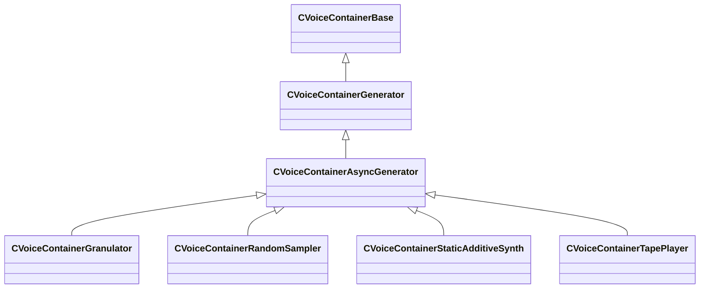

[Schemas](../../schemas.md) / [soundsystem_voicecontainers](../soundsystem_voicecontainers.md) / CVoiceContainerAsyncGenerator

# CVoiceContainerAsyncGenerator

**Kind:** class · **Size:** 128 bytes (`0x80`) · **Align:** 255 · **Module:** soundsystem_voicecontainers

**Inherits from:** [CVoiceContainerGenerator](../soundsystem_voicecontainers/CVoiceContainerGenerator.md)

**Derived by:** [CVoiceContainerGranulator](../soundsystem_voicecontainers/CVoiceContainerGranulator.md), [CVoiceContainerRandomSampler](../soundsystem_voicecontainers/CVoiceContainerRandomSampler.md), [CVoiceContainerStaticAdditiveSynth](../soundsystem_voicecontainers/CVoiceContainerStaticAdditiveSynth.md), [CVoiceContainerTapePlayer](../soundsystem_voicecontainers/CVoiceContainerTapePlayer.md)

**Relationships:**

## Memory layout

2 fields (0 declared here, 2 inherited). Offsets are absolute from the object base.

| Offset | Field | Type | From | Annotations |
|--------|-------|------|------|-------------|
| `0x28` | `m_vSound` | [CVSound](../soundsystem_voicecontainers/CVSound.md) | [CVoiceContainerBase](../soundsystem_voicecontainers/CVoiceContainerBase.md) | `MPropertySuppressField` |
| `0x68` | `m_pEnvelopeAnalyzer` | [CVoiceContainerAnalysisBase](../soundsystem_voicecontainers/CVoiceContainerAnalysisBase.md)* | [CVoiceContainerBase](../soundsystem_voicecontainers/CVoiceContainerBase.md) | `MPropertySuppressExpr true` |
