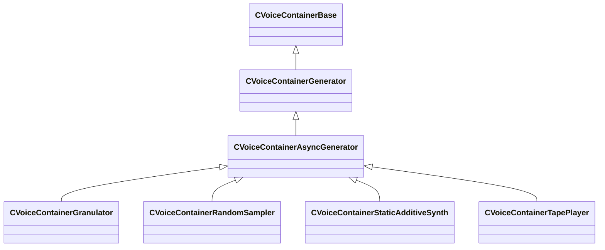

[Schemas](../../schemas.md) / [soundsystem_voicecontainers](../soundsystem_voicecontainers.md) / CVoiceContainerAsyncGenerator

# CVoiceContainerAsyncGenerator

> Source: **Build 26334290** · 2026-10-30 · `windows-x86_64` · schema `0.13.0`

**Kind:** class · **Size:** 136 bytes (`0x88`) · **Align:** n/a (unspecified) · **Module:** soundsystem_voicecontainers

**Inherits from:** [CVoiceContainerGenerator](../soundsystem_voicecontainers/CVoiceContainerGenerator.md)

**Derived by:** [CVoiceContainerGranulator](../soundsystem_voicecontainers/CVoiceContainerGranulator.md), [CVoiceContainerRandomSampler](../soundsystem_voicecontainers/CVoiceContainerRandomSampler.md), [CVoiceContainerStaticAdditiveSynth](../soundsystem_voicecontainers/CVoiceContainerStaticAdditiveSynth.md), [CVoiceContainerTapePlayer](../soundsystem_voicecontainers/CVoiceContainerTapePlayer.md)

**Relationships:**

```mermaid
classDiagram
    CVoiceContainerGenerator <|-- CVoiceContainerAsyncGenerator
    CVoiceContainerBase <|-- CVoiceContainerGenerator
    CVoiceContainerAsyncGenerator <|-- CVoiceContainerGranulator
    CVoiceContainerAsyncGenerator <|-- CVoiceContainerRandomSampler
    CVoiceContainerAsyncGenerator <|-- CVoiceContainerStaticAdditiveSynth
    CVoiceContainerAsyncGenerator <|-- CVoiceContainerTapePlayer
```

## Memory layout

4 fields (0 declared here, 4 inherited). Offsets are absolute from the object base.

| Offset | Field | Type | From | Annotations |
|--------|-------|------|------|-------------|
| `0x10` | `m_bRegisteredVMix` | bool | [CVoiceContainerBase](../soundsystem_voicecontainers/CVoiceContainerBase.md) |  |
| `0x14` | `m_nResourceName` | CUtlStringToken | [CVoiceContainerBase](../soundsystem_voicecontainers/CVoiceContainerBase.md) |  |
| `0x30` | `m_vSound` | [CVSound](../soundsystem_voicecontainers/CVSound.md) | [CVoiceContainerBase](../soundsystem_voicecontainers/CVoiceContainerBase.md) | `MPropertySuppressField` |
| `0x70` | `m_pEnvelopeAnalyzer` | [CVoiceContainerAnalysisBase](../soundsystem_voicecontainers/CVoiceContainerAnalysisBase.md)* | [CVoiceContainerBase](../soundsystem_voicecontainers/CVoiceContainerBase.md) | `MPropertySuppressExpr true` |
