[Schemas](../../schemas.md) / [soundsystem_voicecontainers](../soundsystem_voicecontainers.md) / CVoiceContainerBase

# CVoiceContainerBase

> Source: **Build 25000182** · 2026-08-28 · `windows-x86_64` · schema `0.10.0`

**Kind:** class · **Size:** 112 bytes (`0x70`) · **Align:** n/a (unspecified) · **Module:** soundsystem_voicecontainers

**Derived by:** [CVoiceContainerBlender](../soundsystem_voicecontainers/CVoiceContainerBlender.md), [CVoiceContainerDefault](../soundsystem_voicecontainers/CVoiceContainerDefault.md), [CVoiceContainerEnum](../soundsystem_voicecontainers/CVoiceContainerEnum.md), [CVoiceContainerGenerator](../soundsystem_voicecontainers/CVoiceContainerGenerator.md), [CVoiceContainerLoopTrigger](../soundsystem_voicecontainers/CVoiceContainerLoopTrigger.md), [CVoiceContainerLoopXFade](../soundsystem_voicecontainers/CVoiceContainerLoopXFade.md), [CVoiceContainerMultiBlender](../soundsystem_voicecontainers/CVoiceContainerMultiBlender.md), [CVoiceContainerParameterBlender](../soundsystem_voicecontainers/CVoiceContainerParameterBlender.md), [CVoiceContainerSelector](../soundsystem_voicecontainers/CVoiceContainerSelector.md), [CVoiceContainerSet](../soundsystem_voicecontainers/CVoiceContainerSet.md), [CVoiceContainerSwitch](../soundsystem_voicecontainers/CVoiceContainerSwitch.md), [CVoiceContainerVMixSnd](../soundsystem/CVoiceContainerVMixSnd.md), [CVoiceContainerVsndRadioButton](../soundsystem_voicecontainers/CVoiceContainerVsndRadioButton.md), [CVoiceContainerVsndTrigger](../soundsystem_voicecontainers/CVoiceContainerVsndTrigger.md)

**Metadata:** `MPropertyDescription Voice Container Base`, `MPropertyFriendlyName VSND Container`, `MPropertyPolymorphicClass`, `MVDataFileExtension vsnd`, `MVDataNodeType 1`, `MVDataRoot`, `MVDataSingleton`

**Relationships:**

```mermaid
classDiagram
    CVoiceContainerBase <|-- CVoiceContainerBlender
    CVoiceContainerBase <|-- CVoiceContainerDefault
    CVoiceContainerBase <|-- CVoiceContainerEnum
    CVoiceContainerBase <|-- CVoiceContainerGenerator
    CVoiceContainerBase <|-- CVoiceContainerLoopTrigger
    CVoiceContainerBase <|-- CVoiceContainerLoopXFade
    CVoiceContainerBase <|-- CVoiceContainerMultiBlender
    CVoiceContainerBase <|-- CVoiceContainerParameterBlender
    CVoiceContainerBase <|-- CVoiceContainerSelector
    CVoiceContainerBase <|-- CVoiceContainerSet
    CVoiceContainerBase <|-- CVoiceContainerSwitch
    CVoiceContainerBase <|-- CVoiceContainerVMixSnd
    CVoiceContainerBase <|-- CVoiceContainerVsndRadioButton
    CVoiceContainerBase <|-- CVoiceContainerVsndTrigger
    CVoiceContainerBase *-- CVSound
    CVoiceContainerBase --> CVoiceContainerAnalysisBase
```

## Memory layout

2 fields (2 declared here, 0 inherited). Offsets are absolute from the object base.

| Offset | Field | Type | From | Annotations |
|--------|-------|------|------|-------------|
| `0x28` | `m_vSound` | [CVSound](../soundsystem_voicecontainers/CVSound.md) |  | `MPropertySuppressField` |
| `0x68` | `m_pEnvelopeAnalyzer` | [CVoiceContainerAnalysisBase](../soundsystem_voicecontainers/CVoiceContainerAnalysisBase.md)* |  | `MPropertySuppressExpr true` |
