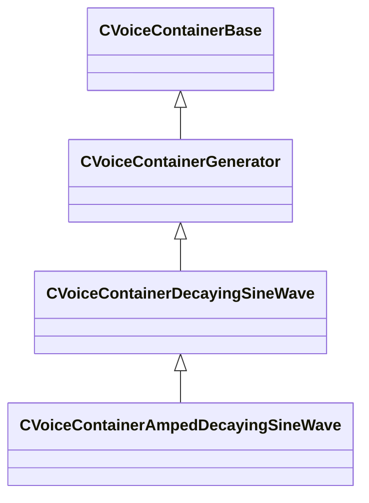

[Schemas](../../schemas.md) / [soundsystem_voicecontainers](../soundsystem_voicecontainers.md) / CVoiceContainerDecayingSineWave

# CVoiceContainerDecayingSineWave

> Source: **Build 25000182** · 2026-08-28 · `windows-x86_64` · schema `0.10.0`

**Kind:** class · **Size:** 120 bytes (`0x78`) · **Align:** 8 · **Module:** soundsystem_voicecontainers

**Inherits from:** [CVoiceContainerGenerator](../soundsystem_voicecontainers/CVoiceContainerGenerator.md)

**Derived by:** [CVoiceContainerAmpedDecayingSineWave](../soundsystem_voicecontainers/CVoiceContainerAmpedDecayingSineWave.md)

**Metadata:** `MPropertyDescription Only text params, renders in real time`, `MPropertyFriendlyName TESTBED: Decaying Sine Wave Container`

**Relationships:**

## Memory layout

4 fields (2 declared here, 2 inherited). Offsets are absolute from the object base.

| Offset | Field | Type | From | Annotations |
|--------|-------|------|------|-------------|
| `0x28` | `m_vSound` | [CVSound](../soundsystem_voicecontainers/CVSound.md) | [CVoiceContainerBase](../soundsystem_voicecontainers/CVoiceContainerBase.md) | `MPropertySuppressField` |
| `0x68` | `m_pEnvelopeAnalyzer` | [CVoiceContainerAnalysisBase](../soundsystem_voicecontainers/CVoiceContainerAnalysisBase.md)* | [CVoiceContainerBase](../soundsystem_voicecontainers/CVoiceContainerBase.md) | `MPropertySuppressExpr true` |
| `0x70` | `m_flFrequency` | float32 |  | `MPropertyDescription The frequency of this sine tone.` `MPropertyFriendlyName Frequency (Hz)` |
| `0x74` | `m_flDecayTime` | float32 |  | `MPropertyDescription The frequency of this sine tone.` `MPropertyFriendlyName Decay Time (Seconds)` |

KV3 class defaults

<pre>{
	&quot;_class&quot;: &quot;CVoiceContainerDecayingSineWave&quot;,
	&quot;m_vSound&quot;:
	{
		&quot;m_Sentences&quot;:
		[
		],
		&quot;m_nRate&quot;: 0,
		&quot;m_nFormat&quot;: &quot;PCM16&quot;,
		&quot;m_nChannels&quot;: 0,
		&quot;m_nLoopStart&quot;: 0,
		&quot;m_nSampleCount&quot;: 0,
		&quot;m_flDuration&quot;: 0.000000,
		&quot;m_nStreamingSize&quot;: 0,
		&quot;m_nLoopEnd&quot;: 0
	},
	&quot;m_pEnvelopeAnalyzer&quot;: null,
	&quot;m_flFrequency&quot;: 0.000000,
	&quot;m_flDecayTime&quot;: 0.000000
}</pre>

