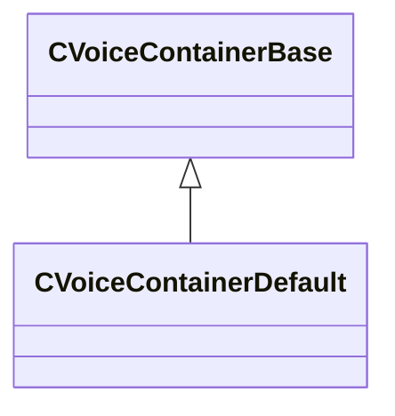

[Schemas](../../schemas.md) / [soundsystem_voicecontainers](../soundsystem_voicecontainers.md) / CVoiceContainerDefault

# CVoiceContainerDefault

**Kind:** class · **Size:** 112 bytes (`0x70`) · **Align:** 8 · **Module:** soundsystem_voicecontainers

**Inherits from:** [CVoiceContainerBase](../soundsystem_voicecontainers/CVoiceContainerBase.md)

**Metadata:** `MPropertyDescription Voice Container Default`, `MPropertyFriendlyName Default Container`

**Relationships:**

## Memory layout

2 fields (0 declared here, 2 inherited). Offsets are absolute from the object base.

| Offset | Field | Type | From | Annotations |
|--------|-------|------|------|-------------|
| `0x28` | `m_vSound` | [CVSound](../soundsystem_voicecontainers/CVSound.md) | [CVoiceContainerBase](../soundsystem_voicecontainers/CVoiceContainerBase.md) | `MPropertySuppressField` |
| `0x68` | `m_pEnvelopeAnalyzer` | [CVoiceContainerAnalysisBase](../soundsystem_voicecontainers/CVoiceContainerAnalysisBase.md)* | [CVoiceContainerBase](../soundsystem_voicecontainers/CVoiceContainerBase.md) | `MPropertySuppressExpr true` |

KV3 class defaults

<pre>{
	&quot;_class&quot;: &quot;CVoiceContainerDefault&quot;,
	&quot;m_vSound&quot;:
	{
		&quot;m_Sentences&quot;:
		[
		],
		&quot;m_nRate&quot;: 0,
		&quot;m_nFormat&quot;: &quot;PCM16&quot;,
		&quot;m_nChannels&quot;: 0,
		&quot;m_nLoopStart&quot;: 0,
		&quot;m_nSampleCount&quot;: 0,
		&quot;m_flDuration&quot;: 0.000000,
		&quot;m_nStreamingSize&quot;: 0,
		&quot;m_nLoopEnd&quot;: 0
	},
	&quot;m_pEnvelopeAnalyzer&quot;: null
}</pre>

