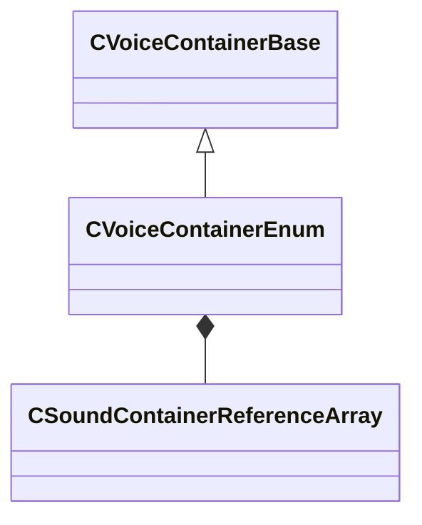

[Schemas](../../schemas.md) / [soundsystem_voicecontainers](../soundsystem_voicecontainers.md) / CVoiceContainerEnum

# CVoiceContainerEnum

> Source: **Build 25000182** · 2026-08-28 · `windows-x86_64` · schema `0.10.0`

**Kind:** class · **Size:** 176 bytes (`0xb0`) · **Align:** 8 · **Module:** soundsystem_voicecontainers

**Inherits from:** [CVoiceContainerBase](../soundsystem_voicecontainers/CVoiceContainerBase.md)

**Metadata:** `MPropertyDescription Switches between a selection of vsnds based on a provided index.`, `MPropertyFriendlyName VSND Enum`

**Relationships:**

## Memory layout

5 fields (3 declared here, 2 inherited). Offsets are absolute from the object base.

| Offset | Field | Type | From | Annotations |
|--------|-------|------|------|-------------|
| `0x28` | `m_vSound` | [CVSound](../soundsystem_voicecontainers/CVSound.md) | [CVoiceContainerBase](../soundsystem_voicecontainers/CVoiceContainerBase.md) | `MPropertySuppressField` |
| `0x68` | `m_pEnvelopeAnalyzer` | [CVoiceContainerAnalysisBase](../soundsystem_voicecontainers/CVoiceContainerAnalysisBase.md)* | [CVoiceContainerBase](../soundsystem_voicecontainers/CVoiceContainerBase.md) | `MPropertySuppressExpr true` |
| `0x70` | `m_soundsToPlay` | [CSoundContainerReferenceArray](../soundsystem_voicecontainers/CSoundContainerReferenceArray.md) |  | `MPropertyFriendlyName Sounds To Play` |
| `0xa8` | `m_iSelection` | int32 |  | `MPropertyFriendlyName Index` |
| `0xac` | `m_flCrossfadeTime` | float32 |  | `MPropertyFriendlyName Crossfade Time` |

KV3 class defaults

<pre>{
	&quot;_class&quot;: &quot;CVoiceContainerEnum&quot;,
	&quot;m_vSound&quot;:
	{
		&quot;m_Sentences&quot;:
		[
		],
		&quot;m_nRate&quot;: 0,
		&quot;m_nFormat&quot;: &quot;PCM16&quot;,
		&quot;m_nChannels&quot;: 0,
		&quot;m_nLoopStart&quot;: 0,
		&quot;m_nSampleCount&quot;: 0,
		&quot;m_flDuration&quot;: 0.000000,
		&quot;m_nStreamingSize&quot;: 0,
		&quot;m_nLoopEnd&quot;: 0
	},
	&quot;m_pEnvelopeAnalyzer&quot;: null,
	&quot;m_soundsToPlay&quot;:
	{
		&quot;m_bUseReference&quot;: true,
		&quot;m_sounds&quot;:
		[
		],
		&quot;m_pSounds&quot;:
		[
		]
	},
	&quot;m_iSelection&quot;: 0,
	&quot;m_flCrossfadeTime&quot;: 0.100000
}</pre>

