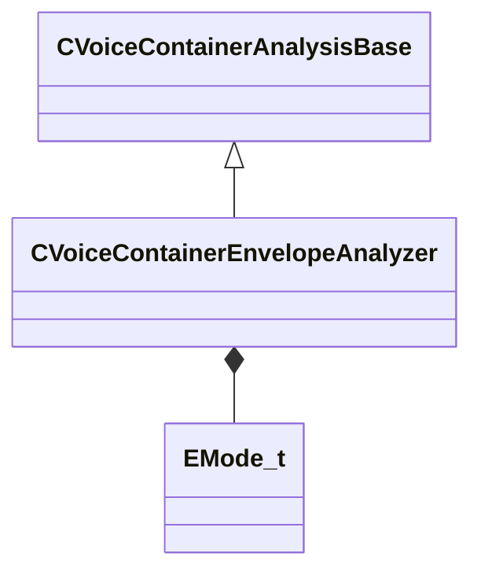

[Schemas](../../schemas.md) / [soundsystem_voicecontainers](../soundsystem_voicecontainers.md) / CVoiceContainerEnvelopeAnalyzer

# CVoiceContainerEnvelopeAnalyzer

> Source: **Build 25000182** · 2026-08-28 · `windows-x86_64` · schema `0.10.0`

**Kind:** class · **Size:** 88 bytes (`0x58`) · **Align:** 8 · **Module:** soundsystem_voicecontainers

**Inherits from:** [CVoiceContainerAnalysisBase](../soundsystem_voicecontainers/CVoiceContainerAnalysisBase.md)

**Metadata:** `MPropertyDescription Generates an Envelope Curve on compile`, `MPropertyFriendlyName Envelope Analyzer`

**Relationships:**

## Memory layout

4 fields (3 declared here, 1 inherited). Offsets are absolute from the object base.

| Offset | Field | Type | From | Annotations |
|--------|-------|------|------|-------------|
| `0x8` | `m_curve` | CPiecewiseCurve | [CVoiceContainerAnalysisBase](../soundsystem_voicecontainers/CVoiceContainerAnalysisBase.md) | `MPropertyFriendlyName Envelope Curve` |
| `0x48` | `m_mode` | [EMode_t](../soundsystem_voicecontainers/EMode_t.md) |  | `MPropertyFriendlyName Envelope Mode` |
| `0x4c` | `m_fAnalysisWindowMs` | float32 |  | `MPropertyFriendlyName Analysis Window` |
| `0x50` | `m_flThreshold` | float32 |  | `MPropertyFriendlyName Threshold` |

KV3 class defaults

<pre>{
	&quot;_class&quot;: &quot;CVoiceContainerEnvelopeAnalyzer&quot;,
	&quot;m_curve&quot;:
	{
		&quot;m_spline&quot;:
		[
		],
		&quot;m_tangents&quot;:
		[
		],
		&quot;m_vDomainMins&quot;:
		[
			0.000000,
			0.000000
		],
		&quot;m_vDomainMaxs&quot;:
		[
			0.000000,
			0.000000
		]
	},
	&quot;m_mode&quot;: &quot;Peak&quot;,
	&quot;m_fAnalysisWindowMs&quot;: 200.000000,
	&quot;m_flThreshold&quot;: 0.000000
}</pre>

