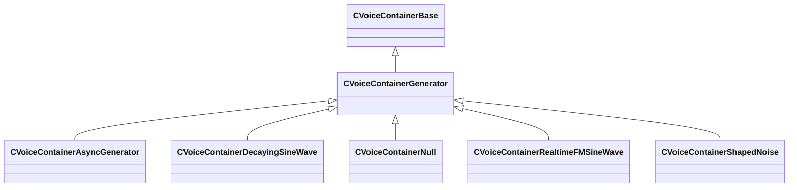

[Schemas](../../schemas.md) / [soundsystem_voicecontainers](../soundsystem_voicecontainers.md) / CVoiceContainerGenerator

# CVoiceContainerGenerator

**Kind:** class · **Size:** 112 bytes (`0x70`) · **Align:** 255 · **Module:** soundsystem_voicecontainers

**Inherits from:** [CVoiceContainerBase](../soundsystem_voicecontainers/CVoiceContainerBase.md)

**Derived by:** [CVoiceContainerAsyncGenerator](../soundsystem_voicecontainers/CVoiceContainerAsyncGenerator.md), [CVoiceContainerDecayingSineWave](../soundsystem_voicecontainers/CVoiceContainerDecayingSineWave.md), [CVoiceContainerNull](../soundsystem_voicecontainers/CVoiceContainerNull.md), [CVoiceContainerRealtimeFMSineWave](../soundsystem_voicecontainers/CVoiceContainerRealtimeFMSineWave.md), [CVoiceContainerShapedNoise](../soundsystem_voicecontainers/CVoiceContainerShapedNoise.md)

**Relationships:**

## Memory layout

2 fields (0 declared here, 2 inherited). Offsets are absolute from the object base.

| Offset | Field | Type | From | Annotations |
|--------|-------|------|------|-------------|
| `0x28` | `m_vSound` | [CVSound](../soundsystem_voicecontainers/CVSound.md) | [CVoiceContainerBase](../soundsystem_voicecontainers/CVoiceContainerBase.md) | `MPropertySuppressField` |
| `0x68` | `m_pEnvelopeAnalyzer` | [CVoiceContainerAnalysisBase](../soundsystem_voicecontainers/CVoiceContainerAnalysisBase.md)* | [CVoiceContainerBase](../soundsystem_voicecontainers/CVoiceContainerBase.md) | `MPropertySuppressExpr true` |
