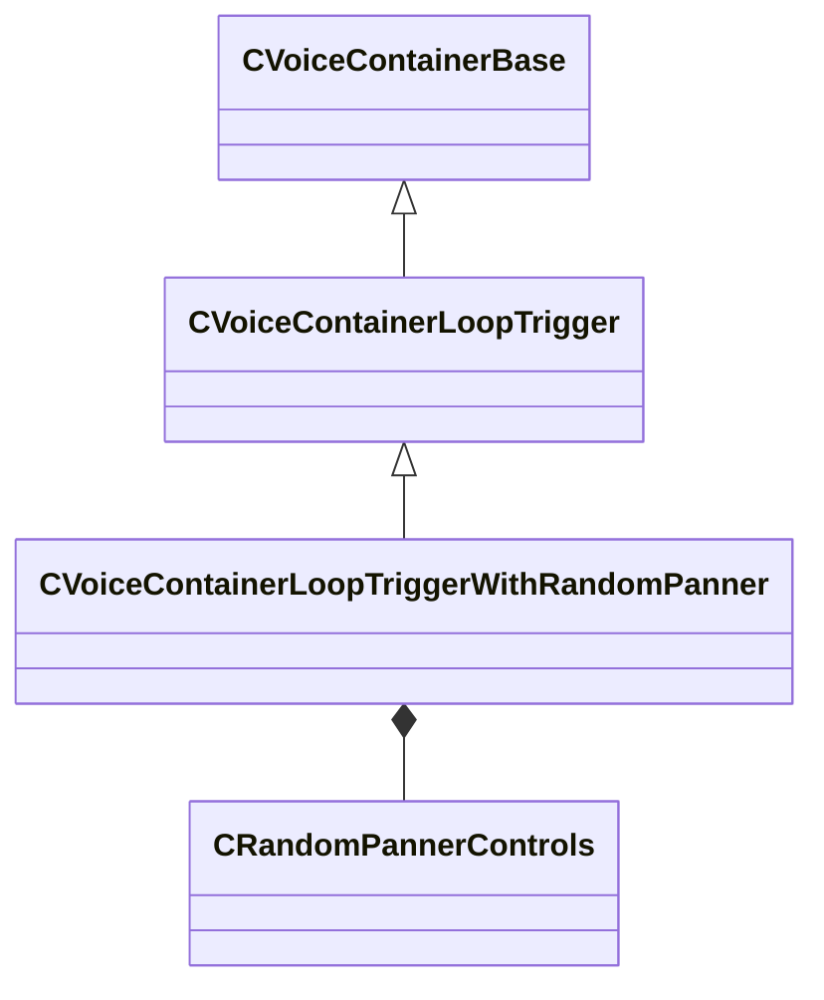

[Schemas](../../schemas.md) / [soundsystem_voicecontainers](../soundsystem_voicecontainers.md) / CVoiceContainerLoopTriggerWithRandomPanner

# CVoiceContainerLoopTriggerWithRandomPanner

> Source: **Build 25000182** · 2026-08-28 · `windows-x86_64` · schema `0.10.0`

**Kind:** class · **Size:** 192 bytes (`0xc0`) · **Align:** 8 · **Module:** soundsystem_voicecontainers

**Inherits from:** [CVoiceContainerLoopTrigger](../soundsystem_voicecontainers/CVoiceContainerLoopTrigger.md)

**Metadata:** `MPropertyDescription Continuously retriggers a sound and optionally fades to the new instance. Sends a new Random panning value to a control input on each retrigger`, `MPropertyFriendlyName LoopTriggerWithRandomPanner`

**Relationships:**

## Memory layout

8 fields (1 declared here, 7 inherited). Offsets are absolute from the object base.

| Offset | Field | Type | From | Annotations |
|--------|-------|------|------|-------------|
| `0x28` | `m_vSound` | [CVSound](../soundsystem_voicecontainers/CVSound.md) | [CVoiceContainerBase](../soundsystem_voicecontainers/CVoiceContainerBase.md) | `MPropertySuppressField` |
| `0x68` | `m_pEnvelopeAnalyzer` | [CVoiceContainerAnalysisBase](../soundsystem_voicecontainers/CVoiceContainerAnalysisBase.md)* | [CVoiceContainerBase](../soundsystem_voicecontainers/CVoiceContainerBase.md) | `MPropertySuppressExpr true` |
| `0x70` | `m_flRetriggerTimeMin` | float32 | [CVoiceContainerLoopTrigger](../soundsystem_voicecontainers/CVoiceContainerLoopTrigger.md) |  |
| `0x74` | `m_flRetriggerTimeMax` | float32 | [CVoiceContainerLoopTrigger](../soundsystem_voicecontainers/CVoiceContainerLoopTrigger.md) |  |
| `0x78` | `m_flFadeTime` | float32 | [CVoiceContainerLoopTrigger](../soundsystem_voicecontainers/CVoiceContainerLoopTrigger.md) |  |
| `0x7c` | `m_bCrossFade` | bool | [CVoiceContainerLoopTrigger](../soundsystem_voicecontainers/CVoiceContainerLoopTrigger.md) |  |
| `0x80` | `m_sound` | [CSoundContainerReference](../soundsystem_voicecontainers/CSoundContainerReference.md) | [CVoiceContainerLoopTrigger](../soundsystem_voicecontainers/CVoiceContainerLoopTrigger.md) | `MPropertyFriendlyName Vsnd Reference` |
| `0xa0` | `m_randomPannerControls` | [CRandomPannerControls](../soundsystem_voicecontainers/CRandomPannerControls.md) |  | `MPropertyFriendlyName Random Panner Control` |

KV3 class defaults

<pre>{
	&quot;_class&quot;: &quot;CVoiceContainerLoopTriggerWithRandomPanner&quot;,
	&quot;m_vSound&quot;:
	{
		&quot;m_Sentences&quot;:
		[
		],
		&quot;m_nRate&quot;: 0,
		&quot;m_nFormat&quot;: &quot;PCM16&quot;,
		&quot;m_nChannels&quot;: 0,
		&quot;m_nLoopStart&quot;: 0,
		&quot;m_nSampleCount&quot;: 0,
		&quot;m_flDuration&quot;: 0.000000,
		&quot;m_nStreamingSize&quot;: 0,
		&quot;m_nLoopEnd&quot;: 0
	},
	&quot;m_pEnvelopeAnalyzer&quot;: null,
	&quot;m_flRetriggerTimeMin&quot;: 1.000000,
	&quot;m_flRetriggerTimeMax&quot;: 1.000000,
	&quot;m_flFadeTime&quot;: 0.500000,
	&quot;m_bCrossFade&quot;: false,
	&quot;m_sound&quot;:
	{
		&quot;m_namespace&quot;: &quot;&quot;,
		&quot;m_bUseReference&quot;: true,
		&quot;m_sound&quot;: &quot;&quot;,
		&quot;m_pSound&quot;: null
	},
	&quot;m_randomPannerControls&quot;:
	{
		&quot;m_panningControlInputName&quot;: &quot;random_pan&quot;,
		&quot;m_volumeControlInputName&quot;: &quot;random_volume&quot;,
		&quot;m_flMinVolume&quot;: -12.000000,
		&quot;m_flMaxVolume&quot;: 0.000000,
		&quot;m_strVectorStackParam&quot;: &quot;ListenerForwardVector&quot;
	}
}</pre>

