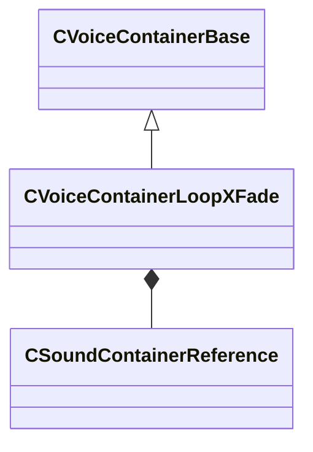

[Schemas](../../schemas.md) / [soundsystem_voicecontainers](../soundsystem_voicecontainers.md) / CVoiceContainerLoopXFade

# CVoiceContainerLoopXFade

> Source: **Build 25000182** · 2026-08-28 · `windows-x86_64` · schema `0.10.0`

**Kind:** class · **Size:** 168 bytes (`0xa8`) · **Align:** 8 · **Module:** soundsystem_voicecontainers

**Inherits from:** [CVoiceContainerBase](../soundsystem_voicecontainers/CVoiceContainerBase.md)

**Metadata:** `MPropertyDescription Sample accurate looping with xfade capabilities.`, `MPropertyFriendlyName Loop XFade`

**Relationships:**

## Memory layout

10 fields (8 declared here, 2 inherited). Offsets are absolute from the object base.

| Offset | Field | Type | From | Annotations |
|--------|-------|------|------|-------------|
| `0x28` | `m_vSound` | [CVSound](../soundsystem_voicecontainers/CVSound.md) | [CVoiceContainerBase](../soundsystem_voicecontainers/CVoiceContainerBase.md) | `MPropertySuppressField` |
| `0x68` | `m_pEnvelopeAnalyzer` | [CVoiceContainerAnalysisBase](../soundsystem_voicecontainers/CVoiceContainerAnalysisBase.md)* | [CVoiceContainerBase](../soundsystem_voicecontainers/CVoiceContainerBase.md) | `MPropertySuppressExpr true` |
| `0x70` | `m_sound` | [CSoundContainerReference](../soundsystem_voicecontainers/CSoundContainerReference.md) |  | `MPropertyFriendlyName Vsnd Reference` |
| `0x90` | `m_flLoopEnd` | float32 |  |  |
| `0x94` | `m_flLoopStart` | float32 |  |  |
| `0x98` | `m_flFadeOut` | float32 |  |  |
| `0x9c` | `m_flFadeIn` | float32 |  |  |
| `0xa0` | `m_bPlayHead` | bool |  |  |
| `0xa1` | `m_bPlayTail` | bool |  |  |
| `0xa2` | `m_bEqualPow` | bool |  |  |

KV3 class defaults

<pre>{
	&quot;_class&quot;: &quot;CVoiceContainerLoopXFade&quot;,
	&quot;m_vSound&quot;:
	{
		&quot;m_Sentences&quot;:
		[
		],
		&quot;m_nRate&quot;: 0,
		&quot;m_nFormat&quot;: &quot;PCM16&quot;,
		&quot;m_nChannels&quot;: 0,
		&quot;m_nLoopStart&quot;: 0,
		&quot;m_nSampleCount&quot;: 0,
		&quot;m_flDuration&quot;: 0.000000,
		&quot;m_nStreamingSize&quot;: 0,
		&quot;m_nLoopEnd&quot;: 0
	},
	&quot;m_pEnvelopeAnalyzer&quot;: null,
	&quot;m_sound&quot;:
	{
		&quot;m_namespace&quot;: &quot;&quot;,
		&quot;m_bUseReference&quot;: true,
		&quot;m_sound&quot;: &quot;&quot;,
		&quot;m_pSound&quot;: null
	},
	&quot;m_flLoopEnd&quot;: 0.000000,
	&quot;m_flLoopStart&quot;: 0.000000,
	&quot;m_flFadeOut&quot;: 0.000000,
	&quot;m_flFadeIn&quot;: 0.000000,
	&quot;m_bPlayHead&quot;: false,
	&quot;m_bPlayTail&quot;: false,
	&quot;m_bEqualPow&quot;: false
}</pre>

