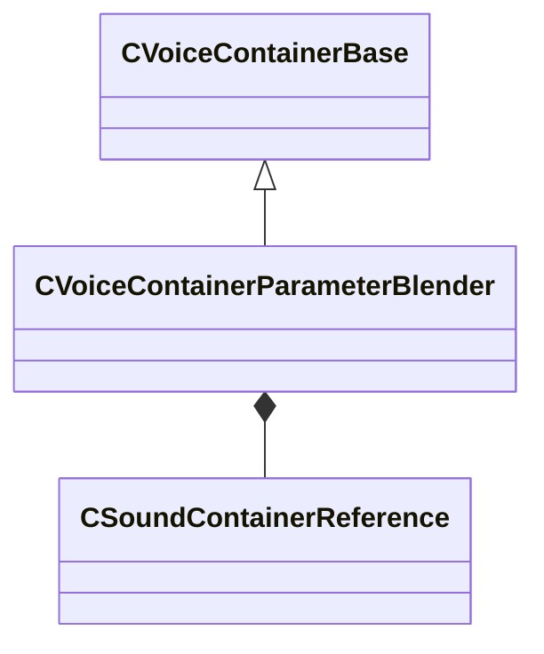

[Schemas](../../schemas.md) / [soundsystem_voicecontainers](../soundsystem_voicecontainers.md) / CVoiceContainerParameterBlender

# CVoiceContainerParameterBlender

> Source: **Build 25000182** · 2026-08-28 · `windows-x86_64` · schema `0.10.0`

**Kind:** class · **Size:** 448 bytes (`0x1c0`) · **Align:** 8 · **Module:** soundsystem_voicecontainers

**Inherits from:** [CVoiceContainerBase](../soundsystem_voicecontainers/CVoiceContainerBase.md)

**Metadata:** `MPropertyDescription Blends two containers according to parameter curves.`, `MPropertyFriendlyName Parameter Blender`

**Relationships:**

## Memory layout

10 fields (8 declared here, 2 inherited). Offsets are absolute from the object base.

| Offset | Field | Type | From | Annotations |
|--------|-------|------|------|-------------|
| `0x28` | `m_vSound` | [CVSound](../soundsystem_voicecontainers/CVSound.md) | [CVoiceContainerBase](../soundsystem_voicecontainers/CVoiceContainerBase.md) | `MPropertySuppressField` |
| `0x68` | `m_pEnvelopeAnalyzer` | [CVoiceContainerAnalysisBase](../soundsystem_voicecontainers/CVoiceContainerAnalysisBase.md)* | [CVoiceContainerBase](../soundsystem_voicecontainers/CVoiceContainerBase.md) | `MPropertySuppressExpr true` |
| `0x70` | `m_firstSound` | [CSoundContainerReference](../soundsystem_voicecontainers/CSoundContainerReference.md) |  | `MPropertyFriendlyName First Sound` |
| `0x90` | `m_secondSound` | [CSoundContainerReference](../soundsystem_voicecontainers/CSoundContainerReference.md) |  | `MPropertyFriendlyName Second Sound` |
| `0xb0` | `m_bEnableOcclusionBlend` | bool |  | `MPropertyFriendlyName Enable Occlusion Blend` `MPropertyStartGroup Occlusion` |
| `0xb8` | `m_curve1` | CPiecewiseCurve |  | `MPropertyFriendlyName First Curve` `MPropertySuppressExpr m_bEnableOcclusionBlend == false` |
| `0xf8` | `m_curve2` | CPiecewiseCurve |  | `MPropertyFriendlyName Second Curve` `MPropertySuppressExpr m_bEnableOcclusionBlend == false` |
| `0x138` | `m_bEnableDistanceBlend` | bool |  | `MPropertyFriendlyName Enable Distance Blend` `MPropertyStartGroup Distance` |
| `0x140` | `m_curve3` | CPiecewiseCurve |  | `MPropertyFriendlyName First Curve` `MPropertySuppressExpr m_bEnableDistanceBlend == false` |
| `0x180` | `m_curve4` | CPiecewiseCurve |  | `MPropertyFriendlyName Second Curve` `MPropertySuppressExpr m_bEnableDistanceBlend == false` |

KV3 class defaults

<pre>{
	&quot;_class&quot;: &quot;CVoiceContainerParameterBlender&quot;,
	&quot;m_vSound&quot;:
	{
		&quot;m_Sentences&quot;:
		[
		],
		&quot;m_nRate&quot;: 0,
		&quot;m_nFormat&quot;: &quot;PCM16&quot;,
		&quot;m_nChannels&quot;: 0,
		&quot;m_nLoopStart&quot;: 0,
		&quot;m_nSampleCount&quot;: 0,
		&quot;m_flDuration&quot;: 0.000000,
		&quot;m_nStreamingSize&quot;: 0,
		&quot;m_nLoopEnd&quot;: 0
	},
	&quot;m_pEnvelopeAnalyzer&quot;: null,
	&quot;m_firstSound&quot;:
	{
		&quot;m_namespace&quot;: &quot;&quot;,
		&quot;m_bUseReference&quot;: true,
		&quot;m_sound&quot;: &quot;&quot;,
		&quot;m_pSound&quot;: null
	},
	&quot;m_secondSound&quot;:
	{
		&quot;m_namespace&quot;: &quot;&quot;,
		&quot;m_bUseReference&quot;: true,
		&quot;m_sound&quot;: &quot;&quot;,
		&quot;m_pSound&quot;: null
	},
	&quot;m_bEnableOcclusionBlend&quot;: false,
	&quot;m_curve1&quot;:
	{
		&quot;m_spline&quot;:
		[
		],
		&quot;m_tangents&quot;:
		[
		],
		&quot;m_vDomainMins&quot;:
		[
			0.000000,
			0.000000
		],
		&quot;m_vDomainMaxs&quot;:
		[
			0.000000,
			0.000000
		]
	},
	&quot;m_curve2&quot;:
	{
		&quot;m_spline&quot;:
		[
		],
		&quot;m_tangents&quot;:
		[
		],
		&quot;m_vDomainMins&quot;:
		[
			0.000000,
			0.000000
		],
		&quot;m_vDomainMaxs&quot;:
		[
			0.000000,
			0.000000
		]
	},
	&quot;m_bEnableDistanceBlend&quot;: false,
	&quot;m_curve3&quot;:
	{
		&quot;m_spline&quot;:
		[
		],
		&quot;m_tangents&quot;:
		[
		],
		&quot;m_vDomainMins&quot;:
		[
			0.000000,
			0.000000
		],
		&quot;m_vDomainMaxs&quot;:
		[
			0.000000,
			0.000000
		]
	},
	&quot;m_curve4&quot;:
	{
		&quot;m_spline&quot;:
		[
		],
		&quot;m_tangents&quot;:
		[
		],
		&quot;m_vDomainMins&quot;:
		[
			0.000000,
			0.000000
		],
		&quot;m_vDomainMaxs&quot;:
		[
			0.000000,
			0.000000
		]
	}
}</pre>

