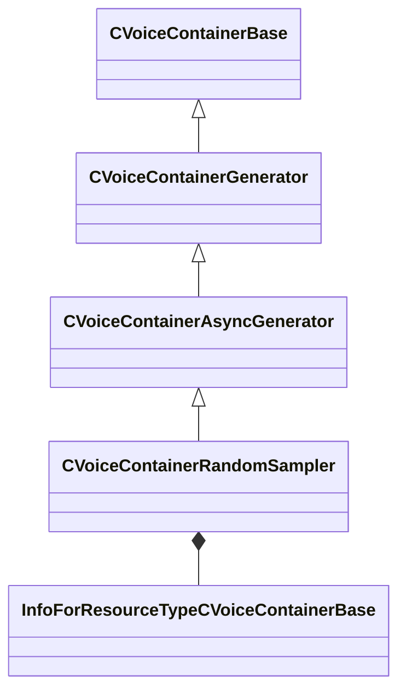

[Schemas](../../schemas.md) / [soundsystem_voicecontainers](../soundsystem_voicecontainers.md) / CVoiceContainerRandomSampler

# CVoiceContainerRandomSampler

**Kind:** class · **Size:** 424 bytes (`0x1a8`) · **Align:** 8 · **Module:** soundsystem_voicecontainers

**Inherits from:** [CVoiceContainerAsyncGenerator](../soundsystem_voicecontainers/CVoiceContainerAsyncGenerator.md)

**Metadata:** `MPropertyDescription Trash Synth`, `MPropertyFriendlyName Random Sampler Container`

**Relationships:**

## Memory layout

8 fields (6 declared here, 2 inherited). Offsets are absolute from the object base.

| Offset | Field | Type | From | Annotations |
|--------|-------|------|------|-------------|
| `0x28` | `m_vSound` | [CVSound](../soundsystem_voicecontainers/CVSound.md) | [CVoiceContainerBase](../soundsystem_voicecontainers/CVoiceContainerBase.md) | `MPropertySuppressField` |
| `0x68` | `m_pEnvelopeAnalyzer` | [CVoiceContainerAnalysisBase](../soundsystem_voicecontainers/CVoiceContainerAnalysisBase.md)* | [CVoiceContainerBase](../soundsystem_voicecontainers/CVoiceContainerBase.md) | `MPropertySuppressExpr true` |
| `0x80` | `m_flAmplitude` | float32 |  |  |
| `0x84` | `m_flAmplitudeJitter` | float32 |  |  |
| `0x88` | `m_flTimeJitter` | float32 |  |  |
| `0x8c` | `m_flMaxLength` | float32 |  |  |
| `0x90` | `m_nNumDelayVariations` | int32 |  |  |
| `0x98` | `m_grainResources` | CUtlVector< CStrongHandle< [InfoForResourceTypeCVoiceContainerBase](../resourcesystem/InfoForResourceTypeCVoiceContainerBase.md) > > |  |  |

KV3 class defaults

<pre>{
	&quot;_class&quot;: &quot;CVoiceContainerRandomSampler&quot;,
	&quot;m_vSound&quot;:
	{
		&quot;m_Sentences&quot;:
		[
		],
		&quot;m_nRate&quot;: 0,
		&quot;m_nFormat&quot;: &quot;PCM16&quot;,
		&quot;m_nChannels&quot;: 0,
		&quot;m_nLoopStart&quot;: 0,
		&quot;m_nSampleCount&quot;: 0,
		&quot;m_flDuration&quot;: 0.000000,
		&quot;m_nStreamingSize&quot;: 0,
		&quot;m_nLoopEnd&quot;: 0
	},
	&quot;m_pEnvelopeAnalyzer&quot;: null,
	&quot;m_flAmplitude&quot;: 0.800000,
	&quot;m_flAmplitudeJitter&quot;: 0.100000,
	&quot;m_flTimeJitter&quot;: 0.200000,
	&quot;m_flMaxLength&quot;: -1.000000,
	&quot;m_nNumDelayVariations&quot;: 0,
	&quot;m_grainResources&quot;:
	[
	]
}</pre>

