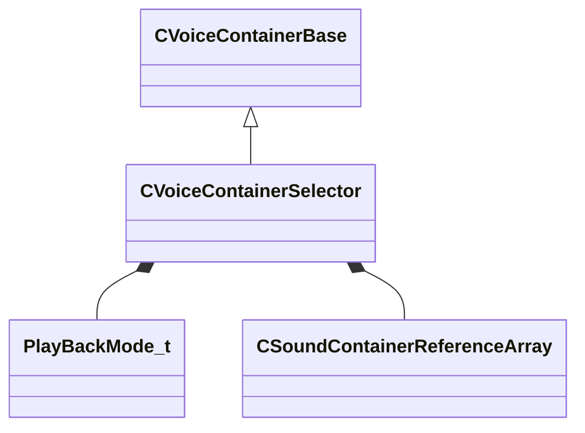

[Schemas](../../schemas.md) / [soundsystem_voicecontainers](../soundsystem_voicecontainers.md) / CVoiceContainerSelector

# CVoiceContainerSelector

**Kind:** class · **Size:** 232 bytes (`0xe8`) · **Align:** 8 · **Module:** soundsystem_voicecontainers

**Inherits from:** [CVoiceContainerBase](../soundsystem_voicecontainers/CVoiceContainerBase.md)

**Metadata:** `MPropertyDescription Plays a selected vsnd on playback.`, `MPropertyFriendlyName Selector`

**Relationships:**

## Memory layout

5 fields (3 declared here, 2 inherited). Offsets are absolute from the object base.

| Offset | Field | Type | From | Annotations |
|--------|-------|------|------|-------------|
| `0x28` | `m_vSound` | [CVSound](../soundsystem_voicecontainers/CVSound.md) | [CVoiceContainerBase](../soundsystem_voicecontainers/CVoiceContainerBase.md) | `MPropertySuppressField` |
| `0x68` | `m_pEnvelopeAnalyzer` | [CVoiceContainerAnalysisBase](../soundsystem_voicecontainers/CVoiceContainerAnalysisBase.md)* | [CVoiceContainerBase](../soundsystem_voicecontainers/CVoiceContainerBase.md) | `MPropertySuppressExpr true` |
| `0x70` | `m_mode` | [PlayBackMode_t](../soundsystem_voicecontainers/PlayBackMode_t.md) |  | `MPropertyFriendlyName Playback Mode` |
| `0x78` | `m_soundsToPlay` | [CSoundContainerReferenceArray](../soundsystem_voicecontainers/CSoundContainerReferenceArray.md) |  | `MPropertyFriendlyName Sounds To play` |
| `0xb0` | `m_fProbabilityWeights` | CUtlVector< float32 > |  | `MPropertyFriendlyName Relative Weights` |

KV3 class defaults

<pre>{
	&quot;_class&quot;: &quot;CVoiceContainerSelector&quot;,
	&quot;m_vSound&quot;:
	{
		&quot;m_Sentences&quot;:
		[
		],
		&quot;m_nRate&quot;: 0,
		&quot;m_nFormat&quot;: &quot;PCM16&quot;,
		&quot;m_nChannels&quot;: 0,
		&quot;m_nLoopStart&quot;: 0,
		&quot;m_nSampleCount&quot;: 0,
		&quot;m_flDuration&quot;: 0.000000,
		&quot;m_nStreamingSize&quot;: 0,
		&quot;m_nLoopEnd&quot;: 0
	},
	&quot;m_pEnvelopeAnalyzer&quot;: null,
	&quot;m_mode&quot;: &quot;Random&quot;,
	&quot;m_soundsToPlay&quot;:
	{
		&quot;m_bUseReference&quot;: true,
		&quot;m_sounds&quot;:
		[
		],
		&quot;m_pSounds&quot;:
		[
		]
	},
	&quot;m_fProbabilityWeights&quot;:
	[
	]
}</pre>

