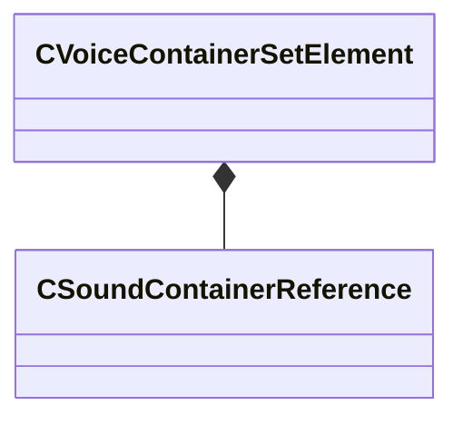

[Schemas](../../schemas.md) / [soundsystem_voicecontainers](../soundsystem_voicecontainers.md) / CVoiceContainerSetElement

# CVoiceContainerSetElement

**Kind:** class · **Size:** 40 bytes (`0x28`) · **Align:** 8 · **Module:** soundsystem_voicecontainers

**Relationships:**

## Memory layout

2 fields (2 declared here, 0 inherited). Offsets are absolute from the object base.

| Offset | Field | Type | From | Annotations |
|--------|-------|------|------|-------------|
| `0x0` | `m_sound` | [CSoundContainerReference](../soundsystem_voicecontainers/CSoundContainerReference.md) |  |  |
| `0x20` | `m_flVolumeDB` | float32 |  | `MPropertyFriendlyName Volume (in Decibels)` |

KV3 class defaults

<pre>{
	&quot;m_sound&quot;:
	{
		&quot;m_namespace&quot;: &quot;&quot;,
		&quot;m_bUseReference&quot;: true,
		&quot;m_sound&quot;: &quot;&quot;,
		&quot;m_pSound&quot;: null
	},
	&quot;m_flVolumeDB&quot;: 0.000000
}</pre>

