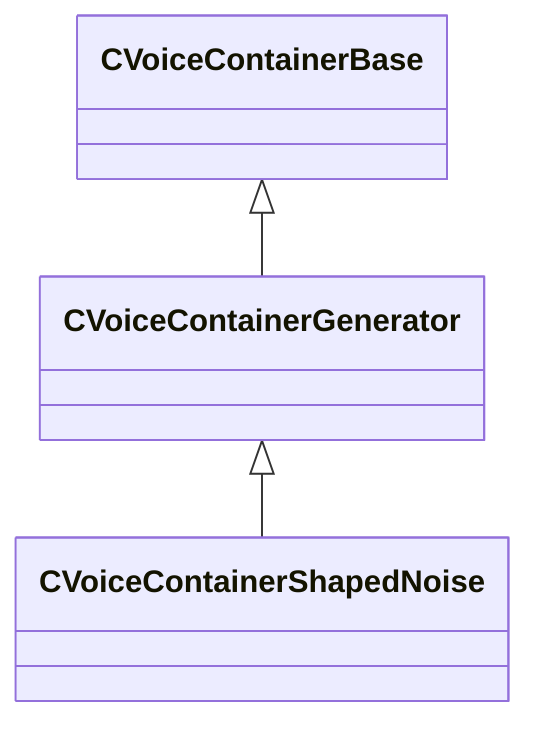

[Schemas](../../schemas.md) / [soundsystem_voicecontainers](../soundsystem_voicecontainers.md) / CVoiceContainerShapedNoise

# CVoiceContainerShapedNoise

**Kind:** class · **Size:** 328 bytes (`0x148`) · **Align:** 8 · **Module:** soundsystem_voicecontainers

**Inherits from:** [CVoiceContainerGenerator](../soundsystem_voicecontainers/CVoiceContainerGenerator.md)

**Metadata:** `MPropertyDescription This is a synth meant to generate whoosh noises.`, `MPropertyFriendlyName Wind Generator Container`

**Relationships:**

## Memory layout

11 fields (9 declared here, 2 inherited). Offsets are absolute from the object base.

| Offset | Field | Type | From | Annotations |
|--------|-------|------|------|-------------|
| `0x28` | `m_vSound` | [CVSound](../soundsystem_voicecontainers/CVSound.md) | [CVoiceContainerBase](../soundsystem_voicecontainers/CVoiceContainerBase.md) | `MPropertySuppressField` |
| `0x68` | `m_pEnvelopeAnalyzer` | [CVoiceContainerAnalysisBase](../soundsystem_voicecontainers/CVoiceContainerAnalysisBase.md)* | [CVoiceContainerBase](../soundsystem_voicecontainers/CVoiceContainerBase.md) | `MPropertySuppressExpr true` |
| `0x70` | `m_bUseCurveForFrequency` | bool |  |  |
| `0x74` | `m_flFrequency` | float32 |  | `MPropertySuppressExpr m_bUseCurveForFrequency == 1` |
| `0x78` | `m_frequencySweep` | CPiecewiseCurve |  | `MPropertyFriendlyName Frequency Sweep` `MPropertySuppressExpr m_bUseCurveForFrequency == 0` |
| `0xb8` | `m_bUseCurveForResonance` | bool |  |  |
| `0xbc` | `m_flResonance` | float32 |  | `MPropertySuppressExpr m_bUseCurveForResonance == 1` |
| `0xc0` | `m_resonanceSweep` | CPiecewiseCurve |  | `MPropertyFriendlyName Resonance Sweep` `MPropertySuppressExpr m_bUseCurveForResonance == 0` |
| `0x100` | `m_bUseCurveForAmplitude` | bool |  |  |
| `0x104` | `m_flGainInDecibels` | float32 |  | `MPropertySuppressExpr m_bUseCurveForAmplitude == 1` |
| `0x108` | `m_gainSweep` | CPiecewiseCurve |  | `MPropertyFriendlyName Gain Sweep (in Decibels)` `MPropertySuppressExpr m_bUseCurveForAmplitude == 0` |

KV3 class defaults

<pre>{
	&quot;_class&quot;: &quot;CVoiceContainerShapedNoise&quot;,
	&quot;m_vSound&quot;:
	{
		&quot;m_Sentences&quot;:
		[
		],
		&quot;m_nRate&quot;: 0,
		&quot;m_nFormat&quot;: &quot;PCM16&quot;,
		&quot;m_nChannels&quot;: 0,
		&quot;m_nLoopStart&quot;: 0,
		&quot;m_nSampleCount&quot;: 0,
		&quot;m_flDuration&quot;: 0.000000,
		&quot;m_nStreamingSize&quot;: 0,
		&quot;m_nLoopEnd&quot;: 0
	},
	&quot;m_pEnvelopeAnalyzer&quot;: null,
	&quot;m_bUseCurveForFrequency&quot;: false,
	&quot;m_flFrequency&quot;: 440.000000,
	&quot;m_frequencySweep&quot;:
	{
		&quot;m_spline&quot;:
		[
		],
		&quot;m_tangents&quot;:
		[
		],
		&quot;m_vDomainMins&quot;:
		[
			0.000000,
			0.000000
		],
		&quot;m_vDomainMaxs&quot;:
		[
			0.000000,
			0.000000
		]
	},
	&quot;m_bUseCurveForResonance&quot;: false,
	&quot;m_flResonance&quot;: 4.000000,
	&quot;m_resonanceSweep&quot;:
	{
		&quot;m_spline&quot;:
		[
		],
		&quot;m_tangents&quot;:
		[
		],
		&quot;m_vDomainMins&quot;:
		[
			0.000000,
			0.000000
		],
		&quot;m_vDomainMaxs&quot;:
		[
			0.000000,
			0.000000
		]
	},
	&quot;m_bUseCurveForAmplitude&quot;: false,
	&quot;m_flGainInDecibels&quot;: 1.000000,
	&quot;m_gainSweep&quot;:
	{
		&quot;m_spline&quot;:
		[
		],
		&quot;m_tangents&quot;:
		[
		],
		&quot;m_vDomainMins&quot;:
		[
			0.000000,
			0.000000
		],
		&quot;m_vDomainMaxs&quot;:
		[
			0.000000,
			0.000000
		]
	}
}</pre>

