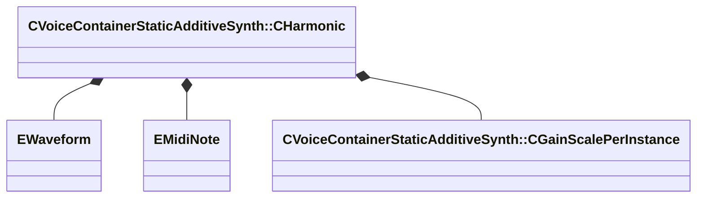

[Schemas](../../schemas.md) / [soundsystem_voicecontainers](../soundsystem_voicecontainers.md) / CVoiceContainerStaticAdditiveSynth::CHarmonic

# CVoiceContainerStaticAdditiveSynth::CHarmonic

> Source: **Build 25000182** · 2026-08-28 · `windows-x86_64` · schema `0.10.0`

**Kind:** class · **Size:** 104 bytes (`0x68`) · **Align:** 8 · **Module:** soundsystem_voicecontainers

**Relationships:**

## Memory layout

7 fields (7 declared here, 0 inherited). Offsets are absolute from the object base.

| Offset | Field | Type | From | Annotations |
|--------|-------|------|------|-------------|
| `0x0` | `m_nWaveform` | [EWaveform](../soundsystem_voicecontainers/EWaveform.md) |  | `MPropertyFriendlyName Waveform` |
| `0x1` | `m_nFundamental` | [EMidiNote](../soundsystem_voicecontainers/EMidiNote.md) |  | `MPropertyFriendlyName Note` |
| `0x4` | `m_nOctave` | int32 |  | `MPropertyFriendlyName Octave` |
| `0x8` | `m_flCents` | float32 |  | `MPropertyFriendlyName Cents To Detune ( -100:100 )` |
| `0xc` | `m_flPhase` | float32 |  | `MPropertyFriendlyName Phase ( 0 - 1 )` |
| `0x10` | `m_curve` | CPiecewiseCurve |  | `MPropertyFriendlyName Envelope (Relative to Tone Envelope)` |
| `0x50` | `m_volumeScaling` | [CVoiceContainerStaticAdditiveSynth::CGainScalePerInstance](../soundsystem_voicecontainers/CVoiceContainerStaticAdditiveSynth.CGainScalePerInstance.md) |  |  |

KV3 class defaults

<pre>{
	&quot;m_nWaveform&quot;: &quot;Sine&quot;,
	&quot;m_nFundamental&quot;: &quot;A&quot;,
	&quot;m_nOctave&quot;: 4,
	&quot;m_flCents&quot;: 0.000000,
	&quot;m_flPhase&quot;: 0.000000,
	&quot;m_curve&quot;:
	{
		&quot;m_spline&quot;:
		[
		],
		&quot;m_tangents&quot;:
		[
		],
		&quot;m_vDomainMins&quot;:
		[
			0.000000,
			0.000000
		],
		&quot;m_vDomainMaxs&quot;:
		[
			0.000000,
			0.000000
		]
	},
	&quot;m_volumeScaling&quot;:
	{
		&quot;m_flMinVolume&quot;: 1.000000,
		&quot;m_nInstancesAtMinVolume&quot;: 1,
		&quot;m_flMaxVolume&quot;: 1.000000,
		&quot;m_nInstancesAtMaxVolume&quot;: 1
	}
}</pre>

