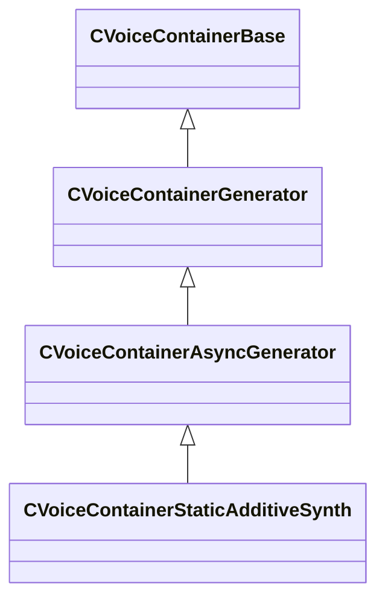

[Schemas](../../schemas.md) / [soundsystem_voicecontainers](../soundsystem_voicecontainers.md) / CVoiceContainerStaticAdditiveSynth

# CVoiceContainerStaticAdditiveSynth

**Kind:** class · **Size:** 176 bytes (`0xb0`) · **Align:** 8 · **Module:** soundsystem_voicecontainers

**Inherits from:** [CVoiceContainerAsyncGenerator](../soundsystem_voicecontainers/CVoiceContainerAsyncGenerator.md)

**Metadata:** `MPropertyDescription This is a static additive synth that can scale components of the synth based on how many instances are running.`, `MPropertyFriendlyName Additive Synth Container`

**Relationships:**

## Memory layout

3 fields (1 declared here, 2 inherited). Offsets are absolute from the object base.

| Offset | Field | Type | From | Annotations |
|--------|-------|------|------|-------------|
| `0x28` | `m_vSound` | [CVSound](../soundsystem_voicecontainers/CVSound.md) | [CVoiceContainerBase](../soundsystem_voicecontainers/CVoiceContainerBase.md) | `MPropertySuppressField` |
| `0x68` | `m_pEnvelopeAnalyzer` | [CVoiceContainerAnalysisBase](../soundsystem_voicecontainers/CVoiceContainerAnalysisBase.md)* | [CVoiceContainerBase](../soundsystem_voicecontainers/CVoiceContainerBase.md) | `MPropertySuppressExpr true` |
| `0x80` | `m_tones` | CUtlVector< [CVoiceContainerStaticAdditiveSynth](../soundsystem_voicecontainers/CVoiceContainerStaticAdditiveSynth.md)::CTone > |  |  |

KV3 class defaults

<pre>{
	&quot;_class&quot;: &quot;CVoiceContainerStaticAdditiveSynth&quot;,
	&quot;m_vSound&quot;:
	{
		&quot;m_Sentences&quot;:
		[
		],
		&quot;m_nRate&quot;: 0,
		&quot;m_nFormat&quot;: &quot;PCM16&quot;,
		&quot;m_nChannels&quot;: 0,
		&quot;m_nLoopStart&quot;: 0,
		&quot;m_nSampleCount&quot;: 0,
		&quot;m_flDuration&quot;: 0.000000,
		&quot;m_nStreamingSize&quot;: 0,
		&quot;m_nLoopEnd&quot;: 0
	},
	&quot;m_pEnvelopeAnalyzer&quot;: null,
	&quot;m_tones&quot;:
	[
	]
}</pre>

