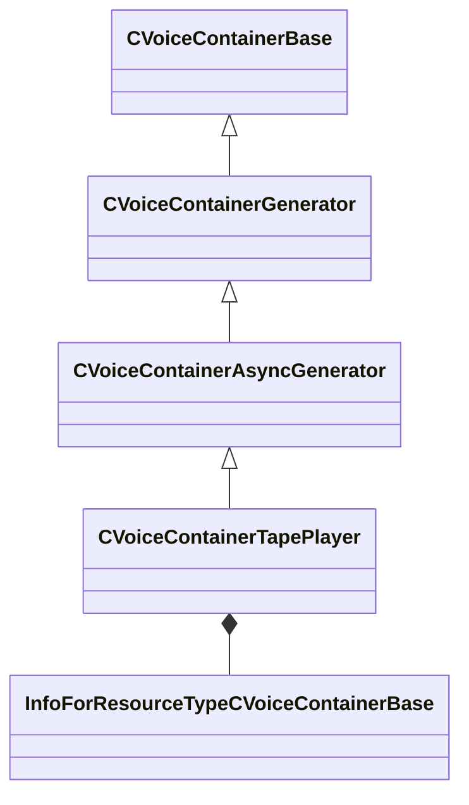

[Schemas](../../schemas.md) / [soundsystem_voicecontainers](../soundsystem_voicecontainers.md) / CVoiceContainerTapePlayer

# CVoiceContainerTapePlayer

> Source: **Build 25000182** · 2026-08-28 · `windows-x86_64` · schema `0.10.0`

**Kind:** class · **Size:** 192 bytes (`0xc0`) · **Align:** 8 · **Module:** soundsystem_voicecontainers

**Inherits from:** [CVoiceContainerAsyncGenerator](../soundsystem_voicecontainers/CVoiceContainerAsyncGenerator.md)

**Metadata:** `MPropertyFriendlyName Tape Player`

**Relationships:**

## Memory layout

6 fields (4 declared here, 2 inherited). Offsets are absolute from the object base.

| Offset | Field | Type | From | Annotations |
|--------|-------|------|------|-------------|
| `0x28` | `m_vSound` | [CVSound](../soundsystem_voicecontainers/CVSound.md) | [CVoiceContainerBase](../soundsystem_voicecontainers/CVoiceContainerBase.md) | `MPropertySuppressField` |
| `0x68` | `m_pEnvelopeAnalyzer` | [CVoiceContainerAnalysisBase](../soundsystem_voicecontainers/CVoiceContainerAnalysisBase.md)* | [CVoiceContainerBase](../soundsystem_voicecontainers/CVoiceContainerBase.md) | `MPropertySuppressExpr true` |
| `0x80` | `m_bShouldWraparound` | bool |  |  |
| `0x88` | `m_sourceAudio` | CStrongHandle< [InfoForResourceTypeCVoiceContainerBase](../resourcesystem/InfoForResourceTypeCVoiceContainerBase.md) > |  |  |
| `0x90` | `m_flTapeSpeedAttackTime` | float32 |  |  |
| `0x94` | `m_flTapeSpeedReleaseTime` | float32 |  |  |

KV3 class defaults

<pre>{
	&quot;_class&quot;: &quot;CVoiceContainerTapePlayer&quot;,
	&quot;m_vSound&quot;:
	{
		&quot;m_Sentences&quot;:
		[
		],
		&quot;m_nRate&quot;: 0,
		&quot;m_nFormat&quot;: &quot;PCM16&quot;,
		&quot;m_nChannels&quot;: 0,
		&quot;m_nLoopStart&quot;: 0,
		&quot;m_nSampleCount&quot;: 0,
		&quot;m_flDuration&quot;: 0.000000,
		&quot;m_nStreamingSize&quot;: 0,
		&quot;m_nLoopEnd&quot;: 0
	},
	&quot;m_pEnvelopeAnalyzer&quot;: null,
	&quot;m_bShouldWraparound&quot;: false,
	&quot;m_sourceAudio&quot;: &quot;&quot;,
	&quot;m_flTapeSpeedAttackTime&quot;: 0.300000,
	&quot;m_flTapeSpeedReleaseTime&quot;: 0.700000
}</pre>

