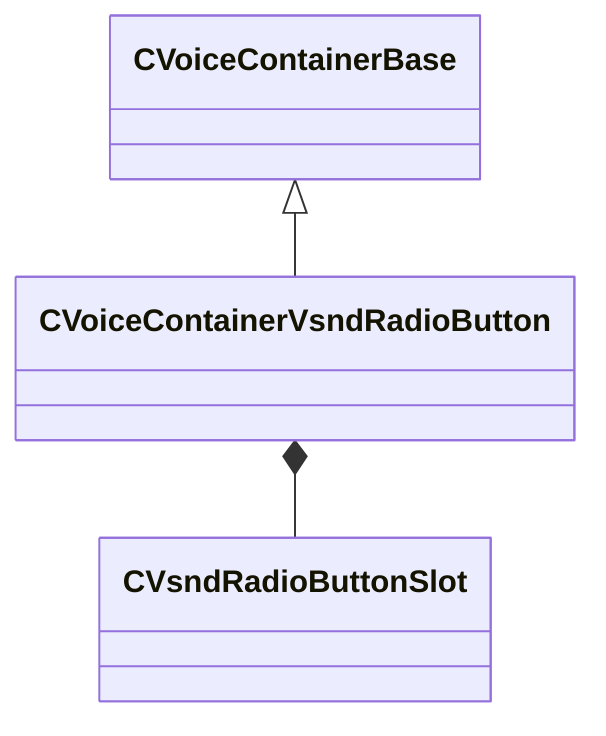

[Schemas](../../schemas.md) / [soundsystem_voicecontainers](../soundsystem_voicecontainers.md) / CVoiceContainerVsndRadioButton

# CVoiceContainerVsndRadioButton

**Kind:** class · **Size:** 2296 bytes (`0x8f8`) · **Align:** 8 · **Module:** soundsystem_voicecontainers

**Inherits from:** [CVoiceContainerBase](../soundsystem_voicecontainers/CVoiceContainerBase.md)

**Metadata:** `MPropertyDescription Plays vsnds based on membership in a numbered index.`, `MPropertyFriendlyName Vsnd Radio Button`

**Relationships:**

## Memory layout

19 fields (17 declared here, 2 inherited). Offsets are absolute from the object base.

| Offset | Field | Type | From | Annotations |
|--------|-------|------|------|-------------|
| `0x28` | `m_vSound` | [CVSound](../soundsystem_voicecontainers/CVSound.md) | [CVoiceContainerBase](../soundsystem_voicecontainers/CVoiceContainerBase.md) | `MPropertySuppressField` |
| `0x68` | `m_pEnvelopeAnalyzer` | [CVoiceContainerAnalysisBase](../soundsystem_voicecontainers/CVoiceContainerAnalysisBase.md)* | [CVoiceContainerBase](../soundsystem_voicecontainers/CVoiceContainerBase.md) | `MPropertySuppressExpr true` |
| `0x70` | `m_namespace` | CUtlString |  | `MPropertyFriendlyName Namespace` |
| `0x78` | `m_slot1` | [CVsndRadioButtonSlot](../soundsystem_voicecontainers/CVsndRadioButtonSlot.md) |  | `MPropertyFriendlyName Vsnd 01` |
| `0x100` | `m_slot2` | [CVsndRadioButtonSlot](../soundsystem_voicecontainers/CVsndRadioButtonSlot.md) |  | `MPropertyFriendlyName Vsnd 02` |
| `0x188` | `m_slot3` | [CVsndRadioButtonSlot](../soundsystem_voicecontainers/CVsndRadioButtonSlot.md) |  | `MPropertyFriendlyName Vsnd 03` |
| `0x210` | `m_slot4` | [CVsndRadioButtonSlot](../soundsystem_voicecontainers/CVsndRadioButtonSlot.md) |  | `MPropertyFriendlyName Vsnd 04` |
| `0x298` | `m_slot5` | [CVsndRadioButtonSlot](../soundsystem_voicecontainers/CVsndRadioButtonSlot.md) |  | `MPropertyFriendlyName Vsnd 05` |
| `0x320` | `m_slot6` | [CVsndRadioButtonSlot](../soundsystem_voicecontainers/CVsndRadioButtonSlot.md) |  | `MPropertyFriendlyName Vsnd 06` |
| `0x3a8` | `m_slot7` | [CVsndRadioButtonSlot](../soundsystem_voicecontainers/CVsndRadioButtonSlot.md) |  | `MPropertyFriendlyName Vsnd 07` |
| `0x430` | `m_slot8` | [CVsndRadioButtonSlot](../soundsystem_voicecontainers/CVsndRadioButtonSlot.md) |  | `MPropertyFriendlyName Vsnd 08` |
| `0x4b8` | `m_slot9` | [CVsndRadioButtonSlot](../soundsystem_voicecontainers/CVsndRadioButtonSlot.md) |  | `MPropertyFriendlyName Vsnd 09` |
| `0x540` | `m_slot10` | [CVsndRadioButtonSlot](../soundsystem_voicecontainers/CVsndRadioButtonSlot.md) |  | `MPropertyFriendlyName Vsnd 10` |
| `0x5c8` | `m_slot11` | [CVsndRadioButtonSlot](../soundsystem_voicecontainers/CVsndRadioButtonSlot.md) |  | `MPropertyFriendlyName Vsnd 11` |
| `0x650` | `m_slot12` | [CVsndRadioButtonSlot](../soundsystem_voicecontainers/CVsndRadioButtonSlot.md) |  | `MPropertyFriendlyName Vsnd 12` |
| `0x6d8` | `m_slot13` | [CVsndRadioButtonSlot](../soundsystem_voicecontainers/CVsndRadioButtonSlot.md) |  | `MPropertyFriendlyName Vsnd 13` |
| `0x760` | `m_slot14` | [CVsndRadioButtonSlot](../soundsystem_voicecontainers/CVsndRadioButtonSlot.md) |  | `MPropertyFriendlyName Vsnd 14` |
| `0x7e8` | `m_slot15` | [CVsndRadioButtonSlot](../soundsystem_voicecontainers/CVsndRadioButtonSlot.md) |  | `MPropertyFriendlyName Vsnd 15` |
| `0x870` | `m_slot16` | [CVsndRadioButtonSlot](../soundsystem_voicecontainers/CVsndRadioButtonSlot.md) |  | `MPropertyFriendlyName Vsnd 16` |

KV3 class defaults

<pre>{
	&quot;_class&quot;: &quot;CVoiceContainerVsndRadioButton&quot;,
	&quot;m_vSound&quot;:
	{
		&quot;m_Sentences&quot;:
		[
		],
		&quot;m_nRate&quot;: 0,
		&quot;m_nFormat&quot;: &quot;PCM16&quot;,
		&quot;m_nChannels&quot;: 0,
		&quot;m_nLoopStart&quot;: 0,
		&quot;m_nSampleCount&quot;: 0,
		&quot;m_flDuration&quot;: 0.000000,
		&quot;m_nStreamingSize&quot;: 0,
		&quot;m_nLoopEnd&quot;: 0
	},
	&quot;m_pEnvelopeAnalyzer&quot;: null,
	&quot;m_namespace&quot;: &quot;&quot;,
	&quot;m_slot1&quot;:
	{
		&quot;m_bEnableVsnd&quot;: true,
		&quot;m_vsnd&quot;:
		{
			&quot;m_namespace&quot;: &quot;&quot;,
			&quot;m_bUseReference&quot;: true,
			&quot;m_sound&quot;: &quot;&quot;,
			&quot;m_pSound&quot;: null
		},
		&quot;m_bEnableEndcap&quot;: false,
		&quot;m_endcapVsnd&quot;:
		{
			&quot;m_namespace&quot;: &quot;&quot;,
			&quot;m_bUseReference&quot;: true,
			&quot;m_sound&quot;: &quot;&quot;,
			&quot;m_pSound&quot;: null
		},
		&quot;m_bEnableLoopcap&quot;: false,
		&quot;m_loopcapVsnd&quot;:
		{
			&quot;m_namespace&quot;: &quot;&quot;,
			&quot;m_bUseReference&quot;: true,
			&quot;m_sound&quot;: &quot;&quot;,
			&quot;m_pSound&quot;: null
		},
		&quot;m_group&quot;: 1,
		&quot;m_volume&quot;: 1.000000,
		&quot;m_fadeOut&quot;: 0.000000,
		&quot;m_mode&quot;: &quot;Trigger&quot;
	},
	&quot;m_slot2&quot;:
	{
		&quot;m_bEnableVsnd&quot;: true,
		&quot;m_vsnd&quot;:
		{
			&quot;m_namespace&quot;: &quot;&quot;,
			&quot;m_bUseReference&quot;: true,
			&quot;m_sound&quot;: &quot;&quot;,
			&quot;m_pSound&quot;: null
		},
		&quot;m_bEnableEndcap&quot;: false,
		&quot;m_endcapVsnd&quot;:
		{
			&quot;m_namespace&quot;: &quot;&quot;,
			&quot;m_bUseReference&quot;: true,
			&quot;m_sound&quot;: &quot;&quot;,
			&quot;m_pSound&quot;: null
		},
		&quot;m_bEnableLoopcap&quot;: false,
		&quot;m_loopcapVsnd&quot;:
		{
			&quot;m_namespace&quot;: &quot;&quot;,
			&quot;m_bUseReference&quot;: true,
			&quot;m_sound&quot;: &quot;&quot;,
			&quot;m_pSound&quot;: null
		},
		&quot;m_group&quot;: 1,
		&quot;m_volume&quot;: 1.000000,
		&quot;m_fadeOut&quot;: 0.000000,
		&quot;m_mode&quot;: &quot;Trigger&quot;
	},
	&quot;m_slot3&quot;:
	{
		&quot;m_bEnableVsnd&quot;: true,
		&quot;m_vsnd&quot;:
		{
			&quot;m_namespace&quot;: &quot;&quot;,
			&quot;m_bUseReference&quot;: true,
			&quot;m_sound&quot;: &quot;&quot;,
			&quot;m_pSound&quot;: null
		},
		&quot;m_bEnableEndcap&quot;: false,
		&quot;m_endcapVsnd&quot;:
		{
			&quot;m_namespace&quot;: &quot;&quot;,
			&quot;m_bUseReference&quot;: true,
			&quot;m_sound&quot;: &quot;&quot;,
			&quot;m_pSound&quot;: null
		},
		&quot;m_bEnableLoopcap&quot;: false,
		&quot;m_loopcapVsnd&quot;:
		{
			&quot;m_namespace&quot;: &quot;&quot;,
			&quot;m_bUseReference&quot;: true,
			&quot;m_sound&quot;: &quot;&quot;,
			&quot;m_pSound&quot;: null
		},
		&quot;m_group&quot;: 1,
		&quot;m_volume&quot;: 1.000000,
		&quot;m_fadeOut&quot;: 0.000000,
		&quot;m_mode&quot;: &quot;Trigger&quot;
	},
	&quot;m_slot4&quot;:
	{
		&quot;m_bEnableVsnd&quot;: true,
		&quot;m_vsnd&quot;:
		{
			&quot;m_namespace&quot;: &quot;&quot;,
			&quot;m_bUseReference&quot;: true,
			&quot;m_sound&quot;: &quot;&quot;,
			&quot;m_pSound&quot;: null
		},
		&quot;m_bEnableEndcap&quot;: false,
		&quot;m_endcapVsnd&quot;:
		{
			&quot;m_namespace&quot;: &quot;&quot;,
			&quot;m_bUseReference&quot;: true,
			&quot;m_sound&quot;: &quot;&quot;,
			&quot;m_pSound&quot;: null
		},
		&quot;m_bEnableLoopcap&quot;: false,
		&quot;m_loopcapVsnd&quot;:
		{
			&quot;m_namespace&quot;: &quot;&quot;,
			&quot;m_bUseReference&quot;: true,
			&quot;m_sound&quot;: &quot;&quot;,
			&quot;m_pSound&quot;: null
		},
		&quot;m_group&quot;: 1,
		&quot;m_volume&quot;: 1.000000,
		&quot;m_fadeOut&quot;: 0.000000,
		&quot;m_mode&quot;: &quot;Trigger&quot;
	},
	&quot;m_slot5&quot;:
	{
		&quot;m_bEnableVsnd&quot;: true,
		&quot;m_vsnd&quot;:
		{
			&quot;m_namespace&quot;: &quot;&quot;,
			&quot;m_bUseReference&quot;: true,
			&quot;m_sound&quot;: &quot;&quot;,
			&quot;m_pSound&quot;: null
		},
		&quot;m_bEnableEndcap&quot;: false,
		&quot;m_endcapVsnd&quot;:
		{
			&quot;m_namespace&quot;: &quot;&quot;,
			&quot;m_bUseReference&quot;: true,
			&quot;m_sound&quot;: &quot;&quot;,
			&quot;m_pSound&quot;: null
		},
		&quot;m_bEnableLoopcap&quot;: false,
		&quot;m_loopcapVsnd&quot;:
		{
			&quot;m_namespace&quot;: &quot;&quot;,
			&quot;m_bUseReference&quot;: true,
			&quot;m_sound&quot;: &quot;&quot;,
			&quot;m_pSound&quot;: null
		},
		&quot;m_group&quot;: 1,
		&quot;m_volume&quot;: 1.000000,
		&quot;m_fadeOut&quot;: 0.000000,
		&quot;m_mode&quot;: &quot;Trigger&quot;
	},
	&quot;m_slot6&quot;:
	{
		&quot;m_bEnableVsnd&quot;: true,
		&quot;m_vsnd&quot;:
		{
			&quot;m_namespace&quot;: &quot;&quot;,
			&quot;m_bUseReference&quot;: true,
			&quot;m_sound&quot;: &quot;&quot;,
			&quot;m_pSound&quot;: null
		},
		&quot;m_bEnableEndcap&quot;: false,
		&quot;m_endcapVsnd&quot;:
		{
			&quot;m_namespace&quot;: &quot;&quot;,
			&quot;m_bUseReference&quot;: true,
			&quot;m_sound&quot;: &quot;&quot;,
			&quot;m_pSound&quot;: null
		},
		&quot;m_bEnableLoopcap&quot;: false,
		&quot;m_loopcapVsnd&quot;:
		{
			&quot;m_namespace&quot;: &quot;&quot;,
			&quot;m_bUseReference&quot;: true,
			&quot;m_sound&quot;: &quot;&quot;,
			&quot;m_pSound&quot;: null
		},
		&quot;m_group&quot;: 1,
		&quot;m_volume&quot;: 1.000000,
		&quot;m_fadeOut&quot;: 0.000000,
		&quot;m_mode&quot;: &quot;Trigger&quot;
	},
	&quot;m_slot7&quot;:
	{
		&quot;m_bEnableVsnd&quot;: true,
		&quot;m_vsnd&quot;:
		{
			&quot;m_namespace&quot;: &quot;&quot;,
			&quot;m_bUseReference&quot;: true,
			&quot;m_sound&quot;: &quot;&quot;,
			&quot;m_pSound&quot;: null
		},
		&quot;m_bEnableEndcap&quot;: false,
		&quot;m_endcapVsnd&quot;:
		{
			&quot;m_namespace&quot;: &quot;&quot;,
			&quot;m_bUseReference&quot;: true,
			&quot;m_sound&quot;: &quot;&quot;,
			&quot;m_pSound&quot;: null
		},
		&quot;m_bEnableLoopcap&quot;: false,
		&quot;m_loopcapVsnd&quot;:
		{
			&quot;m_namespace&quot;: &quot;&quot;,
			&quot;m_bUseReference&quot;: true,
			&quot;m_sound&quot;: &quot;&quot;,
			&quot;m_pSound&quot;: null
		},
		&quot;m_group&quot;: 1,
		&quot;m_volume&quot;: 1.000000,
		&quot;m_fadeOut&quot;: 0.000000,
		&quot;m_mode&quot;: &quot;Trigger&quot;
	},
	&quot;m_slot8&quot;:
	{
		&quot;m_bEnableVsnd&quot;: true,
		&quot;m_vsnd&quot;:
		{
			&quot;m_namespace&quot;: &quot;&quot;,
			&quot;m_bUseReference&quot;: true,
			&quot;m_sound&quot;: &quot;&quot;,
			&quot;m_pSound&quot;: null
		},
		&quot;m_bEnableEndcap&quot;: false,
		&quot;m_endcapVsnd&quot;:
		{
			&quot;m_namespace&quot;: &quot;&quot;,
			&quot;m_bUseReference&quot;: true,
			&quot;m_sound&quot;: &quot;&quot;,
			&quot;m_pSound&quot;: null
		},
		&quot;m_bEnableLoopcap&quot;: false,
		&quot;m_loopcapVsnd&quot;:
		{
			&quot;m_namespace&quot;: &quot;&quot;,
			&quot;m_bUseReference&quot;: true,
			&quot;m_sound&quot;: &quot;&quot;,
			&quot;m_pSound&quot;: null
		},
		&quot;m_group&quot;: 1,
		&quot;m_volume&quot;: 1.000000,
		&quot;m_fadeOut&quot;: 0.000000,
		&quot;m_mode&quot;: &quot;Trigger&quot;
	},
	&quot;m_slot9&quot;:
	{
		&quot;m_bEnableVsnd&quot;: true,
		&quot;m_vsnd&quot;:
		{
			&quot;m_namespace&quot;: &quot;&quot;,
			&quot;m_bUseReference&quot;: true,
			&quot;m_sound&quot;: &quot;&quot;,
			&quot;m_pSound&quot;: null
		},
		&quot;m_bEnableEndcap&quot;: false,
		&quot;m_endcapVsnd&quot;:
		{
			&quot;m_namespace&quot;: &quot;&quot;,
			&quot;m_bUseReference&quot;: true,
			&quot;m_sound&quot;: &quot;&quot;,
			&quot;m_pSound&quot;: null
		},
		&quot;m_bEnableLoopcap&quot;: false,
		&quot;m_loopcapVsnd&quot;:
		{
			&quot;m_namespace&quot;: &quot;&quot;,
			&quot;m_bUseReference&quot;: true,
			&quot;m_sound&quot;: &quot;&quot;,
			&quot;m_pSound&quot;: null
		},
		&quot;m_group&quot;: 1,
		&quot;m_volume&quot;: 1.000000,
		&quot;m_fadeOut&quot;: 0.000000,
		&quot;m_mode&quot;: &quot;Trigger&quot;
	},
	&quot;m_slot10&quot;:
	{
		&quot;m_bEnableVsnd&quot;: true,
		&quot;m_vsnd&quot;:
		{
			&quot;m_namespace&quot;: &quot;&quot;,
			&quot;m_bUseReference&quot;: true,
			&quot;m_sound&quot;: &quot;&quot;,
			&quot;m_pSound&quot;: null
		},
		&quot;m_bEnableEndcap&quot;: false,
		&quot;m_endcapVsnd&quot;:
		{
			&quot;m_namespace&quot;: &quot;&quot;,
			&quot;m_bUseReference&quot;: true,
			&quot;m_sound&quot;: &quot;&quot;,
			&quot;m_pSound&quot;: null
		},
		&quot;m_bEnableLoopcap&quot;: false,
		&quot;m_loopcapVsnd&quot;:
		{
			&quot;m_namespace&quot;: &quot;&quot;,
			&quot;m_bUseReference&quot;: true,
			&quot;m_sound&quot;: &quot;&quot;,
			&quot;m_pSound&quot;: null
		},
		&quot;m_group&quot;: 1,
		&quot;m_volume&quot;: 1.000000,
		&quot;m_fadeOut&quot;: 0.000000,
		&quot;m_mode&quot;: &quot;Trigger&quot;
	},
	&quot;m_slot11&quot;:
	{
		&quot;m_bEnableVsnd&quot;: true,
		&quot;m_vsnd&quot;:
		{
			&quot;m_namespace&quot;: &quot;&quot;,
			&quot;m_bUseReference&quot;: true,
			&quot;m_sound&quot;: &quot;&quot;,
			&quot;m_pSound&quot;: null
		},
		&quot;m_bEnableEndcap&quot;: false,
		&quot;m_endcapVsnd&quot;:
		{
			&quot;m_namespace&quot;: &quot;&quot;,
			&quot;m_bUseReference&quot;: true,
			&quot;m_sound&quot;: &quot;&quot;,
			&quot;m_pSound&quot;: null
		},
		&quot;m_bEnableLoopcap&quot;: false,
		&quot;m_loopcapVsnd&quot;:
		{
			&quot;m_namespace&quot;: &quot;&quot;,
			&quot;m_bUseReference&quot;: true,
			&quot;m_sound&quot;: &quot;&quot;,
			&quot;m_pSound&quot;: null
		},
		&quot;m_group&quot;: 1,
		&quot;m_volume&quot;: 1.000000,
		&quot;m_fadeOut&quot;: 0.000000,
		&quot;m_mode&quot;: &quot;Trigger&quot;
	},
	&quot;m_slot12&quot;:
	{
		&quot;m_bEnableVsnd&quot;: true,
		&quot;m_vsnd&quot;:
		{
			&quot;m_namespace&quot;: &quot;&quot;,
			&quot;m_bUseReference&quot;: true,
			&quot;m_sound&quot;: &quot;&quot;,
			&quot;m_pSound&quot;: null
		},
		&quot;m_bEnableEndcap&quot;: false,
		&quot;m_endcapVsnd&quot;:
		{
			&quot;m_namespace&quot;: &quot;&quot;,
			&quot;m_bUseReference&quot;: true,
			&quot;m_sound&quot;: &quot;&quot;,
			&quot;m_pSound&quot;: null
		},
		&quot;m_bEnableLoopcap&quot;: false,
		&quot;m_loopcapVsnd&quot;:
		{
			&quot;m_namespace&quot;: &quot;&quot;,
			&quot;m_bUseReference&quot;: true,
			&quot;m_sound&quot;: &quot;&quot;,
			&quot;m_pSound&quot;: null
		},
		&quot;m_group&quot;: 1,
		&quot;m_volume&quot;: 1.000000,
		&quot;m_fadeOut&quot;: 0.000000,
		&quot;m_mode&quot;: &quot;Trigger&quot;
	},
	&quot;m_slot13&quot;:
	{
		&quot;m_bEnableVsnd&quot;: true,
		&quot;m_vsnd&quot;:
		{
			&quot;m_namespace&quot;: &quot;&quot;,
			&quot;m_bUseReference&quot;: true,
			&quot;m_sound&quot;: &quot;&quot;,
			&quot;m_pSound&quot;: null
		},
		&quot;m_bEnableEndcap&quot;: false,
		&quot;m_endcapVsnd&quot;:
		{
			&quot;m_namespace&quot;: &quot;&quot;,
			&quot;m_bUseReference&quot;: true,
			&quot;m_sound&quot;: &quot;&quot;,
			&quot;m_pSound&quot;: null
		},
		&quot;m_bEnableLoopcap&quot;: false,
		&quot;m_loopcapVsnd&quot;:
		{
			&quot;m_namespace&quot;: &quot;&quot;,
			&quot;m_bUseReference&quot;: true,
			&quot;m_sound&quot;: &quot;&quot;,
			&quot;m_pSound&quot;: null
		},
		&quot;m_group&quot;: 1,
		&quot;m_volume&quot;: 1.000000,
		&quot;m_fadeOut&quot;: 0.000000,
		&quot;m_mode&quot;: &quot;Trigger&quot;
	},
	&quot;m_slot14&quot;:
	{
		&quot;m_bEnableVsnd&quot;: true,
		&quot;m_vsnd&quot;:
		{
			&quot;m_namespace&quot;: &quot;&quot;,
			&quot;m_bUseReference&quot;: true,
			&quot;m_sound&quot;: &quot;&quot;,
			&quot;m_pSound&quot;: null
		},
		&quot;m_bEnableEndcap&quot;: false,
		&quot;m_endcapVsnd&quot;:
		{
			&quot;m_namespace&quot;: &quot;&quot;,
			&quot;m_bUseReference&quot;: true,
			&quot;m_sound&quot;: &quot;&quot;,
			&quot;m_pSound&quot;: null
		},
		&quot;m_bEnableLoopcap&quot;: false,
		&quot;m_loopcapVsnd&quot;:
		{
			&quot;m_namespace&quot;: &quot;&quot;,
			&quot;m_bUseReference&quot;: true,
			&quot;m_sound&quot;: &quot;&quot;,
			&quot;m_pSound&quot;: null
		},
		&quot;m_group&quot;: 1,
		&quot;m_volume&quot;: 1.000000,
		&quot;m_fadeOut&quot;: 0.000000,
		&quot;m_mode&quot;: &quot;Trigger&quot;
	},
	&quot;m_slot15&quot;:
	{
		&quot;m_bEnableVsnd&quot;: true,
		&quot;m_vsnd&quot;:
		{
			&quot;m_namespace&quot;: &quot;&quot;,
			&quot;m_bUseReference&quot;: true,
			&quot;m_sound&quot;: &quot;&quot;,
			&quot;m_pSound&quot;: null
		},
		&quot;m_bEnableEndcap&quot;: false,
		&quot;m_endcapVsnd&quot;:
		{
			&quot;m_namespace&quot;: &quot;&quot;,
			&quot;m_bUseReference&quot;: true,
			&quot;m_sound&quot;: &quot;&quot;,
			&quot;m_pSound&quot;: null
		},
		&quot;m_bEnableLoopcap&quot;: false,
		&quot;m_loopcapVsnd&quot;:
		{
			&quot;m_namespace&quot;: &quot;&quot;,
			&quot;m_bUseReference&quot;: true,
			&quot;m_sound&quot;: &quot;&quot;,
			&quot;m_pSound&quot;: null
		},
		&quot;m_group&quot;: 1,
		&quot;m_volume&quot;: 1.000000,
		&quot;m_fadeOut&quot;: 0.000000,
		&quot;m_mode&quot;: &quot;Trigger&quot;
	},
	&quot;m_slot16&quot;:
	{
		&quot;m_bEnableVsnd&quot;: true,
		&quot;m_vsnd&quot;:
		{
			&quot;m_namespace&quot;: &quot;&quot;,
			&quot;m_bUseReference&quot;: true,
			&quot;m_sound&quot;: &quot;&quot;,
			&quot;m_pSound&quot;: null
		},
		&quot;m_bEnableEndcap&quot;: false,
		&quot;m_endcapVsnd&quot;:
		{
			&quot;m_namespace&quot;: &quot;&quot;,
			&quot;m_bUseReference&quot;: true,
			&quot;m_sound&quot;: &quot;&quot;,
			&quot;m_pSound&quot;: null
		},
		&quot;m_bEnableLoopcap&quot;: false,
		&quot;m_loopcapVsnd&quot;:
		{
			&quot;m_namespace&quot;: &quot;&quot;,
			&quot;m_bUseReference&quot;: true,
			&quot;m_sound&quot;: &quot;&quot;,
			&quot;m_pSound&quot;: null
		},
		&quot;m_group&quot;: 1,
		&quot;m_volume&quot;: 1.000000,
		&quot;m_fadeOut&quot;: 0.000000,
		&quot;m_mode&quot;: &quot;Trigger&quot;
	}
}</pre>

