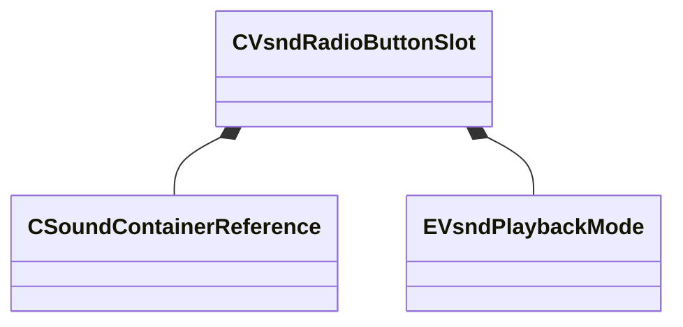

[Schemas](../../schemas.md) / [soundsystem_voicecontainers](../soundsystem_voicecontainers.md) / CVsndRadioButtonSlot

# CVsndRadioButtonSlot

**Kind:** class · **Size:** 136 bytes (`0x88`) · **Align:** 8 · **Module:** soundsystem_voicecontainers

**Relationships:**

## Memory layout

10 fields (10 declared here, 0 inherited). Offsets are absolute from the object base.

| Offset | Field | Type | From | Annotations |
|--------|-------|------|------|-------------|
| `0x0` | `m_bEnableVsnd` | bool |  | `MPropertyFriendlyName Enable Vsnd` `MPropertyGroupName Vsnd` |
| `0x8` | `m_vsnd` | [CSoundContainerReference](../soundsystem_voicecontainers/CSoundContainerReference.md) |  | `MPropertyFriendlyName Vsnd File` `MPropertyGroupName Vsnd` |
| `0x28` | `m_bEnableEndcap` | bool |  | `MPropertyFriendlyName Enable Endcap` `MPropertyGroupName Endcap` |
| `0x30` | `m_endcapVsnd` | [CSoundContainerReference](../soundsystem_voicecontainers/CSoundContainerReference.md) |  | `MPropertyFriendlyName Endcap Vsnd (Stop)` `MPropertyGroupName Endcap` |
| `0x50` | `m_bEnableLoopcap` | bool |  | `MPropertyFriendlyName Enable Loopcap` `MPropertyGroupName Loopcap` |
| `0x58` | `m_loopcapVsnd` | [CSoundContainerReference](../soundsystem_voicecontainers/CSoundContainerReference.md) |  | `MPropertyFriendlyName Loopcap Vsnd (Loop)` `MPropertyGroupName Loopcap` |
| `0x78` | `m_group` | int32 |  | `MPropertyFriendlyName Group` |
| `0x7c` | `m_volume` | float32 |  | `MPropertyFriendlyName Volume` |
| `0x80` | `m_fadeOut` | float32 |  | `MPropertyFriendlyName Fade Out (sec)` |
| `0x84` | `m_mode` | [EVsndPlaybackMode](../!GlobalTypes/EVsndPlaybackMode.md) |  | `MPropertyFriendlyName Mode` |

KV3 class defaults

<pre>{
	&quot;m_bEnableVsnd&quot;: true,
	&quot;m_vsnd&quot;:
	{
		&quot;m_namespace&quot;: &quot;&quot;,
		&quot;m_bUseReference&quot;: true,
		&quot;m_sound&quot;: &quot;&quot;,
		&quot;m_pSound&quot;: null
	},
	&quot;m_bEnableEndcap&quot;: false,
	&quot;m_endcapVsnd&quot;:
	{
		&quot;m_namespace&quot;: &quot;&quot;,
		&quot;m_bUseReference&quot;: true,
		&quot;m_sound&quot;: &quot;&quot;,
		&quot;m_pSound&quot;: null
	},
	&quot;m_bEnableLoopcap&quot;: false,
	&quot;m_loopcapVsnd&quot;:
	{
		&quot;m_namespace&quot;: &quot;&quot;,
		&quot;m_bUseReference&quot;: true,
		&quot;m_sound&quot;: &quot;&quot;,
		&quot;m_pSound&quot;: null
	},
	&quot;m_group&quot;: 1,
	&quot;m_volume&quot;: 1.000000,
	&quot;m_fadeOut&quot;: 0.000000,
	&quot;m_mode&quot;: &quot;Trigger&quot;
}</pre>

