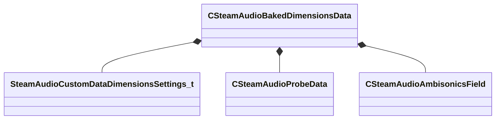
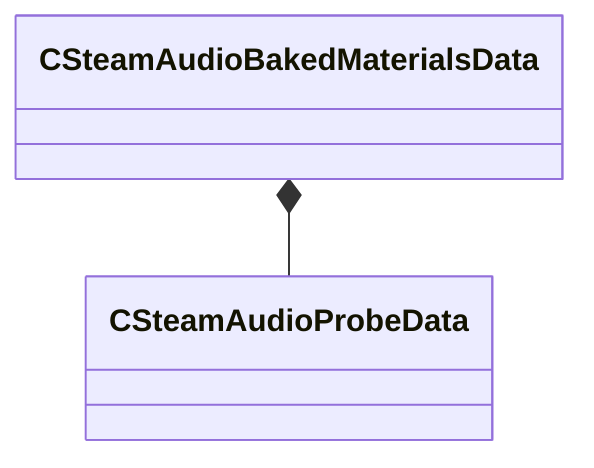
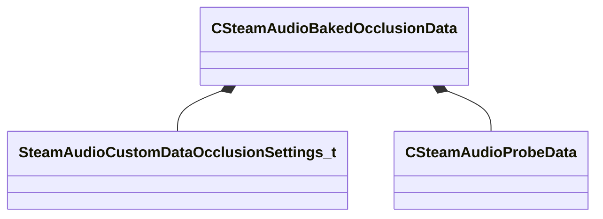
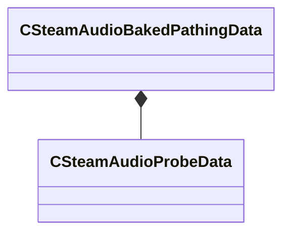
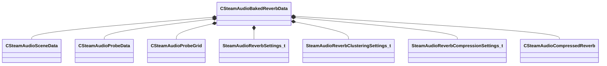
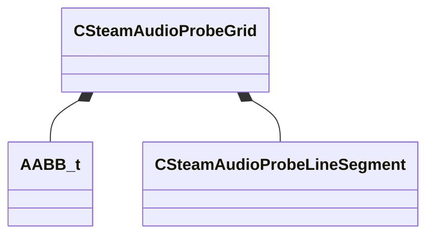

# Module: steamaudio

[📊 View UML Diagram](../diagrams/steamaudio.md)

| Name | Kind | Bases | Fields |
|------|------|-------|--------|
| [CSteamAudioAmbisonicsField](#csteamaudioambisonicsfield) | class |  | 1 |
| [CSteamAudioBakedDimensionsData](#csteamaudiobakeddimensionsdata) | class |  | 7 |
| [CSteamAudioBakedMaterialsData](#csteamaudiobakedmaterialsdata) | class |  | 3 |
| [CSteamAudioBakedOcclusionData](#csteamaudiobakedocclusiondata) | class |  | 5 |
| [CSteamAudioBakedPathingData](#csteamaudiobakedpathingdata) | class |  | 3 |
| [CSteamAudioBakedReverbData](#csteamaudiobakedreverbdata) | class |  | 12 |
| [CSteamAudioCompressedReverb](#csteamaudiocompressedreverb) | class |  | 8 |
| [CSteamAudioProbeData](#csteamaudioprobedata) | class |  | 1 |
| [CSteamAudioProbeGrid](#csteamaudioprobegrid) | class |  | 7 |
| [CSteamAudioProbeLineSegment](#csteamaudioprobelinesegment) | class |  | 4 |
| [CSteamAudioSceneData](#csteamaudioscenedata) | class |  | 2 |
| [SteamAudioCustomDataDimensionsSettings_t](#steamaudiocustomdatadimensionssettings_t) | class |  | 5 |
| [SteamAudioCustomDataOcclusionSettings_t](#steamaudiocustomdataocclusionsettings_t) | class |  | 4 |
| [SteamAudioPathSettings_t](#steamaudiopathsettings_t) | class |  | 4 |
| [SteamAudioReverbClusteringSettings_t](#steamaudioreverbclusteringsettings_t) | class |  | 3 |
| [SteamAudioReverbCompressionSettings_t](#steamaudioreverbcompressionsettings_t) | class |  | 2 |
| [SteamAudioReverbSettings_t](#steamaudioreverbsettings_t) | class |  | 5 |

---

### CSteamAudioAmbisonicsField

**Metadata:** `MGetKV3ClassDefaults {
	"m_field":
	[
	]
}`

**Fields:**

| Name | Type | Annotations |
|------|------|-------------|
| `m_field` | CUtlVector<float32> |  |

### CSteamAudioBakedDimensionsData

**Metadata:** `MGetKV3ClassDefaults {
	"m_settings":
	{
		"m_nAmbisonicsOrderOutsideField": 0,
		"m_nAmbisonicsOrderInsideSizeField": 0,
		"m_flOutsideThreshold": 0.000000,
		"m_flSizeThreshold": 0.000000,
		"m_flInsideThreshold": 0.000000
	},
	"m_probes":
	{
	},
	"m_vecInOut":
	[
	],
	"m_vecSize":
	[
	],
	"m_vecOutsideField":
	[
	],
	"m_vecInsideSmallSizeField":
	[
	],
	"m_movables":
	{
		"m_vecData":
		[
		],
		"m_vecInitialTransforms":
		[
		],
		"m_vecAABBs":
		[
		],
		"m_vecKeys":
		[
		]
	}
}`

**Relationships:**

**Fields:**

| Name | Type | Annotations |
|------|------|-------------|
| `m_settings` | [SteamAudioCustomDataDimensionsSettings_t](../schemas/steamaudio.md#steamaudiocustomdatadimensionssettings_t) |  |
| `m_probes` | [CSteamAudioProbeData](../schemas/steamaudio.md#csteamaudioprobedata) |  |
| `m_vecInOut` | CUtlVector<float32> |  |
| `m_vecSize` | CUtlVector<float32> |  |
| `m_vecOutsideField` | CUtlVector<[CSteamAudioAmbisonicsField](../schemas/steamaudio.md#csteamaudioambisonicsfield)> |  |
| `m_vecInsideSmallSizeField` | CUtlVector<[CSteamAudioAmbisonicsField](../schemas/steamaudio.md#csteamaudioambisonicsfield)> |  |
| `m_movables` | CSteamAudioMovableBakedData<[CSteamAudioBakedDimensionsData](../schemas/steamaudio.md#csteamaudiobakeddimensionsdata)> |  |

### CSteamAudioBakedMaterialsData

**Metadata:** `MGetKV3ClassDefaults {
	"m_probes":
	{
	},
	"m_vecMaterialTokens":
	[
	],
	"m_vecMaterialWeights":
	[
	]
}`

**Relationships:**

**Fields:**

| Name | Type | Annotations |
|------|------|-------------|
| `m_probes` | [CSteamAudioProbeData](../schemas/steamaudio.md#csteamaudioprobedata) |  |
| `m_vecMaterialTokens` | CUtlVector<uint32> |  |
| `m_vecMaterialWeights` | CUtlVector<float32> |  |

### CSteamAudioBakedOcclusionData

**Metadata:** `MGetKV3ClassDefaults {
	"m_settings":
	{
		"m_bEnablePathing": false,
		"m_bEnableReflections": false,
		"m_nReflectionRays": 0,
		"m_nReflectionBounces": 0
	},
	"m_probes":
	{
	},
	"m_vecPathingRatio":
	[
	],
	"m_vecPathingDeviation":
	[
	],
	"m_vecReflectionRatio":
	[
	]
}`

**Relationships:**

**Fields:**

| Name | Type | Annotations |
|------|------|-------------|
| `m_settings` | [SteamAudioCustomDataOcclusionSettings_t](../schemas/steamaudio.md#steamaudiocustomdataocclusionsettings_t) |  |
| `m_probes` | [CSteamAudioProbeData](../schemas/steamaudio.md#csteamaudioprobedata) |  |
| `m_vecPathingRatio` | CUtlVector<float32> |  |
| `m_vecPathingDeviation` | CUtlVector<float32> |  |
| `m_vecReflectionRatio` | CUtlVector<float32> |  |

### CSteamAudioBakedPathingData

**Metadata:** `MGetKV3ClassDefaults {
	"m_nBands": 3,
	"m_probes":
	{
	},
	"m_movables":
	{
		"m_vecData":
		[
		],
		"m_vecInitialTransforms":
		[
		],
		"m_vecAABBs":
		[
		],
		"m_vecKeys":
		[
		]
	}
}`

**Relationships:**

**Fields:**

| Name | Type | Annotations |
|------|------|-------------|
| `m_nBands` | int32 |  |
| `m_probes` | [CSteamAudioProbeData](../schemas/steamaudio.md#csteamaudioprobedata) |  |
| `m_movables` | CSteamAudioMovableBakedData<[CSteamAudioBakedPathingData](../schemas/steamaudio.md#csteamaudiobakedpathingdata)> |  |

### CSteamAudioBakedReverbData

**Metadata:** `MGetKV3ClassDefaults {
	"m_nBands": 3,
	"m_scene":
	{
	},
	"m_grid":
	{
		"m_aabb":
		{
			"m_vMinBounds":
			[
				0.000000,
				0.000000,
				0.000000
			],
			"m_vMaxBounds":
			[
				0.000000,
				0.000000,
				0.000000
			]
		},
		"m_flSpacing": 0.000000,
		"m_nx": 0,
		"m_ny": 0,
		"m_nz": 0,
		"m_vecLineSegments":
		[
		],
		"m_vecProbes":
		[
		]
	},
	"m_reverbSettings":
	{
		"m_nNumRays": 0,
		"m_nNumBounces": 0,
		"m_flIRDuration": 0.000000,
		"m_nAmbisonicsOrder": 0,
		"m_bExportScene": false
	},
	"m_reverbClusteringSettings":
	{
		"m_bEnableClustering": false,
		"m_nCubeMapResolution": 0,
		"m_flDepthThreshold": 0.000000
	},
	"m_reverbCompressionSettings":
	{
		"m_bEnableCompression": false,
		"m_flQuality": 0.950000
	},
	"m_vecClusterForProbe":
	[
	],
	"m_compressedData":
	{
		"m_nChannels": 0,
		"m_nBands": 0,
		"m_nBins": 0,
		"m_nProbes": 0,
		"m_vecNumSingularValues":
		[
		],
		"m_vecDictionary":
		[
		],
		"m_vecCompressedData":
		[
		]
	},
	"m_compressedClusteredData":
	{
		"m_nChannels": 0,
		"m_nBands": 0,
		"m_nBins": 0,
		"m_nProbes": 0,
		"m_vecNumSingularValues":
		[
		],
		"m_vecDictionary":
		[
		],
		"m_vecCompressedData":
		[
		]
	},
	"m_movables":
	{
		"m_vecData":
		[
		],
		"m_vecInitialTransforms":
		[
		],
		"m_vecAABBs":
		[
		],
		"m_vecKeys":
		[
		]
	}
}`

**Relationships:**

**Fields:**

| Name | Type | Annotations |
|------|------|-------------|
| `m_nBands` | int32 |  |
| `m_scene` | [CSteamAudioSceneData](../schemas/steamaudio.md#csteamaudioscenedata) |  |
| `m_probes` | [CSteamAudioProbeData](../schemas/steamaudio.md#csteamaudioprobedata) |  |
| `m_grid` | [CSteamAudioProbeGrid](../schemas/steamaudio.md#csteamaudioprobegrid) |  |
| `m_reverbSettings` | [SteamAudioReverbSettings_t](../schemas/steamaudio.md#steamaudioreverbsettings_t) |  |
| `m_reverbClusteringSettings` | [SteamAudioReverbClusteringSettings_t](../schemas/steamaudio.md#steamaudioreverbclusteringsettings_t) |  |
| `m_reverbCompressionSettings` | [SteamAudioReverbCompressionSettings_t](../schemas/steamaudio.md#steamaudioreverbcompressionsettings_t) |  |
| `m_clusteredProbes` | [CSteamAudioProbeData](../schemas/steamaudio.md#csteamaudioprobedata) |  |
| `m_vecClusterForProbe` | CUtlVector<int16> |  |
| `m_compressedData` | [CSteamAudioCompressedReverb](../schemas/steamaudio.md#csteamaudiocompressedreverb) |  |
| `m_compressedClusteredData` | [CSteamAudioCompressedReverb](../schemas/steamaudio.md#csteamaudiocompressedreverb) |  |
| `m_movables` | CSteamAudioMovableBakedData<[CSteamAudioBakedReverbData](../schemas/steamaudio.md#csteamaudiobakedreverbdata)> |  |

### CSteamAudioCompressedReverb

**Metadata:** `MGetKV3ClassDefaults {
	"m_nChannels": 0,
	"m_nBands": 0,
	"m_nBins": 0,
	"m_nProbes": 0,
	"m_vecNumSingularValues":
	[
	],
	"m_vecDictionary":
	[
	],
	"m_vecCompressedData":
	[
	]
}`

**Fields:**

| Name | Type | Annotations |
|------|------|-------------|
| `m_nChannels` | int32 |  |
| `m_nBands` | int32 |  |
| `m_nBins` | int32 |  |
| `m_nProbes` | int32 |  |
| `m_vecNumSingularValues` | CUtlVector<int32> |  |
| `m_vecDictionary` | CUtlVector<float32> |  |
| `m_vecCompressedData` | CUtlVector<float32> |  |
| `m_pCompressedData` | IPLCompressedEnergyFields |  |

### CSteamAudioProbeData

**Metadata:** `MGetKV3ClassDefaults {
}`

**Fields:**

| Name | Type | Annotations |
|------|------|-------------|
| `m_pProbeBatch` | IPLProbeBatch |  |

### CSteamAudioProbeGrid

**Metadata:** `MGetKV3ClassDefaults {
	"m_aabb":
	{
		"m_vMinBounds":
		[
			0.000000,
			0.000000,
			0.000000
		],
		"m_vMaxBounds":
		[
			0.000000,
			0.000000,
			0.000000
		]
	},
	"m_flSpacing": 0.000000,
	"m_nx": 0,
	"m_ny": 0,
	"m_nz": 0,
	"m_vecLineSegments":
	[
	],
	"m_vecProbes":
	[
	]
}`

**Relationships:**

**Fields:**

| Name | Type | Annotations |
|------|------|-------------|
| `m_aabb` | [AABB_t](../schemas/mathlib_extended.md#aabb_t) |  |
| `m_flSpacing` | float32 |  |
| `m_nx` | int32 |  |
| `m_ny` | int32 |  |
| `m_nz` | int32 |  |
| `m_vecLineSegments` | CUtlVector<[CSteamAudioProbeLineSegment](../schemas/steamaudio.md#csteamaudioprobelinesegment)> |  |
| `m_vecProbes` | CUtlVector<Vector> |  |

### CSteamAudioProbeLineSegment

**Metadata:** `MGetKV3ClassDefaults {
	"m_vStart":
	[
		0.000000,
		0.000000,
		0.000000
	],
	"m_vEnd":
	[
		0.000000,
		0.000000,
		0.000000
	],
	"m_vecIntervals":
	[
	],
	"m_vecProbeIndices":
	[
	]
}`

**Fields:**

| Name | Type | Annotations |
|------|------|-------------|
| `m_vStart` | Vector |  |
| `m_vEnd` | Vector |  |
| `m_vecIntervals` | CUtlVector<float32> |  |
| `m_vecProbeIndices` | CUtlVector<int32> |  |

### CSteamAudioSceneData

**Metadata:** `MGetKV3ClassDefaults {
}`

**Fields:**

| Name | Type | Annotations |
|------|------|-------------|
| `m_pScene` | IPLScene |  |
| `m_pStaticMesh` | IPLStaticMesh |  |

### SteamAudioCustomDataDimensionsSettings_t

**Metadata:** `MGetKV3ClassDefaults {
	"m_nAmbisonicsOrderOutsideField": 0,
	"m_nAmbisonicsOrderInsideSizeField": 0,
	"m_flOutsideThreshold": 0.000000,
	"m_flSizeThreshold": 0.000000,
	"m_flInsideThreshold": 0.000000
}`

**Fields:**

| Name | Type | Annotations |
|------|------|-------------|
| `m_nAmbisonicsOrderOutsideField` | int32 |  |
| `m_nAmbisonicsOrderInsideSizeField` | int32 |  |
| `m_flOutsideThreshold` | float32 |  |
| `m_flSizeThreshold` | float32 |  |
| `m_flInsideThreshold` | float32 |  |

### SteamAudioCustomDataOcclusionSettings_t

**Metadata:** `MGetKV3ClassDefaults {
	"m_bEnablePathing": false,
	"m_bEnableReflections": false,
	"m_nReflectionRays": 0,
	"m_nReflectionBounces": 0
}`

**Fields:**

| Name | Type | Annotations |
|------|------|-------------|
| `m_bEnablePathing` | bool |  |
| `m_bEnableReflections` | bool |  |
| `m_nReflectionRays` | int32 |  |
| `m_nReflectionBounces` | int32 |  |

### SteamAudioPathSettings_t

**Metadata:** `MGetKV3ClassDefaults {
	"m_nNumVisSamples": 0,
	"m_flProbeVisRadius": 0.000000,
	"m_flProbeVisThreshold": 0.000000,
	"m_flProbePathRange": 0.000000
}`

**Fields:**

| Name | Type | Annotations |
|------|------|-------------|
| `m_nNumVisSamples` | int32 |  |
| `m_flProbeVisRadius` | float32 |  |
| `m_flProbeVisThreshold` | float32 |  |
| `m_flProbePathRange` | float32 |  |

### SteamAudioReverbClusteringSettings_t

**Metadata:** `MGetKV3ClassDefaults {
	"m_bEnableClustering": false,
	"m_nCubeMapResolution": 0,
	"m_flDepthThreshold": 0.000000
}`

**Fields:**

| Name | Type | Annotations |
|------|------|-------------|
| `m_bEnableClustering` | bool |  |
| `m_nCubeMapResolution` | int32 |  |
| `m_flDepthThreshold` | float32 |  |

### SteamAudioReverbCompressionSettings_t

**Metadata:** `MGetKV3ClassDefaults {
	"m_bEnableCompression": true,
	"m_flQuality": 0.950000
}`

**Fields:**

| Name | Type | Annotations |
|------|------|-------------|
| `m_bEnableCompression` | bool |  |
| `m_flQuality` | float32 |  |

### SteamAudioReverbSettings_t

**Metadata:** `MGetKV3ClassDefaults {
	"m_nNumRays": 0,
	"m_nNumBounces": 0,
	"m_flIRDuration": 0.000000,
	"m_nAmbisonicsOrder": 0,
	"m_bExportScene": false
}`

**Fields:**

| Name | Type | Annotations |
|------|------|-------------|
| `m_nNumRays` | int32 |  |
| `m_nNumBounces` | int32 |  |
| `m_flIRDuration` | float32 |  |
| `m_nAmbisonicsOrder` | int32 |  |
| `m_bExportScene` | bool |  |
