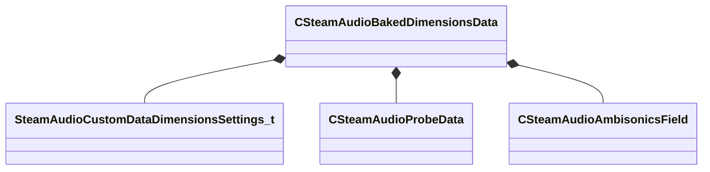

[Schemas](../../schemas.md) / [steamaudio](../steamaudio.md) / CSteamAudioBakedDimensionsData

# CSteamAudioBakedDimensionsData

> Source: **Build 25000182** · 2026-08-28 · `windows-x86_64` · schema `0.10.0`

**Kind:** class · **Size:** 296 bytes (`0x128`) · **Align:** 8 · **Module:** steamaudio

**Relationships:**

## Memory layout

7 fields (7 declared here, 0 inherited). Offsets are absolute from the object base.

| Offset | Field | Type | From | Annotations |
|--------|-------|------|------|-------------|
| `0x0` | `m_settings` | [SteamAudioCustomDataDimensionsSettings_t](../steamaudio/SteamAudioCustomDataDimensionsSettings_t.md) |  |  |
| `0x18` | `m_probes` | [CSteamAudioProbeData](../steamaudio/CSteamAudioProbeData.md) |  |  |
| `0x20` | `m_vecInOut` | CUtlVector< float32 > |  |  |
| `0x38` | `m_vecSize` | CUtlVector< float32 > |  |  |
| `0x50` | `m_vecOutsideField` | CUtlVector< [CSteamAudioAmbisonicsField](../steamaudio/CSteamAudioAmbisonicsField.md) > |  |  |
| `0x68` | `m_vecInsideSmallSizeField` | CUtlVector< [CSteamAudioAmbisonicsField](../steamaudio/CSteamAudioAmbisonicsField.md) > |  |  |
| `0x80` | `m_movables` | CSteamAudioMovableBakedData< [CSteamAudioBakedDimensionsData](../steamaudio/CSteamAudioBakedDimensionsData.md) > |  |  |

KV3 class defaults

<pre>{
	&quot;m_settings&quot;:
	{
		&quot;m_nAmbisonicsOrderOutsideField&quot;: 0,
		&quot;m_nAmbisonicsOrderInsideSizeField&quot;: 0,
		&quot;m_flOutsideThreshold&quot;: 0.000000,
		&quot;m_flSizeThreshold&quot;: 0.000000,
		&quot;m_flInsideThreshold&quot;: 0.000000
	},
	&quot;m_probes&quot;:
	{
	},
	&quot;m_vecInOut&quot;:
	[
	],
	&quot;m_vecSize&quot;:
	[
	],
	&quot;m_vecOutsideField&quot;:
	[
	],
	&quot;m_vecInsideSmallSizeField&quot;:
	[
	],
	&quot;m_movables&quot;:
	{
		&quot;m_vecData&quot;:
		[
		],
		&quot;m_vecInitialTransforms&quot;:
		[
		],
		&quot;m_vecAABBs&quot;:
		[
		],
		&quot;m_vecKeys&quot;:
		[
		]
	}
}</pre>

