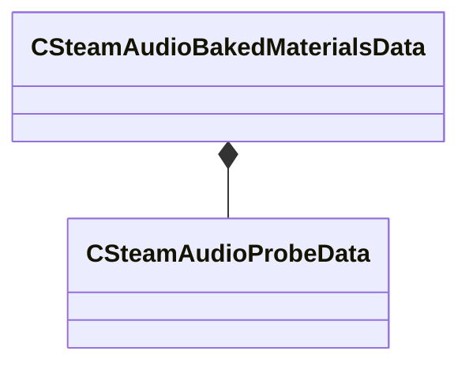

[Schemas](../../schemas.md) / [steamaudio](../steamaudio.md) / CSteamAudioBakedMaterialsData

# CSteamAudioBakedMaterialsData

**Kind:** class · **Size:** 56 bytes (`0x38`) · **Align:** 8 · **Module:** steamaudio

**Relationships:**

## Memory layout

3 fields (3 declared here, 0 inherited). Offsets are absolute from the object base.

| Offset | Field | Type | From | Annotations |
|--------|-------|------|------|-------------|
| `0x0` | `m_probes` | [CSteamAudioProbeData](../steamaudio/CSteamAudioProbeData.md) |  |  |
| `0x8` | `m_vecMaterialTokens` | CUtlVector< uint32 > |  |  |
| `0x20` | `m_vecMaterialWeights` | CUtlVector< float32 > |  |  |

KV3 class defaults

<pre>{
	&quot;m_probes&quot;:
	{
	},
	&quot;m_vecMaterialTokens&quot;:
	[
	],
	&quot;m_vecMaterialWeights&quot;:
	[
	]
}</pre>

