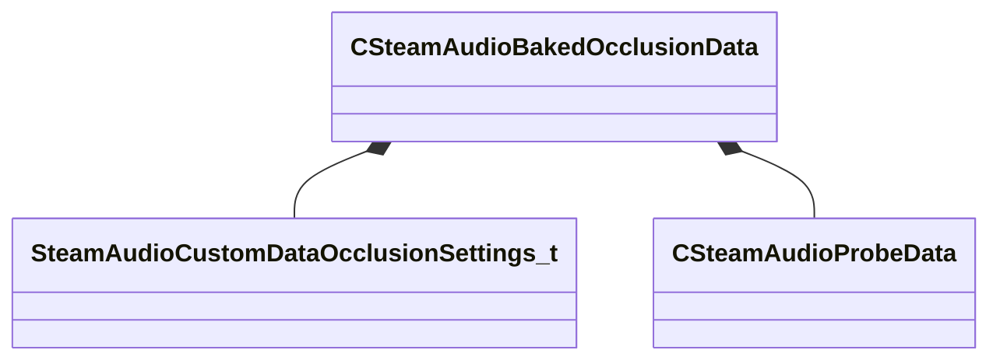

[Schemas](../../schemas.md) / [steamaudio](../steamaudio.md) / CSteamAudioBakedOcclusionData

# CSteamAudioBakedOcclusionData

**Kind:** class · **Size:** 96 bytes (`0x60`) · **Align:** 8 · **Module:** steamaudio

**Relationships:**

## Memory layout

5 fields (5 declared here, 0 inherited). Offsets are absolute from the object base.

| Offset | Field | Type | From | Annotations |
|--------|-------|------|------|-------------|
| `0x0` | `m_settings` | [SteamAudioCustomDataOcclusionSettings_t](../steamaudio/SteamAudioCustomDataOcclusionSettings_t.md) |  |  |
| `0x10` | `m_probes` | [CSteamAudioProbeData](../steamaudio/CSteamAudioProbeData.md) |  |  |
| `0x18` | `m_vecPathingRatio` | CUtlVector< float32 > |  |  |
| `0x30` | `m_vecPathingDeviation` | CUtlVector< float32 > |  |  |
| `0x48` | `m_vecReflectionEnergy` | CUtlVector< float32 > |  |  |

KV3 class defaults

<pre>{
	&quot;m_settings&quot;:
	{
		&quot;m_bEnablePathing&quot;: false,
		&quot;m_bEnableReflections&quot;: false,
		&quot;m_nReflectionRays&quot;: 0,
		&quot;m_nReflectionBounces&quot;: 0
	},
	&quot;m_probes&quot;:
	{
	},
	&quot;m_vecPathingRatio&quot;:
	[
	],
	&quot;m_vecPathingDeviation&quot;:
	[
	],
	&quot;m_vecReflectionEnergy&quot;:
	[
	]
}</pre>

