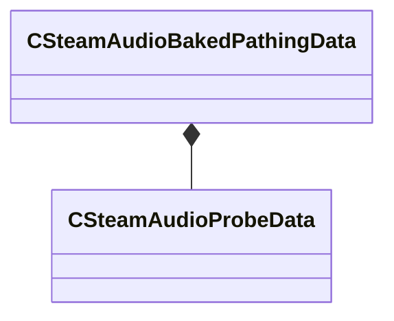

[Schemas](../../schemas.md) / [steamaudio](../steamaudio.md) / CSteamAudioBakedPathingData

# CSteamAudioBakedPathingData

**Kind:** class · **Size:** 184 bytes (`0xb8`) · **Align:** 8 · **Module:** steamaudio

**Relationships:**

## Memory layout

3 fields (3 declared here, 0 inherited). Offsets are absolute from the object base.

| Offset | Field | Type | From | Annotations |
|--------|-------|------|------|-------------|
| `0x0` | `m_nBands` | int32 |  |  |
| `0x8` | `m_probes` | [CSteamAudioProbeData](../steamaudio/CSteamAudioProbeData.md) |  |  |
| `0x10` | `m_movables` | CSteamAudioMovableBakedData< [CSteamAudioBakedPathingData](../steamaudio/CSteamAudioBakedPathingData.md) > |  |  |

KV3 class defaults

<pre>{
	&quot;m_nBands&quot;: 3,
	&quot;m_probes&quot;:
	{
	},
	&quot;m_movables&quot;:
	{
		&quot;m_vecData&quot;:
		[
		],
		&quot;m_vecInitialTransforms&quot;:
		[
		],
		&quot;m_vecAABBs&quot;:
		[
		],
		&quot;m_vecKeys&quot;:
		[
		]
	}
}</pre>

