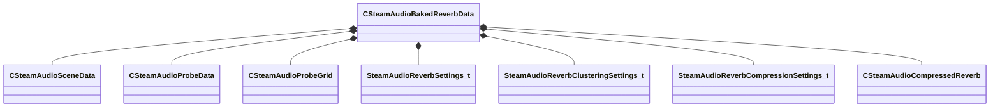

[Schemas](../../schemas.md) / [steamaudio](../steamaudio.md) / CSteamAudioBakedReverbData

# CSteamAudioBakedReverbData

> Source: **Build 25000182** · 2026-08-28 · `windows-x86_64` · schema `0.10.0`

**Kind:** class · **Size:** 552 bytes (`0x228`) · **Align:** 8 · **Module:** steamaudio

**Relationships:**

## Memory layout

12 fields (12 declared here, 0 inherited). Offsets are absolute from the object base.

| Offset | Field | Type | From | Annotations |
|--------|-------|------|------|-------------|
| `0x0` | `m_nBands` | int32 |  |  |
| `0x8` | `m_scene` | [CSteamAudioSceneData](../steamaudio/CSteamAudioSceneData.md) |  |  |
| `0x18` | `m_probes` | [CSteamAudioProbeData](../steamaudio/CSteamAudioProbeData.md) |  |  |
| `0x20` | `m_grid` | [CSteamAudioProbeGrid](../steamaudio/CSteamAudioProbeGrid.md) |  |  |
| `0x78` | `m_reverbSettings` | [SteamAudioReverbSettings_t](../steamaudio/SteamAudioReverbSettings_t.md) |  |  |
| `0x8c` | `m_reverbClusteringSettings` | [SteamAudioReverbClusteringSettings_t](../steamaudio/SteamAudioReverbClusteringSettings_t.md) |  |  |
| `0x98` | `m_reverbCompressionSettings` | [SteamAudioReverbCompressionSettings_t](../steamaudio/SteamAudioReverbCompressionSettings_t.md) |  |  |
| `0xa0` | `m_clusteredProbes` | [CSteamAudioProbeData](../steamaudio/CSteamAudioProbeData.md) |  |  |
| `0xa8` | `m_vecClusterForProbe` | CUtlVector< int16 > |  |  |
| `0xc0` | `m_compressedData` | [CSteamAudioCompressedReverb](../steamaudio/CSteamAudioCompressedReverb.md) |  |  |
| `0x120` | `m_compressedClusteredData` | [CSteamAudioCompressedReverb](../steamaudio/CSteamAudioCompressedReverb.md) |  |  |
| `0x180` | `m_movables` | CSteamAudioMovableBakedData< [CSteamAudioBakedReverbData](../steamaudio/CSteamAudioBakedReverbData.md) > |  |  |

KV3 class defaults

<pre>{
	&quot;m_nBands&quot;: 3,
	&quot;m_scene&quot;:
	{
	},
	&quot;m_grid&quot;:
	{
		&quot;m_aabb&quot;:
		{
			&quot;m_vMinBounds&quot;:
			[
				0.000000,
				0.000000,
				0.000000
			],
			&quot;m_vMaxBounds&quot;:
			[
				0.000000,
				0.000000,
				0.000000
			]
		},
		&quot;m_flSpacing&quot;: 0.000000,
		&quot;m_nx&quot;: 0,
		&quot;m_ny&quot;: 0,
		&quot;m_nz&quot;: 0,
		&quot;m_vecLineSegments&quot;:
		[
		],
		&quot;m_vecProbes&quot;:
		[
		]
	},
	&quot;m_reverbSettings&quot;:
	{
		&quot;m_nNumRays&quot;: 0,
		&quot;m_nNumBounces&quot;: 0,
		&quot;m_flIRDuration&quot;: 0.000000,
		&quot;m_nAmbisonicsOrder&quot;: 0,
		&quot;m_bExportScene&quot;: false
	},
	&quot;m_reverbClusteringSettings&quot;:
	{
		&quot;m_bEnableClustering&quot;: false,
		&quot;m_nCubeMapResolution&quot;: 0,
		&quot;m_flDepthThreshold&quot;: 0.000000
	},
	&quot;m_reverbCompressionSettings&quot;:
	{
		&quot;m_bEnableCompression&quot;: false,
		&quot;m_flQuality&quot;: 0.950000
	},
	&quot;m_vecClusterForProbe&quot;:
	[
	],
	&quot;m_compressedData&quot;:
	{
		&quot;m_nChannels&quot;: 0,
		&quot;m_nBands&quot;: 0,
		&quot;m_nBins&quot;: 0,
		&quot;m_nProbes&quot;: 0,
		&quot;m_vecNumSingularValues&quot;:
		[
		],
		&quot;m_vecDictionary&quot;:
		[
		],
		&quot;m_vecCompressedData&quot;:
		[
		]
	},
	&quot;m_compressedClusteredData&quot;:
	{
		&quot;m_nChannels&quot;: 0,
		&quot;m_nBands&quot;: 0,
		&quot;m_nBins&quot;: 0,
		&quot;m_nProbes&quot;: 0,
		&quot;m_vecNumSingularValues&quot;:
		[
		],
		&quot;m_vecDictionary&quot;:
		[
		],
		&quot;m_vecCompressedData&quot;:
		[
		]
	},
	&quot;m_movables&quot;:
	{
		&quot;m_vecData&quot;:
		[
		],
		&quot;m_vecInitialTransforms&quot;:
		[
		],
		&quot;m_vecAABBs&quot;:
		[
		],
		&quot;m_vecKeys&quot;:
		[
		]
	}
}</pre>

