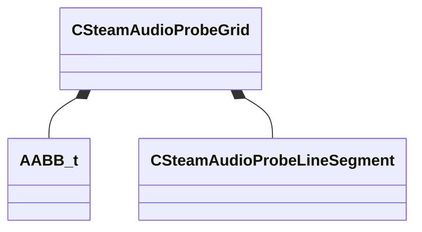

[Schemas](../../schemas.md) / [steamaudio](../steamaudio.md) / CSteamAudioProbeGrid

# CSteamAudioProbeGrid

> Source: **Build 25000182** · 2026-08-28 · `windows-x86_64` · schema `0.10.0`

**Kind:** class · **Size:** 88 bytes (`0x58`) · **Align:** 8 · **Module:** steamaudio

**Relationships:**

## Memory layout

7 fields (7 declared here, 0 inherited). Offsets are absolute from the object base.

| Offset | Field | Type | From | Annotations |
|--------|-------|------|------|-------------|
| `0x0` | `m_aabb` | [AABB_t](../mathlib_extended/AABB_t.md) |  |  |
| `0x18` | `m_flSpacing` | float32 |  |  |
| `0x1c` | `m_nx` | int32 |  |  |
| `0x20` | `m_ny` | int32 |  |  |
| `0x24` | `m_nz` | int32 |  |  |
| `0x28` | `m_vecLineSegments` | CUtlVector< [CSteamAudioProbeLineSegment](../steamaudio/CSteamAudioProbeLineSegment.md) > |  |  |
| `0x40` | `m_vecProbes` | CUtlVector< Vector > |  |  |

KV3 class defaults

<pre>{
	&quot;m_aabb&quot;:
	{
		&quot;m_vMinBounds&quot;:
		[
			0.000000,
			0.000000,
			0.000000
		],
		&quot;m_vMaxBounds&quot;:
		[
			0.000000,
			0.000000,
			0.000000
		]
	},
	&quot;m_flSpacing&quot;: 0.000000,
	&quot;m_nx&quot;: 0,
	&quot;m_ny&quot;: 0,
	&quot;m_nz&quot;: 0,
	&quot;m_vecLineSegments&quot;:
	[
	],
	&quot;m_vecProbes&quot;:
	[
	]
}</pre>

