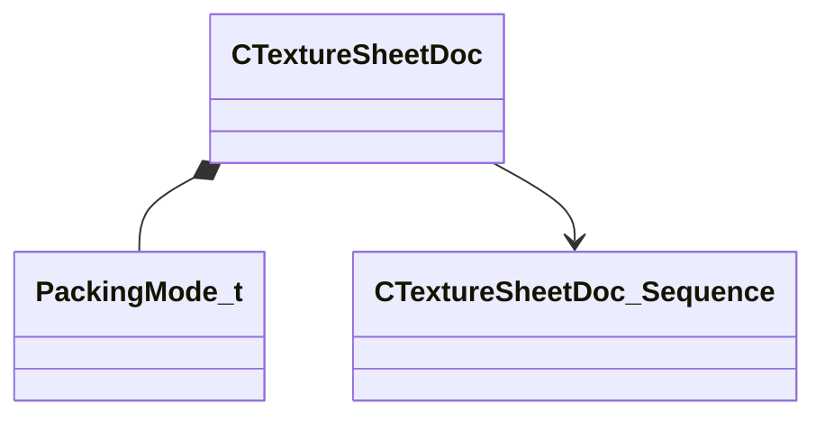
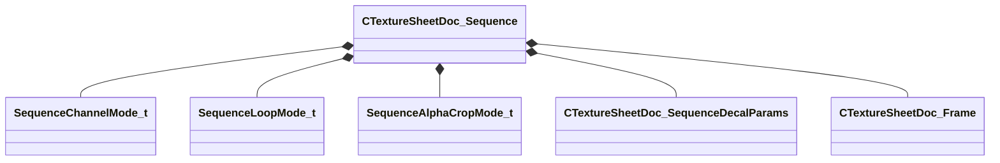
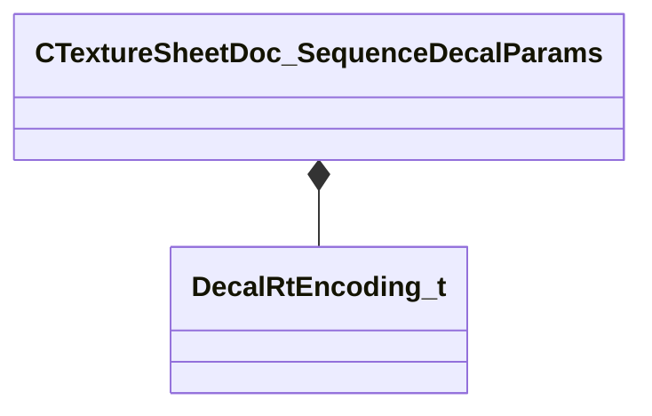

# Module: texturelib

[📊 View UML Diagram](../diagrams/texturelib.md)

| Name | Kind | Bases | Fields |
|------|------|-------|--------|
| [AlphaCropAxis_t](#alphacropaxis_t) | enum |  | 3 |
| [CTextureSheetDoc](#ctexturesheetdoc) | class |  | 5 |
| [CTextureSheetDoc_Frame](#ctexturesheetdoc_frame) | class |  | 7 |
| [CTextureSheetDoc_Sequence](#ctexturesheetdoc_sequence) | class |  | 5 |
| [CTextureSheetDoc_SequenceDecalParams](#ctexturesheetdoc_sequencedecalparams) | class |  | 9 |
| [PackingMode_t](#packingmode_t) | enum |  | 3 |
| [SeqMode_t](#seqmode_t) | enum |  | 4 |
| [SequenceAlphaCropMode_t](#sequencealphacropmode_t) | enum |  | 4 |
| [SequenceChannelMode_t](#sequencechannelmode_t) | enum |  | 3 |
| [SequenceLoopMode_t](#sequenceloopmode_t) | enum |  | 3 |

---

### AlphaCropAxis_t

**Values:**

| Name | Value | Description |
|------|-------|-------------|
| `ALPHACROP_UV` | 0 |  |
| `ALPHACROP_U` | 1 |  |
| `ALPHACROP_V` | 2 |  |

### CTextureSheetDoc

**Metadata:** `MGetKV3ClassDefaults {
	"m_ePackingMode": "PCKM_FLAT",
	"m_NumMips": 2,
	"m_bHasDecalParams": false,
	"m_sLayoutOwnerSheet": "",
	"m_Sequences":
	{
	},
	"generic_data_type": "CTextureSheetDoc"
}`, `MVDataRoot`, `MVDataSingleton`, `MVDataPreviewWidget "sheet_file_preview"`, `MVDataFileExtension "mks"`

**Relationships:**

**Fields:**

| Name | Type | Annotations |
|------|------|-------------|
| `m_ePackingMode` | [PackingMode_t](../schemas/texturelib.md#packingmode_t) |  |
| `m_NumMips` | int32 |  |
| `m_bHasDecalParams` | bool | `MPropertySuppressExpr "m_sLayoutOwnerSheet != "" "` |
| `m_sLayoutOwnerSheet` | CUtlString | `MPropertyAttributeEditor "AssetBrowse( mks )"` |
| `m_Sequences` | CUtlStringMap<[CTextureSheetDoc_Sequence](../schemas/texturelib.md#ctexturesheetdoc_sequence)*> | `MVDataPromoteField 1` |

### CTextureSheetDoc_Frame

**Metadata:** `MGetKV3ClassDefaults {
	"m_sImageName": "",
	"m_fDisplayTime": 1.000000,
	"m_bCropEnabled": false,
	"m_srcCropXStart": -1,
	"m_srcCropYStart": -1,
	"m_srcCropXEnd": -1,
	"m_srcCropYEnd": -1
}`, `MPropertyAutoExpandSelf`, `MPropertyCustomEditor "SheetSequenceFrame"`

**Fields:**

| Name | Type | Annotations |
|------|------|-------------|
| `m_sImageName` | CUtlString |  |
| `m_fDisplayTime` | float32 |  |
| `m_bCropEnabled` | bool |  |
| `m_srcCropXStart` | int32 |  |
| `m_srcCropYStart` | int32 |  |
| `m_srcCropXEnd` | int32 |  |
| `m_srcCropYEnd` | int32 |  |

### CTextureSheetDoc_Sequence

**Metadata:** `MGetKV3ClassDefaults {
	"m_ChannelMode": "RGBA",
	"m_LoopMode": "CLAMP",
	"m_AlphaCropMode": "NONE",
	"m_DecalParams":
	{
		"m_flScale": 1.000000,
		"m_flDepth": 4.000000,
		"m_flScaleVariation": 0.250000,
		"m_flStartFadeTime": 10.000000,
		"m_flFadeDuration": 3.000000,
		"m_flAnimationScale": 1.000000,
		"m_flAnimationStartTime": 0.000000,
		"m_flAlignWithGravityFactor": 0.000000,
		"m_nDecalRtEncoding": "kDecalInvalid"
	},
	"m_Frames":
	[
	]
}`

**Relationships:**

**Fields:**

| Name | Type | Annotations |
|------|------|-------------|
| `m_ChannelMode` | [SequenceChannelMode_t](../schemas/texturelib.md#sequencechannelmode_t) | `MPropertyAutoRebuildOnChange` |
| `m_LoopMode` | [SequenceLoopMode_t](../schemas/texturelib.md#sequenceloopmode_t) |  |
| `m_AlphaCropMode` | [SequenceAlphaCropMode_t](../schemas/texturelib.md#sequencealphacropmode_t) |  |
| `m_DecalParams` | [CTextureSheetDoc_SequenceDecalParams](../schemas/texturelib.md#ctexturesheetdoc_sequencedecalparams) | `MPropertySuppressExpr "!__SheetFileHasDecalParams"` |
| `m_Frames` | CUtlVector<[CTextureSheetDoc_Frame](../schemas/texturelib.md#ctexturesheetdoc_frame)> | `MPropertyAutoExpandSelf` |

### CTextureSheetDoc_SequenceDecalParams

**Metadata:** `MGetKV3ClassDefaults {
	"m_flScale": 1.000000,
	"m_flDepth": 4.000000,
	"m_flScaleVariation": 0.250000,
	"m_flStartFadeTime": 10.000000,
	"m_flFadeDuration": 3.000000,
	"m_flAnimationScale": 1.000000,
	"m_flAnimationStartTime": 0.000000,
	"m_flAlignWithGravityFactor": 0.000000,
	"m_nDecalRtEncoding": "kDecalInvalid"
}`, `MPropertyAutoExpandSelf`

**Relationships:**

**Fields:**

| Name | Type | Annotations |
|------|------|-------------|
| `m_flScale` | float32 |  |
| `m_flDepth` | float32 |  |
| `m_flScaleVariation` | float32 |  |
| `m_flStartFadeTime` | float32 |  |
| `m_flFadeDuration` | float32 |  |
| `m_flAnimationScale` | float32 |  |
| `m_flAnimationStartTime` | float32 |  |
| `m_flAlignWithGravityFactor` | float32 |  |
| `m_nDecalRtEncoding` | [DecalRtEncoding_t](../schemas/client.md#decalrtencoding_t) |  |

### PackingMode_t

**Values:**

| Name | Value | Description |
|------|-------|-------------|
| `PCKM_INVALID` | 0 |  |
| `PCKM_FLAT` | 1 |  |
| `PCKM_RGB_A` | 2 |  |

### SeqMode_t

**Values:**

| Name | Value | Description |
|------|-------|-------------|
| `SQM_RGBA` | 0 |  |
| `SQM_RGB` | 1 |  |
| `SQM_ALPHA` | 2 |  |
| `SQM_ALPHA_INVALID` | 3 |  |

### SequenceAlphaCropMode_t

**Values:**

| Name | Value | Description |
|------|-------|-------------|
| `NONE` | 0 |  |
| `UV` | 1 |  |
| `U` | 2 |  |
| `V` | 3 |  |

### SequenceChannelMode_t

**Values:**

| Name | Value | Description |
|------|-------|-------------|
| `RGBA` | 0 |  |
| `RGB` | 1 |  |
| `ALPHA` | 2 |  |

### SequenceLoopMode_t

**Values:**

| Name | Value | Description |
|------|-------|-------------|
| `CLAMP` | 0 |  |
| `LOOP` | 1 |  |
| `CLAMP_EXTEND` | 2 |  |
