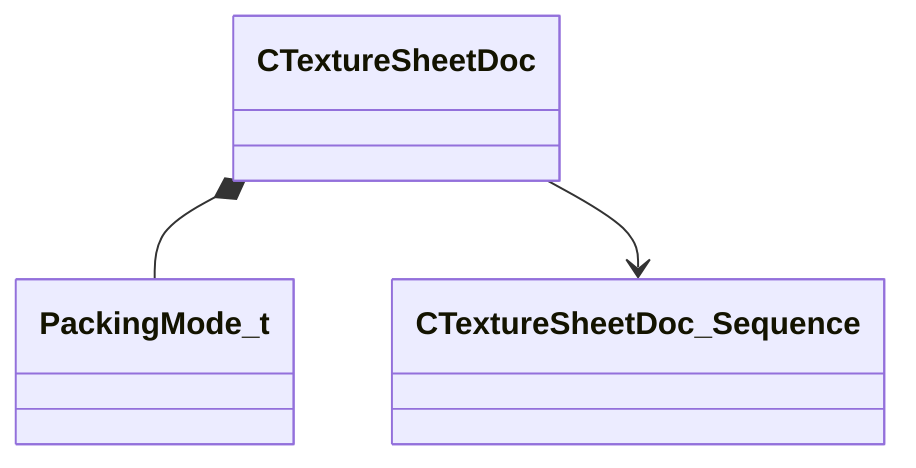
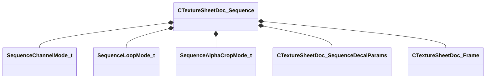
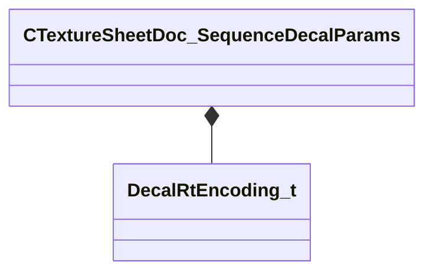

# Module: texturelib

[📊 View UML Diagram](../diagrams/texturelib.md)

| Name | Kind | Bases | Fields |
|------|------|-------|--------|
| [CTextureSheetDoc](#ctexturesheetdoc) | class |  | 5 |
| [CTextureSheetDoc_Frame](#ctexturesheetdoc_frame) | class |  | 7 |
| [CTextureSheetDoc_Sequence](#ctexturesheetdoc_sequence) | class |  | 5 |
| [CTextureSheetDoc_SequenceDecalParams](#ctexturesheetdoc_sequencedecalparams) | class |  | 9 |

---

### CTextureSheetDoc

**Metadata:** `MGetKV3ClassDefaults`, `MVDataFileExtension`, `MVDataPreviewWidget`, `MVDataRoot`, `MVDataSingleton`

**Relationships:**

```mermaid
classDiagram
    CTextureSheetDoc *-- PackingMode_t
    CTextureSheetDoc --> CTextureSheetDoc_Sequence
```

**Fields:**

| Name | Type | Annotations |
|------|------|-------------|
| `m_ePackingMode` | [PackingMode_t](../schemas/!GlobalTypes.md#packingmode_t) |  |
| `m_NumMips` | int32 |  |
| `m_bHasDecalParams` | bool | `MPropertySuppressExpr` |
| `m_sLayoutOwnerSheet` | CUtlString | `MPropertyAttributeEditor AssetBrowse( mks )` |
| `m_Sequences` | CUtlStringMap< [CTextureSheetDoc_Sequence](../schemas/texturelib.md#ctexturesheetdoc_sequence)* > | `MVDataPromoteField` |

### CTextureSheetDoc_Frame

**Metadata:** `MGetKV3ClassDefaults`, `MPropertyAutoExpandSelf`, `MPropertyCustomEditor SheetSequenceFrame`

**Fields:**

| Name | Type | Annotations |
|------|------|-------------|
| `m_sImageName` | CUtlString |  |
| `m_fDisplayTime` | float32 |  |
| `m_bCropEnabled` | bool |  |
| `m_srcCropXStart` | int32 |  |
| `m_srcCropYStart` | int32 |  |
| `m_srcCropXEnd` | int32 |  |
| `m_srcCropYEnd` | int32 |  |

### CTextureSheetDoc_Sequence

**Metadata:** `MGetKV3ClassDefaults`

**Relationships:**

```mermaid
classDiagram
    CTextureSheetDoc_Sequence *-- SequenceChannelMode_t
    CTextureSheetDoc_Sequence *-- SequenceLoopMode_t
    CTextureSheetDoc_Sequence *-- SequenceAlphaCropMode_t
    CTextureSheetDoc_Sequence *-- CTextureSheetDoc_SequenceDecalParams
    CTextureSheetDoc_Sequence *-- CTextureSheetDoc_Frame
```

**Fields:**

| Name | Type | Annotations |
|------|------|-------------|
| `m_ChannelMode` | [SequenceChannelMode_t](../schemas/!GlobalTypes.md#sequencechannelmode_t) | `MPropertyAutoRebuildOnChange` |
| `m_LoopMode` | [SequenceLoopMode_t](../schemas/!GlobalTypes.md#sequenceloopmode_t) |  |
| `m_AlphaCropMode` | [SequenceAlphaCropMode_t](../schemas/!GlobalTypes.md#sequencealphacropmode_t) |  |
| `m_DecalParams` | [CTextureSheetDoc_SequenceDecalParams](../schemas/texturelib.md#ctexturesheetdoc_sequencedecalparams) | `MPropertySuppressExpr` |
| `m_Frames` | CUtlVector< [CTextureSheetDoc_Frame](../schemas/texturelib.md#ctexturesheetdoc_frame) > | `MPropertyAutoExpandSelf` |

### CTextureSheetDoc_SequenceDecalParams

**Metadata:** `MGetKV3ClassDefaults`, `MPropertyAutoExpandSelf`

**Relationships:**

```mermaid
classDiagram
    CTextureSheetDoc_SequenceDecalParams *-- DecalRtEncoding_t
```

**Fields:**

| Name | Type | Annotations |
|------|------|-------------|
| `m_flScale` | float32 |  |
| `m_flDepth` | float32 |  |
| `m_flScaleVariation` | float32 |  |
| `m_flStartFadeTime` | float32 |  |
| `m_flFadeDuration` | float32 |  |
| `m_flAnimationScale` | float32 |  |
| `m_flAnimationStartTime` | float32 |  |
| `m_flAlignWithGravityFactor` | float32 |  |
| `m_nDecalRtEncoding` | [DecalRtEncoding_t](../schemas/!GlobalTypes.md#decalrtencoding_t) |  |
