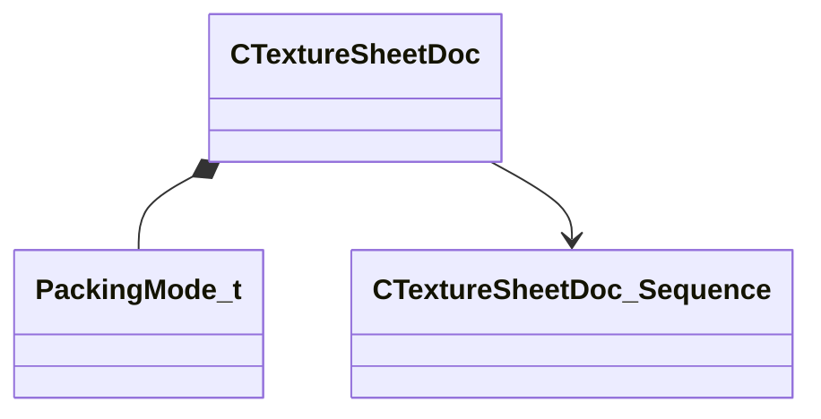

[Schemas](../../schemas.md) / [texturelib](../texturelib.md) / CTextureSheetDoc

# CTextureSheetDoc

> Source: **Build 25000182** · 2026-08-28 · `windows-x86_64` · schema `0.10.0`

**Kind:** class · **Size:** 144 bytes (`0x90`) · **Align:** 8 · **Module:** texturelib

**Metadata:** `MVDataFileExtension mks`, `MVDataPreviewWidget sheet_file_preview`, `MVDataRoot`, `MVDataSingleton`

**Relationships:**

## Memory layout

5 fields (5 declared here, 0 inherited). Offsets are absolute from the object base.

| Offset | Field | Type | From | Annotations |
|--------|-------|------|------|-------------|
| `0x0` | `m_ePackingMode` | [PackingMode_t](../texturelib/PackingMode_t.md) |  |  |
| `0x4` | `m_NumMips` | int32 |  |  |
| `0x8` | `m_bHasDecalParams` | bool |  | `MPropertySuppressExpr m_sLayoutOwnerSheet != ""` |
| `0x10` | `m_sLayoutOwnerSheet` | CUtlString |  | `MPropertyAttributeEditor AssetBrowse( mks )` |
| `0x18` | `m_Sequences` | CUtlStringMap< [CTextureSheetDoc_Sequence](../texturelib/CTextureSheetDoc_Sequence.md)* > |  | `MVDataPromoteField 1` |

KV3 class defaults

<pre>{
	&quot;m_ePackingMode&quot;: &quot;PCKM_FLAT&quot;,
	&quot;m_NumMips&quot;: 2,
	&quot;m_bHasDecalParams&quot;: false,
	&quot;m_sLayoutOwnerSheet&quot;: &quot;&quot;,
	&quot;m_Sequences&quot;:
	{
	},
	&quot;generic_data_type&quot;: &quot;CTextureSheetDoc&quot;
}</pre>

