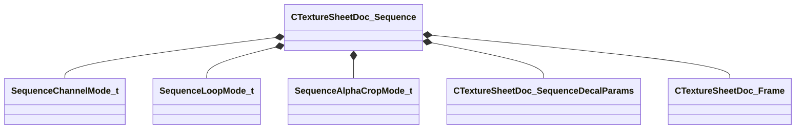

[Schemas](../../schemas.md) / [texturelib](../texturelib.md) / CTextureSheetDoc_Sequence

# CTextureSheetDoc_Sequence

> Source: **Build 25000182** · 2026-08-28 · `windows-x86_64` · schema `0.10.0`

**Kind:** class · **Size:** 72 bytes (`0x48`) · **Align:** 8 · **Module:** texturelib

**Relationships:**

## Memory layout

5 fields (5 declared here, 0 inherited). Offsets are absolute from the object base.

| Offset | Field | Type | From | Annotations |
|--------|-------|------|------|-------------|
| `0x0` | `m_ChannelMode` | [SequenceChannelMode_t](../texturelib/SequenceChannelMode_t.md) |  | `MPropertyAutoRebuildOnChange` |
| `0x4` | `m_LoopMode` | [SequenceLoopMode_t](../texturelib/SequenceLoopMode_t.md) |  |  |
| `0x8` | `m_AlphaCropMode` | [SequenceAlphaCropMode_t](../texturelib/SequenceAlphaCropMode_t.md) |  |  |
| `0xc` | `m_DecalParams` | [CTextureSheetDoc_SequenceDecalParams](../texturelib/CTextureSheetDoc_SequenceDecalParams.md) |  | `MPropertySuppressExpr !__SheetFileHasDecalParams` |
| `0x30` | `m_Frames` | CUtlVector< [CTextureSheetDoc_Frame](../texturelib/CTextureSheetDoc_Frame.md) > |  | `MPropertyAutoExpandSelf` |

KV3 class defaults

<pre>{
	&quot;m_ChannelMode&quot;: &quot;RGBA&quot;,
	&quot;m_LoopMode&quot;: &quot;CLAMP&quot;,
	&quot;m_AlphaCropMode&quot;: &quot;NONE&quot;,
	&quot;m_DecalParams&quot;:
	{
		&quot;m_flScale&quot;: 1.000000,
		&quot;m_flDepth&quot;: 4.000000,
		&quot;m_flScaleVariation&quot;: 0.250000,
		&quot;m_flStartFadeTime&quot;: 10.000000,
		&quot;m_flFadeDuration&quot;: 3.000000,
		&quot;m_flAnimationScale&quot;: 1.000000,
		&quot;m_flAnimationStartTime&quot;: 0.000000,
		&quot;m_flAlignWithGravityFactor&quot;: 0.000000,
		&quot;m_nDecalRtEncoding&quot;: &quot;kDecalInvalid&quot;
	},
	&quot;m_Frames&quot;:
	[
	]
}</pre>

