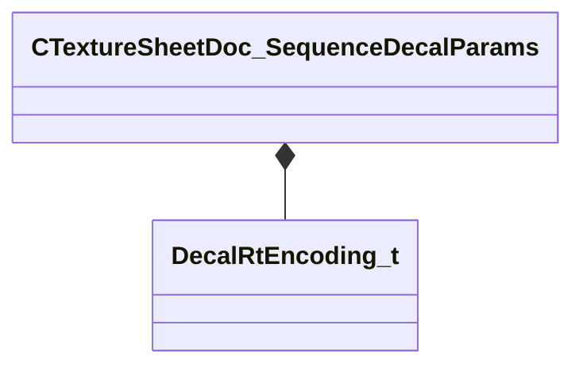

[Schemas](../../schemas.md) / [texturelib](../texturelib.md) / CTextureSheetDoc_SequenceDecalParams

# CTextureSheetDoc_SequenceDecalParams

> Source: **Build 25000182** · 2026-08-28 · `windows-x86_64` · schema `0.10.0`

**Kind:** class · **Size:** 36 bytes (`0x24`) · **Align:** 4 · **Module:** texturelib

**Metadata:** `MPropertyAutoExpandSelf`

**Relationships:**

## Memory layout

9 fields (9 declared here, 0 inherited). Offsets are absolute from the object base.

| Offset | Field | Type | From | Annotations |
|--------|-------|------|------|-------------|
| `0x0` | `m_flScale` | float32 |  |  |
| `0x4` | `m_flDepth` | float32 |  |  |
| `0x8` | `m_flScaleVariation` | float32 |  |  |
| `0xc` | `m_flStartFadeTime` | float32 |  |  |
| `0x10` | `m_flFadeDuration` | float32 |  |  |
| `0x14` | `m_flAnimationScale` | float32 |  |  |
| `0x18` | `m_flAnimationStartTime` | float32 |  |  |
| `0x1c` | `m_flAlignWithGravityFactor` | float32 |  |  |
| `0x20` | `m_nDecalRtEncoding` | [DecalRtEncoding_t](../scenesystem/DecalRtEncoding_t.md) |  |  |

KV3 class defaults

<pre>{
	&quot;m_flScale&quot;: 1.000000,
	&quot;m_flDepth&quot;: 4.000000,
	&quot;m_flScaleVariation&quot;: 0.250000,
	&quot;m_flStartFadeTime&quot;: 10.000000,
	&quot;m_flFadeDuration&quot;: 3.000000,
	&quot;m_flAnimationScale&quot;: 1.000000,
	&quot;m_flAnimationStartTime&quot;: 0.000000,
	&quot;m_flAlignWithGravityFactor&quot;: 0.000000,
	&quot;m_nDecalRtEncoding&quot;: &quot;kDecalInvalid&quot;
}</pre>

