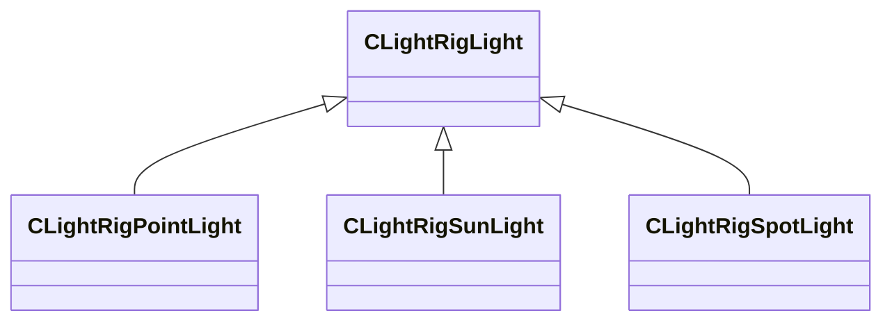
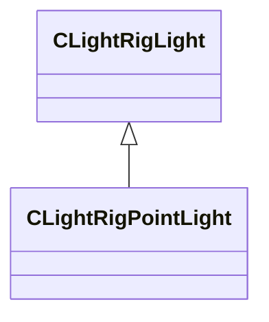
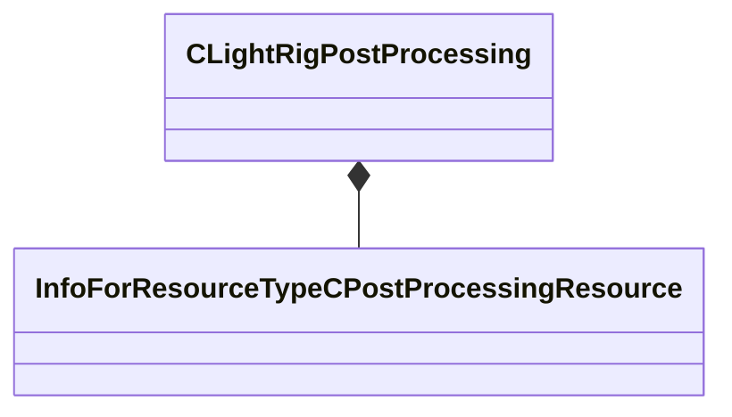
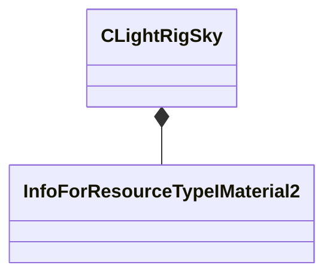
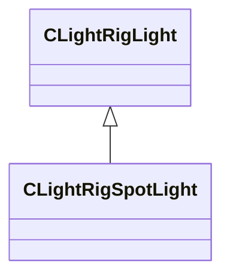
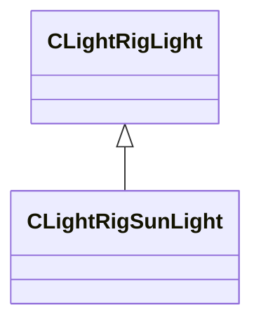
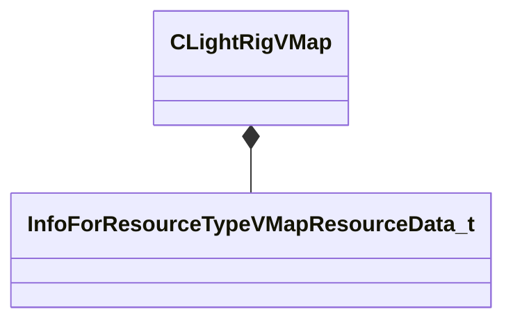
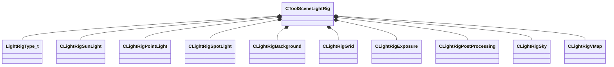

# Module: toolscene

[📊 View UML Diagram](../diagrams/toolscene.md)

| Name | Kind | Bases | Fields |
|------|------|-------|--------|
| [CLightRigBackground](#clightrigbackground) | class |  | 2 |
| [CLightRigExposure](#clightrigexposure) | class |  | 3 |
| [CLightRigGrid](#clightriggrid) | class |  | 2 |
| [CLightRigLight](#clightriglight) | class |  | 11 |
| [CLightRigPointLight](#clightrigpointlight) | class | CLightRigLight | 0 |
| [CLightRigPostProcessing](#clightrigpostprocessing) | class |  | 1 |
| [CLightRigSky](#clightrigsky) | class |  | 1 |
| [CLightRigSpotLight](#clightrigspotlight) | class | CLightRigLight | 3 |
| [CLightRigSunLight](#clightrigsunlight) | class | CLightRigLight | 5 |
| [CLightRigVMap](#clightrigvmap) | class |  | 3 |
| [CToolSceneLightRig](#ctoolscenelightrig) | class |  | 10 |
| [LightRigType_t](#lightrigtype_t) | enum |  | 4 |

---

### CLightRigBackground

**Metadata:** `MGetKV3ClassDefaults {
	"m_bEnabled": false,
	"m_Color":
	[
		0,
		0,
		0,
		0
	]
}`

**Fields:**

| Name | Type | Annotations |
|------|------|-------------|
| `m_bEnabled` | bool |  |
| `m_Color` | Color |  |

### CLightRigExposure

**Metadata:** `MGetKV3ClassDefaults {
	"m_bEnabled": false,
	"m_flMinEV": -2.000000,
	"m_flMaxEV": 2.000000
}`

**Fields:**

| Name | Type | Annotations |
|------|------|-------------|
| `m_bEnabled` | bool |  |
| `m_flMinEV` | float32 |  |
| `m_flMaxEV` | float32 |  |

### CLightRigGrid

**Metadata:** `MGetKV3ClassDefaults {
	"m_bEnabled": true,
	"m_Color":
	[
		0,
		0,
		0,
		0
	]
}`

**Fields:**

| Name | Type | Annotations |
|------|------|-------------|
| `m_bEnabled` | bool |  |
| `m_Color` | Color |  |

### CLightRigLight

**Derived by:** [CLightRigPointLight](toolscene.md#clightrigpointlight), [CLightRigSpotLight](toolscene.md#clightrigspotlight), [CLightRigSunLight](toolscene.md#clightrigsunlight)

**Metadata:** `MGetKV3ClassDefaults {
	"m_vPosition":
	[
		0.000000,
		0.000000,
		0.000000
	],
	"m_vDirection":
	[
		0.000000,
		0.000000,
		0.000000
	],
	"m_vLookAt":
	[
		0.000000,
		0.000000,
		0.000000
	],
	"m_Color":
	[
		255,
		255,
		255
	],
	"m_flAxisScale": 1.000000,
	"m_flRadius": 10000.000000,
	"m_flBrightness": 1.000000,
	"m_flLightSourceRadius": 0.000000,
	"m_flDistance": 1.500000,
	"m_bRelativePositioning": false,
	"m_bParentToCamera": false
}`

**Relationships:**

**Fields:**

| Name | Type | Annotations |
|------|------|-------------|
| `m_vPosition` | Vector |  |
| `m_vDirection` | Vector |  |
| `m_vLookAt` | Vector |  |
| `m_Color` | Color |  |
| `m_flAxisScale` | float32 |  |
| `m_flRadius` | float32 |  |
| `m_flBrightness` | float32 |  |
| `m_flLightSourceRadius` | float32 |  |
| `m_flDistance` | float32 |  |
| `m_bRelativePositioning` | bool |  |
| `m_bParentToCamera` | bool |  |

### CLightRigPointLight

**Inherits from:** [CLightRigLight](toolscene.md#clightriglight)

**Metadata:** `MGetKV3ClassDefaults {
	"m_vPosition":
	[
		0.000000,
		0.000000,
		0.000000
	],
	"m_vDirection":
	[
		0.000000,
		0.000000,
		0.000000
	],
	"m_vLookAt":
	[
		0.000000,
		0.000000,
		0.000000
	],
	"m_Color":
	[
		255,
		255,
		255
	],
	"m_flAxisScale": 1.000000,
	"m_flRadius": 10000.000000,
	"m_flBrightness": 1.000000,
	"m_flLightSourceRadius": 0.000000,
	"m_flDistance": 1.500000,
	"m_bRelativePositioning": false,
	"m_bParentToCamera": false
}`

**Relationships:**

### CLightRigPostProcessing

**Metadata:** `MGetKV3ClassDefaults {
	"m_hPostProcessing": ""
}`

**Relationships:**

**Fields:**

| Name | Type | Annotations |
|------|------|-------------|
| `m_hPostProcessing` | CStrongHandle<[InfoForResourceTypeCPostProcessingResource](../schemas/resourcesystem.md#infoforresourcetypecpostprocessingresource)> |  |

### CLightRigSky

**Metadata:** `MGetKV3ClassDefaults {
	"m_hSkyMaterial": ""
}`

**Relationships:**

**Fields:**

| Name | Type | Annotations |
|------|------|-------------|
| `m_hSkyMaterial` | CStrongHandle<[InfoForResourceTypeIMaterial2](../schemas/resourcesystem.md#infoforresourcetypeimaterial2)> |  |

### CLightRigSpotLight

**Inherits from:** [CLightRigLight](toolscene.md#clightriglight)

**Metadata:** `MGetKV3ClassDefaults {
	"m_vPosition":
	[
		0.000000,
		0.000000,
		0.000000
	],
	"m_vDirection":
	[
		0.000000,
		0.000000,
		0.000000
	],
	"m_vLookAt":
	[
		0.000000,
		0.000000,
		0.000000
	],
	"m_Color":
	[
		255,
		255,
		255
	],
	"m_flAxisScale": 1.000000,
	"m_flRadius": 10000.000000,
	"m_flBrightness": 1.000000,
	"m_flLightSourceRadius": 0.000000,
	"m_flDistance": 1.500000,
	"m_bRelativePositioning": false,
	"m_bParentToCamera": false,
	"m_flOuterConeAngle": 90.000000,
	"m_flInnerConeAngle": 45.000000,
	"m_bCastShadows": false
}`

**Relationships:**

**Fields:**

| Name | Type | Annotations |
|------|------|-------------|
| `m_flOuterConeAngle` | float32 |  |
| `m_flInnerConeAngle` | float32 |  |
| `m_bCastShadows` | bool |  |

### CLightRigSunLight

**Inherits from:** [CLightRigLight](toolscene.md#clightriglight)

**Metadata:** `MGetKV3ClassDefaults {
	"m_vPosition":
	[
		0.000000,
		0.000000,
		0.000000
	],
	"m_vDirection":
	[
		0.000000,
		0.000000,
		0.000000
	],
	"m_vLookAt":
	[
		0.000000,
		0.000000,
		0.000000
	],
	"m_Color":
	[
		255,
		255,
		255
	],
	"m_flAxisScale": 1.000000,
	"m_flRadius": 10000.000000,
	"m_flBrightness": 1.000000,
	"m_flLightSourceRadius": 0.000000,
	"m_flDistance": 1.500000,
	"m_bRelativePositioning": false,
	"m_bParentToCamera": false,
	"m_flShadowCascadeDistance0": 0.000000,
	"m_flShadowCascadeDistance1": 0.000000,
	"m_flShadowCascadeDistance2": 0.000000,
	"m_flShadowCascadeDistance3": 0.000000,
	"m_bCastShadows": false
}`

**Relationships:**

**Fields:**

| Name | Type | Annotations |
|------|------|-------------|
| `m_flShadowCascadeDistance0` | float32 |  |
| `m_flShadowCascadeDistance1` | float32 |  |
| `m_flShadowCascadeDistance2` | float32 |  |
| `m_flShadowCascadeDistance3` | float32 |  |
| `m_bCastShadows` | bool |  |

### CLightRigVMap

**Metadata:** `MGetKV3ClassDefaults {
	"m_MapName": "",
	"m_bRender3DSkybox": true,
	"m_bParticlesTraceAgainstMap": false
}`

**Relationships:**

**Fields:**

| Name | Type | Annotations |
|------|------|-------------|
| `m_MapName` | CResourceNameTyped<CWeakHandle<[InfoForResourceTypeVMapResourceData_t](../schemas/worldrenderer.md#infoforresourcetypevmapresourcedata_t)>> |  |
| `m_bRender3DSkybox` | bool |  |
| `m_bParticlesTraceAgainstMap` | bool |  |

### CToolSceneLightRig

**Metadata:** `MGetKV3ClassDefaults {
	"m_nRigType": "PREVIEW",
	"m_Suns":
	[
	],
	"m_PointLights":
	[
	],
	"m_SpotLights":
	[
	],
	"m_Background":
	{
		"m_bEnabled": false,
		"m_Color":
		[
			0,
			0,
			0,
			0
		]
	},
	"m_Grid":
	{
		"m_bEnabled": true,
		"m_Color":
		[
			0,
			0,
			0,
			0
		]
	},
	"m_Exposure":
	{
		"m_bEnabled": false,
		"m_flMinEV": -2.000000,
		"m_flMaxEV": 2.000000
	},
	"m_PostProcessing":
	{
		"m_hPostProcessing": ""
	},
	"m_Sky":
	{
		"m_hSkyMaterial": ""
	},
	"m_BackgroundMap":
	{
		"m_MapName": "",
		"m_bRender3DSkybox": true,
		"m_bParticlesTraceAgainstMap": false
	}
}`, `MVDataRoot`, `MVDataAssociatedFile "toolscenelightrigs.vdata"`

**Relationships:**

**Fields:**

| Name | Type | Annotations |
|------|------|-------------|
| `m_nRigType` | [LightRigType_t](../schemas/toolscene.md#lightrigtype_t) |  |
| `m_Suns` | CUtlVector<[CLightRigSunLight](../schemas/toolscene.md#clightrigsunlight)> |  |
| `m_PointLights` | CUtlVector<[CLightRigPointLight](../schemas/toolscene.md#clightrigpointlight)> |  |
| `m_SpotLights` | CUtlVector<[CLightRigSpotLight](../schemas/toolscene.md#clightrigspotlight)> |  |
| `m_Background` | [CLightRigBackground](../schemas/toolscene.md#clightrigbackground) |  |
| `m_Grid` | [CLightRigGrid](../schemas/toolscene.md#clightriggrid) |  |
| `m_Exposure` | [CLightRigExposure](../schemas/toolscene.md#clightrigexposure) |  |
| `m_PostProcessing` | [CLightRigPostProcessing](../schemas/toolscene.md#clightrigpostprocessing) |  |
| `m_Sky` | [CLightRigSky](../schemas/toolscene.md#clightrigsky) |  |
| `m_BackgroundMap` | [CLightRigVMap](../schemas/toolscene.md#clightrigvmap) |  |

### LightRigType_t

**Values:**

| Name | Value | Description |
|------|-------|-------------|
| `PREVIEW` | 0 |  |
| `THUMBNAIL` | 1 |  |
| `MATERIAL_THUMBNAIL` | 2 |  |
| `NUM_TYPES` | 3 |  |
