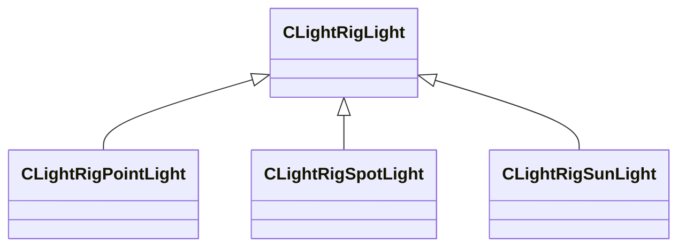
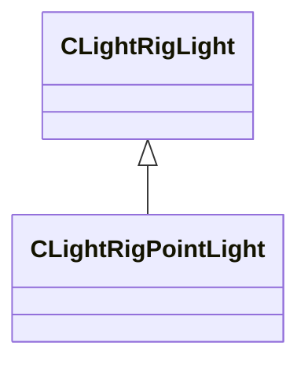
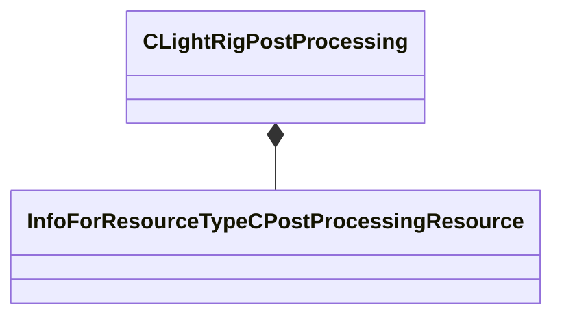
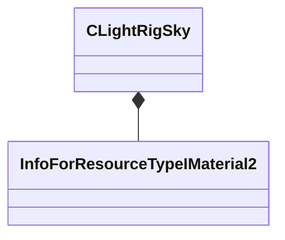
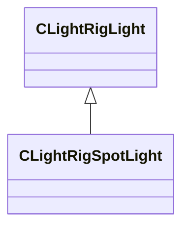
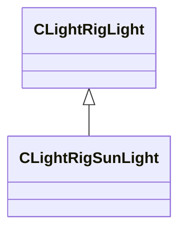
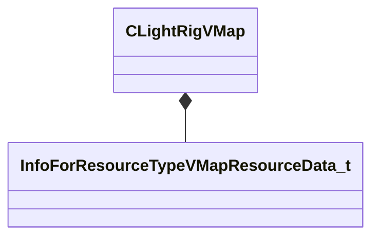
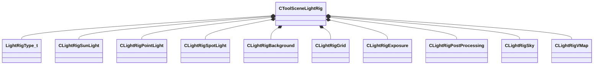

# Module: toolscene

[📊 View UML Diagram](../diagrams/toolscene.md)

| Name | Kind | Bases | Fields |
|------|------|-------|--------|
| [CLightRigBackground](#clightrigbackground) | class |  | 2 |
| [CLightRigExposure](#clightrigexposure) | class |  | 3 |
| [CLightRigGrid](#clightriggrid) | class |  | 2 |
| [CLightRigLight](#clightriglight) | class |  | 11 |
| [CLightRigPointLight](#clightrigpointlight) | class | CLightRigLight | 0 |
| [CLightRigPostProcessing](#clightrigpostprocessing) | class |  | 1 |
| [CLightRigSky](#clightrigsky) | class |  | 1 |
| [CLightRigSpotLight](#clightrigspotlight) | class | CLightRigLight | 3 |
| [CLightRigSunLight](#clightrigsunlight) | class | CLightRigLight | 5 |
| [CLightRigVMap](#clightrigvmap) | class |  | 3 |
| [CToolSceneLightRig](#ctoolscenelightrig) | class |  | 10 |

---

### CLightRigBackground

**Metadata:** `MGetKV3ClassDefaults`

**Fields:**

| Name | Type | Annotations |
|------|------|-------------|
| `m_bEnabled` | bool |  |
| `m_Color` | Color |  |

### CLightRigExposure

**Metadata:** `MGetKV3ClassDefaults`

**Fields:**

| Name | Type | Annotations |
|------|------|-------------|
| `m_bEnabled` | bool |  |
| `m_flMinEV` | float32 |  |
| `m_flMaxEV` | float32 |  |

### CLightRigGrid

**Metadata:** `MGetKV3ClassDefaults`

**Fields:**

| Name | Type | Annotations |
|------|------|-------------|
| `m_bEnabled` | bool |  |
| `m_Color` | Color |  |

### CLightRigLight

**Derived by:** [CLightRigPointLight](toolscene.md#clightrigpointlight), [CLightRigSpotLight](toolscene.md#clightrigspotlight), [CLightRigSunLight](toolscene.md#clightrigsunlight)

**Metadata:** `MGetKV3ClassDefaults`

**Relationships:**

```mermaid
classDiagram
    CLightRigLight <|-- CLightRigPointLight
    CLightRigLight <|-- CLightRigSpotLight
    CLightRigLight <|-- CLightRigSunLight
```

**Fields:**

| Name | Type | Annotations |
|------|------|-------------|
| `m_vPosition` | Vector |  |
| `m_vDirection` | Vector |  |
| `m_vLookAt` | Vector |  |
| `m_Color` | Color |  |
| `m_flAxisScale` | float32 |  |
| `m_flRadius` | float32 |  |
| `m_flBrightness` | float32 |  |
| `m_flLightSourceRadius` | float32 |  |
| `m_flDistance` | float32 |  |
| `m_bRelativePositioning` | bool |  |
| `m_bParentToCamera` | bool |  |

### CLightRigPointLight

**Inherits from:** [CLightRigLight](toolscene.md#clightriglight)

**Metadata:** `MGetKV3ClassDefaults`

**Relationships:**

```mermaid
classDiagram
    CLightRigLight <|-- CLightRigPointLight
```

### CLightRigPostProcessing

**Metadata:** `MGetKV3ClassDefaults`

**Relationships:**

```mermaid
classDiagram
    CLightRigPostProcessing *-- InfoForResourceTypeCPostProcessingResource
```

**Fields:**

| Name | Type | Annotations |
|------|------|-------------|
| `m_hPostProcessing` | CStrongHandle< [InfoForResourceTypeCPostProcessingResource](../schemas/resourcesystem.md#infoforresourcetypecpostprocessingresource) > |  |

### CLightRigSky

**Metadata:** `MGetKV3ClassDefaults`

**Relationships:**

```mermaid
classDiagram
    CLightRigSky *-- InfoForResourceTypeIMaterial2
```

**Fields:**

| Name | Type | Annotations |
|------|------|-------------|
| `m_hSkyMaterial` | CStrongHandle< [InfoForResourceTypeIMaterial2](../schemas/resourcesystem.md#infoforresourcetypeimaterial2) > |  |

### CLightRigSpotLight

**Inherits from:** [CLightRigLight](toolscene.md#clightriglight)

**Metadata:** `MGetKV3ClassDefaults`

**Relationships:**

```mermaid
classDiagram
    CLightRigLight <|-- CLightRigSpotLight
```

**Fields:**

| Name | Type | Annotations |
|------|------|-------------|
| `m_flOuterConeAngle` | float32 |  |
| `m_flInnerConeAngle` | float32 |  |
| `m_bCastShadows` | bool |  |

### CLightRigSunLight

**Inherits from:** [CLightRigLight](toolscene.md#clightriglight)

**Metadata:** `MGetKV3ClassDefaults`

**Relationships:**

```mermaid
classDiagram
    CLightRigLight <|-- CLightRigSunLight
```

**Fields:**

| Name | Type | Annotations |
|------|------|-------------|
| `m_flShadowCascadeDistance0` | float32 |  |
| `m_flShadowCascadeDistance1` | float32 |  |
| `m_flShadowCascadeDistance2` | float32 |  |
| `m_flShadowCascadeDistance3` | float32 |  |
| `m_bCastShadows` | bool |  |

### CLightRigVMap

**Metadata:** `MGetKV3ClassDefaults`

**Relationships:**

```mermaid
classDiagram
    CLightRigVMap *-- InfoForResourceTypeVMapResourceData_t
```

**Fields:**

| Name | Type | Annotations |
|------|------|-------------|
| `m_MapName` | CResourceNameTyped< CWeakHandle< [InfoForResourceTypeVMapResourceData_t](../schemas/worldrenderer.md#infoforresourcetypevmapresourcedata_t) > > |  |
| `m_bRender3DSkybox` | bool |  |
| `m_bParticlesTraceAgainstMap` | bool |  |

### CToolSceneLightRig

**Metadata:** `MGetKV3ClassDefaults`, `MVDataAssociatedFile`, `MVDataRoot`

**Relationships:**

```mermaid
classDiagram
    CToolSceneLightRig *-- LightRigType_t
    CToolSceneLightRig *-- CLightRigSunLight
    CToolSceneLightRig *-- CLightRigPointLight
    CToolSceneLightRig *-- CLightRigSpotLight
    CToolSceneLightRig *-- CLightRigBackground
    CToolSceneLightRig *-- CLightRigGrid
    CToolSceneLightRig *-- CLightRigExposure
    CToolSceneLightRig *-- CLightRigPostProcessing
    CToolSceneLightRig *-- CLightRigSky
    CToolSceneLightRig *-- CLightRigVMap
```

**Fields:**

| Name | Type | Annotations |
|------|------|-------------|
| `m_nRigType` | [LightRigType_t](../schemas/!GlobalTypes.md#lightrigtype_t) |  |
| `m_Suns` | CUtlVector< [CLightRigSunLight](../schemas/toolscene.md#clightrigsunlight) > |  |
| `m_PointLights` | CUtlVector< [CLightRigPointLight](../schemas/toolscene.md#clightrigpointlight) > |  |
| `m_SpotLights` | CUtlVector< [CLightRigSpotLight](../schemas/toolscene.md#clightrigspotlight) > |  |
| `m_Background` | [CLightRigBackground](../schemas/toolscene.md#clightrigbackground) |  |
| `m_Grid` | [CLightRigGrid](../schemas/toolscene.md#clightriggrid) |  |
| `m_Exposure` | [CLightRigExposure](../schemas/toolscene.md#clightrigexposure) |  |
| `m_PostProcessing` | [CLightRigPostProcessing](../schemas/toolscene.md#clightrigpostprocessing) |  |
| `m_Sky` | [CLightRigSky](../schemas/toolscene.md#clightrigsky) |  |
| `m_BackgroundMap` | [CLightRigVMap](../schemas/toolscene.md#clightrigvmap) |  |
