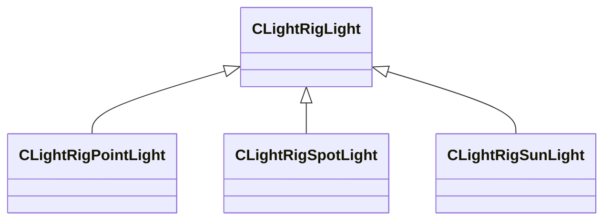

[Schemas](../../schemas.md) / [toolscene](../toolscene.md) / CLightRigLight

# CLightRigLight

> Source: **Build 25000182** · 2026-08-28 · `windows-x86_64` · schema `0.10.0`

**Kind:** class · **Size:** 64 bytes (`0x40`) · **Align:** 4 · **Module:** toolscene

**Derived by:** [CLightRigPointLight](../toolscene/CLightRigPointLight.md), [CLightRigSpotLight](../toolscene/CLightRigSpotLight.md), [CLightRigSunLight](../toolscene/CLightRigSunLight.md)

**Relationships:**

## Memory layout

11 fields (11 declared here, 0 inherited). Offsets are absolute from the object base.

| Offset | Field | Type | From | Annotations |
|--------|-------|------|------|-------------|
| `0x0` | `m_vPosition` | Vector |  |  |
| `0xc` | `m_vDirection` | Vector |  |  |
| `0x18` | `m_vLookAt` | Vector |  |  |
| `0x24` | `m_Color` | Color |  |  |
| `0x28` | `m_flAxisScale` | float32 |  |  |
| `0x2c` | `m_flRadius` | float32 |  |  |
| `0x30` | `m_flBrightness` | float32 |  |  |
| `0x34` | `m_flLightSourceRadius` | float32 |  |  |
| `0x38` | `m_flDistance` | float32 |  |  |
| `0x3c` | `m_bRelativePositioning` | bool |  |  |
| `0x3d` | `m_bParentToCamera` | bool |  |  |

KV3 class defaults

<pre>{
	&quot;m_vPosition&quot;:
	[
		0.000000,
		0.000000,
		0.000000
	],
	&quot;m_vDirection&quot;:
	[
		0.000000,
		0.000000,
		0.000000
	],
	&quot;m_vLookAt&quot;:
	[
		0.000000,
		0.000000,
		0.000000
	],
	&quot;m_Color&quot;:
	[
		255,
		255,
		255
	],
	&quot;m_flAxisScale&quot;: 1.000000,
	&quot;m_flRadius&quot;: 10000.000000,
	&quot;m_flBrightness&quot;: 1.000000,
	&quot;m_flLightSourceRadius&quot;: 0.000000,
	&quot;m_flDistance&quot;: 1.500000,
	&quot;m_bRelativePositioning&quot;: false,
	&quot;m_bParentToCamera&quot;: false
}</pre>

