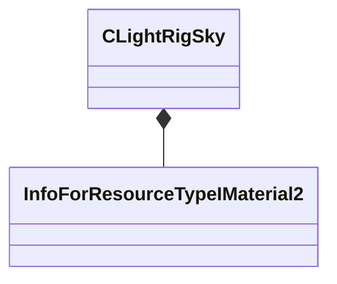

[Schemas](../../schemas.md) / [toolscene](../toolscene.md) / CLightRigSky

# CLightRigSky

**Kind:** class · **Size:** 8 bytes (`0x8`) · **Align:** 8 · **Module:** toolscene

**Relationships:**

## Memory layout

1 fields (1 declared here, 0 inherited). Offsets are absolute from the object base.

| Offset | Field | Type | From | Annotations |
|--------|-------|------|------|-------------|
| `0x0` | `m_hSkyMaterial` | CStrongHandle< [InfoForResourceTypeIMaterial2](../resourcesystem/InfoForResourceTypeIMaterial2.md) > |  |  |

KV3 class defaults

<pre>{
	&quot;m_hSkyMaterial&quot;: &quot;&quot;
}</pre>

