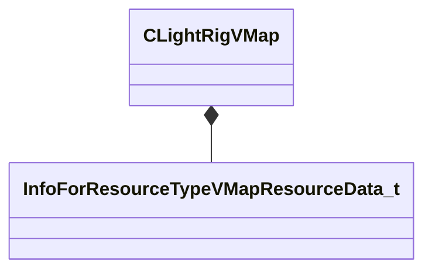

[Schemas](../../schemas.md) / [toolscene](../toolscene.md) / CLightRigVMap

# CLightRigVMap

> Source: **Build 25000182** · 2026-08-28 · `windows-x86_64` · schema `0.10.0`

**Kind:** class · **Size:** 232 bytes (`0xe8`) · **Align:** 8 · **Module:** toolscene

**Relationships:**

## Memory layout

3 fields (3 declared here, 0 inherited). Offsets are absolute from the object base.

| Offset | Field | Type | From | Annotations |
|--------|-------|------|------|-------------|
| `0x0` | `m_MapName` | CResourceNameTyped< CWeakHandle< [InfoForResourceTypeVMapResourceData_t](../worldrenderer/InfoForResourceTypeVMapResourceData_t.md) > > |  |  |
| `0xe0` | `m_bRender3DSkybox` | bool |  |  |
| `0xe1` | `m_bParticlesTraceAgainstMap` | bool |  |  |

KV3 class defaults

<pre>{
	&quot;m_MapName&quot;: &quot;&quot;,
	&quot;m_bRender3DSkybox&quot;: true,
	&quot;m_bParticlesTraceAgainstMap&quot;: false
}</pre>

