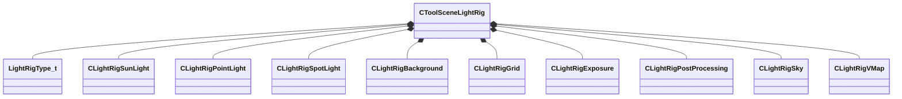

[Schemas](../../schemas.md) / [toolscene](../toolscene.md) / CToolSceneLightRig

# CToolSceneLightRig

**Kind:** class · **Size:** 360 bytes (`0x168`) · **Align:** 8 · **Module:** toolscene

**Metadata:** `MVDataAssociatedFile toolscenelightrigs.vdata`, `MVDataRoot`

**Relationships:**

## Memory layout

10 fields (10 declared here, 0 inherited). Offsets are absolute from the object base.

| Offset | Field | Type | From | Annotations |
|--------|-------|------|------|-------------|
| `0x8` | `m_nRigType` | [LightRigType_t](../!GlobalTypes/LightRigType_t.md) |  |  |
| `0x10` | `m_Suns` | CUtlVector< [CLightRigSunLight](../toolscene/CLightRigSunLight.md) > |  |  |
| `0x28` | `m_PointLights` | CUtlVector< [CLightRigPointLight](../toolscene/CLightRigPointLight.md) > |  |  |
| `0x40` | `m_SpotLights` | CUtlVector< [CLightRigSpotLight](../toolscene/CLightRigSpotLight.md) > |  |  |
| `0x58` | `m_Background` | [CLightRigBackground](../toolscene/CLightRigBackground.md) |  |  |
| `0x5d` | `m_Grid` | [CLightRigGrid](../toolscene/CLightRigGrid.md) |  |  |
| `0x64` | `m_Exposure` | [CLightRigExposure](../toolscene/CLightRigExposure.md) |  |  |
| `0x70` | `m_PostProcessing` | [CLightRigPostProcessing](../toolscene/CLightRigPostProcessing.md) |  |  |
| `0x78` | `m_Sky` | [CLightRigSky](../toolscene/CLightRigSky.md) |  |  |
| `0x80` | `m_BackgroundMap` | [CLightRigVMap](../toolscene/CLightRigVMap.md) |  |  |

KV3 class defaults

<pre>{
	&quot;m_nRigType&quot;: &quot;PREVIEW&quot;,
	&quot;m_Suns&quot;:
	[
	],
	&quot;m_PointLights&quot;:
	[
	],
	&quot;m_SpotLights&quot;:
	[
	],
	&quot;m_Background&quot;:
	{
		&quot;m_bEnabled&quot;: false,
		&quot;m_Color&quot;:
		[
			0,
			0,
			0,
			0
		]
	},
	&quot;m_Grid&quot;:
	{
		&quot;m_bEnabled&quot;: true,
		&quot;m_Color&quot;:
		[
			0,
			0,
			0,
			0
		]
	},
	&quot;m_Exposure&quot;:
	{
		&quot;m_bEnabled&quot;: false,
		&quot;m_flMinEV&quot;: -2.000000,
		&quot;m_flMaxEV&quot;: 2.000000
	},
	&quot;m_PostProcessing&quot;:
	{
		&quot;m_hPostProcessing&quot;: &quot;&quot;
	},
	&quot;m_Sky&quot;:
	{
		&quot;m_hSkyMaterial&quot;: &quot;&quot;
	},
	&quot;m_BackgroundMap&quot;:
	{
		&quot;m_MapName&quot;: &quot;&quot;,
		&quot;m_bRender3DSkybox&quot;: true,
		&quot;m_bParticlesTraceAgainstMap&quot;: false
	}
}</pre>

