# Module: toolutils2

[📊 View UML Diagram](../diagrams/toolutils2.md)

| Name | Kind | Bases | Fields |
|------|------|-------|--------|
| [AssetEngineCommand_t](#assetenginecommand_t) | class |  | 4 |
| [AssetWarningFixType_t](#assetwarningfixtype_t) | enum |  | 3 |
| [AutoTagVDataCondition_t](#autotagvdatacondition_t) | class |  | 4 |
| [CAssetTagInfo](#cassettaginfo) | class |  | 11 |
| [CAssetTypeConfig](#cassettypeconfig) | class |  | 3 |
| [CAssetWarning](#cassetwarning) | class |  | 3 |
| [CAssetWarningCheck](#cassetwarningcheck) | class |  | 9 |
| [CBaseToolInfo](#cbasetoolinfo) | class |  | 4 |
| [CBitmapAssetTypeInfo](#cbitmapassettypeinfo) | class | CSimpleAssetTypeInfo | 0 |
| [CDetailPropModel](#cdetailpropmodel) | class |  | 20 |
| [CDetailPropType](#cdetailproptype) | class |  | 2 |
| [CEngineToolInfo](#cenginetoolinfo) | class | CBaseToolInfo | 11 |
| [CExternalToolInfo](#cexternaltoolinfo) | class | CBaseToolInfo | 8 |
| [CManifestInfo](#cmanifestinfo) | class |  | 6 |
| [CMapAssetTypeInfo](#cmapassettypeinfo) | class | CResourceAssetTypeInfo | 0 |
| [CModuleManifests](#cmodulemanifests) | class |  | 1 |
| [CResourceAssetTypeInfo](#cresourceassettypeinfo) | class | CSimpleAssetTypeInfo | 8 |
| [CSimpleAssetTypeInfo](#csimpleassettypeinfo) | class |  | 24 |
| [CSubassetTypeInfo](#csubassettypeinfo) | class |  | 1 |
| [CToolsConfig](#ctoolsconfig) | class |  | 3 |
| [CVMMDAssetTypeInfo](#cvmmdassettypeinfo) | class | CSimpleAssetTypeInfo | 0 |
| [ResourceBlockTypeInfo_t](#resourceblocktypeinfo_t) | class |  | 4 |
| [ResourceDataEncodingType_t](#resourcedataencodingtype_t) | enum |  | 15 |

---

### AssetEngineCommand_t

**Metadata:** `MGetKV3ClassDefaults {
	"m_Command": "",
	"m_Icon": "",
	"m_Description": "",
	"m_bBringEngineToFront": false
}`

**Fields:**

| Name | Type | Annotations |
|------|------|-------------|
| `m_Command` | CBufferString |  |
| `m_Icon` | CBufferString |  |
| `m_Description` | CBufferString |  |
| `m_bBringEngineToFront` | bool |  |

### AssetWarningFixType_t

**Values:**

| Name | Value | Description |
|------|-------|-------------|
| `NONE` | 0 |  |
| `VMDL_CONVERT_TO_MODELDOC` | 1 |  |
| `VMAP_MANUAL_RECOMPILE` | 2 |  |

### AutoTagVDataCondition_t

**Metadata:** `MGetKV3ClassDefaults {
	"m_SourceFile": "",
	"m_AssetKey": "",
	"m_AlternateAssetKey": "",
	"m_Expression": ""
}`

**Relationships:**

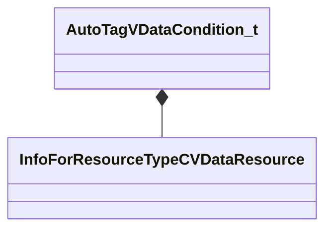

**Fields:**

| Name | Type | Annotations |
|------|------|-------------|
| `m_SourceFile` | CResourceNameTyped<CWeakHandle<[InfoForResourceTypeCVDataResource](../schemas/resourcesystem.md#infoforresourcetypecvdataresource)>> | `MPropertyDescription "The VData file to read"` |
| `m_AssetKey` | CKV3MemberNameWithStorage | `MPropertyDescription "The key whose value must match the asset name (ie. something like 'm_Model' if you want to apply this tag to .vmdl assets that are referenced by the vdata file)"` |
| `m_AlternateAssetKey` | CKV3MemberNameWithStorage | `MPropertyDescription "Optional second key to check"` |
| `m_Expression` | CUtlString | `MPropertyDescription "This expression determines whether the tag should actually be applied to an asset
It will be evaluated against vdata entries where the key matches the asset - if any of them evaluate to true the tag will be applied.
Most simple expressions involving the VData keys are supported. Use 'true' to tag unconditionally."` |

### CAssetTagInfo

**Metadata:** `MGetKV3ClassDefaults {
	"m_TagName": "",
	"m_TagDescription": "",
	"m_TagIcon": "",
	"m_TagColor":
	[
		255,
		255,
		255
	],
	"m_TagAliases":
	[
	],
	"m_ThumbnailOverlayImage": "",
	"m_bTagIndicatesRejectedAsset": false,
	"m_bTagHidesAssetByDefault": false,
	"m_RestrictAutoTagToAssetType": "",
	"m_AutoFilterTag": "",
	"m_AutoDataTag":
	{
		"m_SourceFile": "",
		"m_AssetKey": "",
		"m_AlternateAssetKey": "",
		"m_Expression": ""
	}
}`, `MVDataRoot`, `MVDataOutlinerDetailExpr "m_TagName"`, `MVDataOutlinerIconExpr "m_TagIcon"`

**Relationships:**

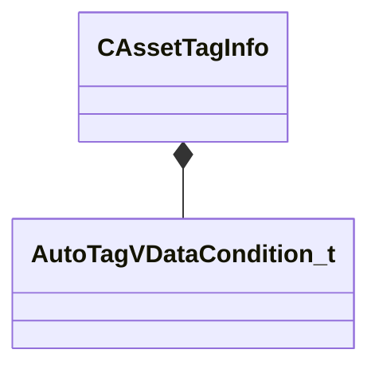

**Fields:**

| Name | Type | Annotations |
|------|------|-------------|
| `m_TagName` | CUtlString | `MPropertyDescription "User-facing tag name"` |
| `m_TagDescription` | CUtlString | `MPropertyDescription "User-facing description of the tag"` `MPropertyAttributeEditor "TextBlock()"` |
| `m_TagIcon` | CUtlString | `MPropertyDescription "Icon associated with the tag"` `MPropertyAttributeEditor "ToolImage( 16 )"` |
| `m_TagColor` | Color | `MPropertyDescription "Color for the tag badge"` |
| `m_TagAliases` | CUtlVector<CUtlString> | `MPropertyDescription "Alternate strings this tag will match when searching for assets by name."` `MPropertyAutoExpandSelf` |
| `m_ThumbnailOverlayImage` | CUtlString | `MPropertyDescription "If set, draw this as an overlay image on the asset preview"` `MPropertyAttributeEditor "ToolImage( 64 )"` |
| `m_bTagIndicatesRejectedAsset` | bool | `MPropertyDescription "If set, the presence of this tag will cause the tools to suppress or dissuade use in several ways (and draw a red X over the asset preview)"` |
| `m_bTagHidesAssetByDefault` | bool | `MPropertyDescription "If set, the presence of this tag will cause the tools to hide the asset from users by default. NOTE: This means if an asset gets tagged with this it might 'dissapear' from the UI!"` |
| `m_RestrictAutoTagToAssetType` | CUtlString | `MPropertyStartGroup "+Auto Tags"` `MPropertyDescription "Required for any auto-tag. Restricts the auto-application of this tag to a specific asset type (string from assettypes_common.txt like 'material_asset' or 'model_asset')"` |
| `m_AutoFilterTag` | CUtlString | `MPropertyDescription "Set this to automatically apply this tag based on an asset filter string. (NOTE: Auto tag names MUST start with an '@' character!)"` `MPropertyAutoExpandSelf` `MPropertySuppressExpr "m_RestrictAutoTagToAssetType == """` |
| `m_AutoDataTag` | [AutoTagVDataCondition_t](../schemas/toolutils2.md#autotagvdatacondition_t) | `MPropertyDescription "Set this to automatically apply this tag to assets based on references from a VData file. (NOTE: Auto tag names MUST start with an '@' character!)"` `MPropertyAutoExpandSelf` `MPropertySuppressExpr "m_RestrictAutoTagToAssetType == """` |

### CAssetTypeConfig

**Metadata:** `MGetKV3ClassDefaults {
	"m_AssetTypes":
	[
	],
	"m_SubassetTypes":
	[
	],
	"m_AssetWarnings":
	[
	]
}`

**Relationships:**

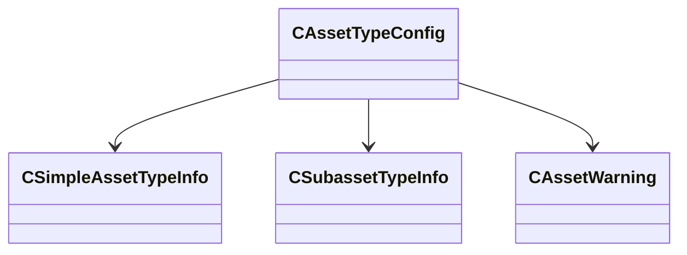

**Fields:**

| Name | Type | Annotations |
|------|------|-------------|
| `m_AssetTypes` | CUtlVector<[CSimpleAssetTypeInfo](../schemas/toolutils2.md#csimpleassettypeinfo)*> |  |
| `m_SubassetTypes` | CUtlVector<[CSubassetTypeInfo](../schemas/toolutils2.md#csubassettypeinfo)*> |  |
| `m_AssetWarnings` | CUtlVector<[CAssetWarning](../schemas/toolutils2.md#cassetwarning)*> |  |

### CAssetWarning

**Metadata:** `MGetKV3ClassDefaults {
	"m_Title": "",
	"m_Message": "",
	"m_Checks":
	[
	]
}`

**Relationships:**

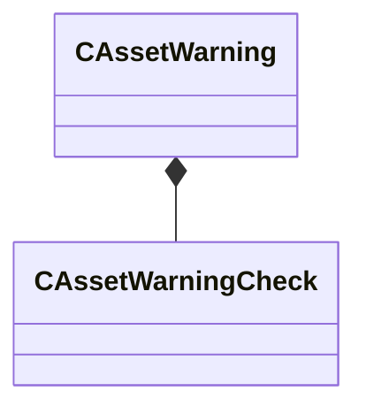

**Fields:**

| Name | Type | Annotations |
|------|------|-------------|
| `m_Title` | CBufferString |  |
| `m_Message` | CBufferString |  |
| `m_Checks` | CUtlVector<[CAssetWarningCheck](../schemas/toolutils2.md#cassetwarningcheck)> |  |

### CAssetWarningCheck

**Metadata:** `MGetKV3ClassDefaults {
	"m_AssetType": "",
	"m_RequireSearchableIntKey": "",
	"m_RequireSearchableIntValue": -1,
	"m_bOnlyWarnIfGameFilePresent": false,
	"m_bOnlyWarnIfContentFilePresent": false,
	"m_bOnlyWarnAddons": false,
	"m_ExcludeAddonNames":
	[
	],
	"m_FixDescription": "",
	"m_FixType": "NONE"
}`

**Relationships:**

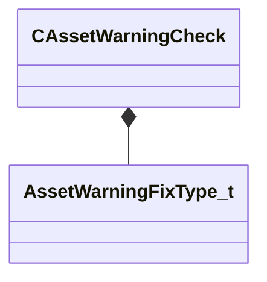

**Fields:**

| Name | Type | Annotations |
|------|------|-------------|
| `m_AssetType` | CUtlString |  |
| `m_RequireSearchableIntKey` | CBufferString |  |
| `m_RequireSearchableIntValue` | int32 |  |
| `m_bOnlyWarnIfGameFilePresent` | bool |  |
| `m_bOnlyWarnIfContentFilePresent` | bool |  |
| `m_bOnlyWarnAddons` | bool |  |
| `m_ExcludeAddonNames` | CUtlVector<CUtlString> |  |
| `m_FixDescription` | CUtlString |  |
| `m_FixType` | [AssetWarningFixType_t](../schemas/toolutils2.md#assetwarningfixtype_t) |  |

### CBaseToolInfo

**Derived by:** [CEngineToolInfo](toolutils2.md#cenginetoolinfo), [CExternalToolInfo](toolutils2.md#cexternaltoolinfo)

**Metadata:** `MGetKV3ClassDefaults {
	"m_Name": "",
	"m_OverrideToolShortcutName": "",
	"m_FriendlyName": "",
	"m_ToolIcon": ""
}`

**Relationships:**

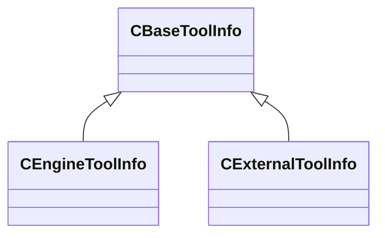

**Fields:**

| Name | Type | Annotations |
|------|------|-------------|
| `m_Name` | CUtlString |  |
| `m_OverrideToolShortcutName` | CUtlString |  |
| `m_FriendlyName` | CUtlString |  |
| `m_ToolIcon` | CUtlString |  |

### CBitmapAssetTypeInfo

**Inherits from:** [CSimpleAssetTypeInfo](toolutils2.md#csimpleassettypeinfo)

**Metadata:** `MGetKV3ClassDefaults {
	"_class": "CBitmapAssetTypeInfo",
	"m_FriendlyName": "",
	"m_Ext": "",
	"m_IconLg": "game:tools/images/assettypes/generic_lg.png",
	"m_IconSm": "game:tools/images/assettypes/generic_sm.png",
	"m_SuppressSubstrings":
	[
	],
	"m_AdditionalExtensions":
	[
	],
	"m_EngineCommands":
	[
	],
	"m_LimitToMods":
	[
	],
	"m_ExcludeFromMods":
	[
	],
	"m_HideForRetailMods":
	[
	],
	"m_PreviewThumbnailOverlayIcon": "",
	"m_bErrorOnUnrecognizedOutboundRefs": false,
	"m_UnrecognizedOutboundRefsErrorTypeExceptions":
	[
	],
	"m_bHideTypeByDefault": false,
	"m_bCannotBeShown": false,
	"m_bIsNontrivialChildAssetType": false,
	"m_bSuppressFullFingerprintCalculation": false,
	"m_bIgnoreCompiledState": false,
	"m_bContentFileIsText": false,
	"m_bPrefersLivePreview": false,
	"m_bPresentInGameTree": false,
	"m_bShouldCompileErrorFallbackToDisk": false,
	"m_nAssetTypeVersion": 0,
	"m_Test_InjectSearchable": ""
}`

**Relationships:**

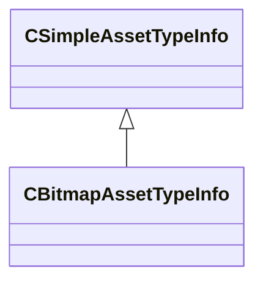

### CDetailPropModel

**Metadata:** `MGetKV3ClassDefaults {
	"m_ModelName": "",
	"m_MaterialGroup": "",
	"m_flWeight": 1.000000,
	"m_flStartFadeSize": 0.020000,
	"m_flEndFadeSize": 0.012500,
	"m_flOrientToSurface": 1.000000,
	"m_flMinSurfaceSlope": 0.000000,
	"m_flMaxSurfaceSlope": 180.000000,
	"m_flRandomVerticalOffsetMin": 0.000000,
	"m_flRandomVerticalOffsetMax": 0.000000,
	"m_vRandomRotationMin":
	[
		0.000000,
		0.000000,
		0.000000
	],
	"m_vRandomRotationMax":
	[
		0.000000,
		360.000000,
		0.000000
	],
	"m_flRandomScaleMin": 1.000000,
	"m_flRandomScaleMax": 1.000000,
	"m_flDensityMinScale": 1.000000,
	"m_flBlendWeightMinScale": 1.000000,
	"m_flBlendWeightMin": 0.250000,
	"m_flBlendWeightMax": 1.000000,
	"m_flBlendWeightFullDenstity": 0.750000,
	"m_bCastStaticShadows": false
}`, `MPropertyFriendlyName "Model"`, `MVDataAnonymousNode`, `MVDataOutlinerAssetNameExpr`

**Relationships:**

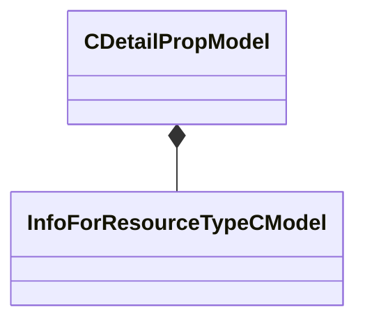

**Fields:**

| Name | Type | Annotations |
|------|------|-------------|
| `m_ModelName` | CResourceNameTyped<CWeakHandle<[InfoForResourceTypeCModel](../schemas/resourcesystem.md#infoforresourcetypecmodel)>> | `MPropertyDescription "Model to be displayed."` `MPropertyProvidesEditContextString "ToolEditContext_ID_VMDL"` |
| `m_MaterialGroup` | CModelMaterialGroupName | `MPropertyDescription "Material group (skin) to assign to use with the model."` |
| `m_flWeight` | float32 | `MPropertyDescription "A weight determining the frequency at which this model is placed relative to other models within the detail type. The weights of all models are summed and the probability of selecting this model is its weight divided by the sum weight."` |
| `m_flStartFadeSize` | float32 | `MPropertyAttributeRange "0.001 1.0"` `MPropertyFriendlyName "Start fade out size"` `MPropertyDescription "Screen space size [ 0, 1 ] (where 1 is the whole screen) at which the model will begin to to fade out. Anything larger will be fully visible, anything smaller will start to fade out."` |
| `m_flEndFadeSize` | float32 | `MPropertyAttributeRange "0.001 1.0"` `MPropertyFriendlyName "Complete fade out size"` `MPropertyDescription "Screen space size [ 0, 1 ] (where 1 is the whole screen) at which the model will be completely faded out. Anything smaller than this size will not be visible, anything larger will start fading in."` |
| `m_flOrientToSurface` | float32 | `MPropertyAttributeRange "0.0 1.0"` `MPropertyDescription "Value indicating if the model's up direction should be matched to the surface. Value should be in the [ 0, 1 ] range, where 0 means that the model up will be model (or object space) up and will ignore the surface direction, and 1 indicates that the model up will exactly match the surface normal."` |
| `m_flMinSurfaceSlope` | float32 | `MPropertyAttributeRange "0.0 180.0"` `MPropertyDescription "Minimum slope on which the target will be placed. Slope is a [ 0, 180 ] value based on the surface normal where horizontal surface (floor) is 0, vertical surface (wall) is 90, and a horizontal upside down surface (ceiling) is 180."` |
| `m_flMaxSurfaceSlope` | float32 | `MPropertyAttributeRange "0.0 180.0"` `MPropertyDescription "Maximum slope on which the target will be placed."` |
| `m_flRandomVerticalOffsetMin` | float32 | `MPropertyDescription "Minimum range of random offset to apply along the model's local up direction"` |
| `m_flRandomVerticalOffsetMax` | float32 | `MPropertyDescription "Maximum range of random offset to apply along the model's local up direction"` |
| `m_vRandomRotationMin` | QAngle | `MPropertyDescription "Minimum range of the random rotation to apply the model. Random rotation is applied in the local space of the model. Rotation values are ordered pitch, yaw, roll."` |
| `m_vRandomRotationMax` | QAngle | `MPropertyDescription "Maximum range of the random rotation to apply the model."` |
| `m_flRandomScaleMin` | float32 | `MPropertyDescription "Minimum random scale value to apply to the model."` |
| `m_flRandomScaleMax` | float32 | `MPropertyDescription "Maximum random scale value to apply to the model."` |
| `m_flDensityMinScale` | float32 | `MPropertyFriendlyName "Density Scale"` `MPropertyAttributeRange "0.01 1.0"` `MPropertyDescription "Minimum scale to apply to the model based the painted detail prop density. The minimum of the detail and blend weight scale values is multiplied with the random scale value to determine the final scale."` |
| `m_flBlendWeightMinScale` | float32 | `MPropertyFriendlyName "Blend Weight Scale"` `MPropertyAttributeRange "0.01 1.0"` `MPropertyDescription "Minimum scale to apply to the model based on the final material layer blend weight. The model will be given this scale value when the layer blend weight equals the minimum blend weight and will be 1.0 when the maximum blend weight has been reached. The minimum of the detail and blend weight scale values is multiplied with the random scale value to determine the final scale. Set this if you want the model to scale up as the material blend fades in. The smaller the value, the smaller the model will start as the material begins to fade in."` |
| `m_flBlendWeightMin` | float32 | `MPropertyFriendlyName "Min Blend Weight"` `MPropertyAttributeRange "0.01 1.0"` `MPropertyDescription "Minimum blend weight value for which the model will be placed. If the blend weight value is less than this value, the model will not be placed."` |
| `m_flBlendWeightMax` | float32 | `MPropertyFriendlyName "Max Blend Weight"` `MPropertyAttributeRange "0.01 1.0"` `MPropertyDescription "Maximum blend weight value for which the model will be placed. If the blend weight value is more than this value, the model will not be placed."` |
| `m_flBlendWeightFullDenstity` | float32 | `MPropertyFriendlyName "Full Density Blend Weight"` `MPropertyAttributeRange "0.01 1.0"` `MPropertyDescription "Blend weight at which the model will be at full density. Must be between the minimum and maximum blend weight values. The density of this model placement will increase with the blend weight value up to this value at which point it will be at full density."` |
| `m_bCastStaticShadows` | bool | `MPropertyDescription "Should instances of this model generate shadows in the lightmap. Note that shadows in the light map will persist even after the model fades out."` |

### CDetailPropType

**Metadata:** `MGetKV3ClassDefaults {
	"m_flDensity": 1.000000,
	"m_Models":
	[
	]
}`, `MVDataRoot`, `MPropertyFriendlyName "Detail Prop Type"`, `MVDataAssociatedFile "scripts/detail_prop_types.vdata"`, `MVDataOutlinerDefaultExpanded`

**Relationships:**

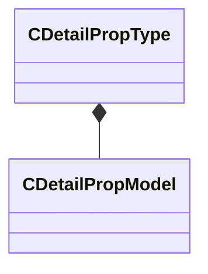

**Fields:**

| Name | Type | Annotations |
|------|------|-------------|
| `m_flDensity` | float32 | `MPropertyDescription "Specifies the number of props placed per square foot."` |
| `m_Models` | CUtlVector<[CDetailPropModel](../schemas/toolutils2.md#cdetailpropmodel)> | `MVDataPromoteField 1` |

### CEngineToolInfo

**Inherits from:** [CBaseToolInfo](toolutils2.md#cbasetoolinfo)

**Metadata:** `MGetKV3ClassDefaults {
	"m_Name": "",
	"m_OverrideToolShortcutName": "",
	"m_FriendlyName": "",
	"m_ToolIcon": "",
	"m_Library": "",
	"m_InterfaceName": "",
	"m_bShowInRevisionSubMenu": false,
	"m_bIsSecondaryTool": false,
	"m_bDoNotWarnAboutLargeAssetBatches": false,
	"m_bIsWorkshopManagerTool": false,
	"m_bIsWorkshopItemTool": false,
	"m_bCanHighlightSubassets": false,
	"m_AssetTypes":
	[
	],
	"m_LimitToMods":
	[
	],
	"m_ExcludeFromMods":
	[
	]
}`

**Relationships:**

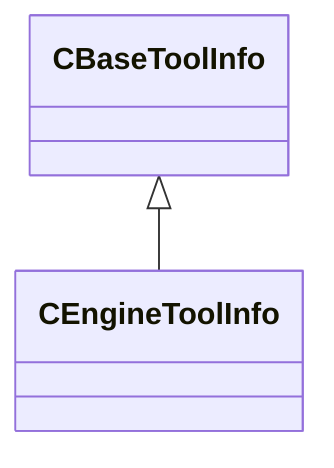

**Fields:**

| Name | Type | Annotations |
|------|------|-------------|
| `m_Library` | CUtlString |  |
| `m_InterfaceName` | CUtlString |  |
| `m_bShowInRevisionSubMenu` | bool |  |
| `m_bIsSecondaryTool` | bool |  |
| `m_bDoNotWarnAboutLargeAssetBatches` | bool |  |
| `m_bIsWorkshopManagerTool` | bool |  |
| `m_bIsWorkshopItemTool` | bool |  |
| `m_bCanHighlightSubassets` | bool |  |
| `m_AssetTypes` | CUtlVector<CUtlString> |  |
| `m_LimitToMods` | CUtlVector<CUtlString> |  |
| `m_ExcludeFromMods` | CUtlVector<CUtlString> |  |

### CExternalToolInfo

**Inherits from:** [CBaseToolInfo](toolutils2.md#cbasetoolinfo)

**Metadata:** `MGetKV3ClassDefaults {
	"m_Name": "",
	"m_OverrideToolShortcutName": "",
	"m_FriendlyName": "",
	"m_ToolIcon": "",
	"m_Executable": "",
	"m_Args": "",
	"m_ArgsWithLineColumn": "",
	"m_WorkingDir": "",
	"m_MatchSystemExecutable": "",
	"m_SupportedExts":
	[
	],
	"m_PriorityExts":
	[
	],
	"m_bDebugCommandline": false
}`

**Relationships:**

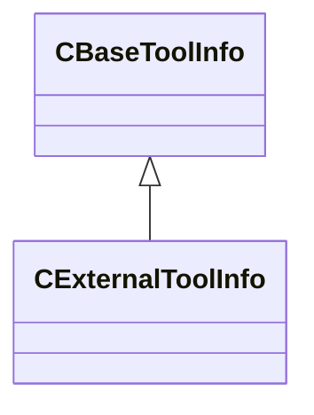

**Fields:**

| Name | Type | Annotations |
|------|------|-------------|
| `m_Executable` | CUtlString |  |
| `m_Args` | CUtlString |  |
| `m_ArgsWithLineColumn` | CUtlString |  |
| `m_WorkingDir` | CUtlString |  |
| `m_MatchSystemExecutable` | CUtlString |  |
| `m_SupportedExts` | CUtlVector<CUtlString> |  |
| `m_PriorityExts` | CUtlVector<CUtlString> |  |
| `m_bDebugCommandline` | bool |  |

### CManifestInfo

**Metadata:** `MGetKV3ClassDefaults {
	"m_Name": "",
	"m_Group": "",
	"m_Mod": "",
	"m_SourceFile": "",
	"m_nSourceLine": 0,
	"m_Resources":
	[
	]
}`

**Fields:**

| Name | Type | Annotations |
|------|------|-------------|
| `m_Name` | CUtlString |  |
| `m_Group` | CUtlString |  |
| `m_Mod` | CUtlString |  |
| `m_SourceFile` | CUtlString |  |
| `m_nSourceLine` | int32 |  |
| `m_Resources` | CUtlVector<CUtlString> |  |

### CMapAssetTypeInfo

**Inherits from:** [CResourceAssetTypeInfo](toolutils2.md#cresourceassettypeinfo)

**Metadata:** `MGetKV3ClassDefaults {
	"_class": "CMapAssetTypeInfo",
	"m_FriendlyName": "",
	"m_Ext": "",
	"m_IconLg": "game:tools/images/assettypes/generic_lg.png",
	"m_IconSm": "game:tools/images/assettypes/generic_sm.png",
	"m_SuppressSubstrings":
	[
	],
	"m_AdditionalExtensions":
	[
	],
	"m_EngineCommands":
	[
	],
	"m_LimitToMods":
	[
	],
	"m_ExcludeFromMods":
	[
	],
	"m_HideForRetailMods":
	[
	],
	"m_PreviewThumbnailOverlayIcon": "",
	"m_bErrorOnUnrecognizedOutboundRefs": false,
	"m_UnrecognizedOutboundRefsErrorTypeExceptions":
	[
	],
	"m_bHideTypeByDefault": false,
	"m_bCannotBeShown": false,
	"m_bIsNontrivialChildAssetType": false,
	"m_bSuppressFullFingerprintCalculation": false,
	"m_bIgnoreCompiledState": false,
	"m_bContentFileIsText": false,
	"m_bPrefersLivePreview": false,
	"m_bPresentInGameTree": false,
	"m_bShouldCompileErrorFallbackToDisk": false,
	"m_nAssetTypeVersion": 0,
	"m_Test_InjectSearchable": "",
	"m_CompilerIdentifier": "",
	"m_CompileDependsOnResourceTypes":
	[
	],
	"m_Blocks":
	[
	],
	"m_RequiredSpecialDependency": "",
	"m_bPreventDirectCompile": false,
	"m_bCannotBeAMultiParentChildCompile": false,
	"m_bPrefersIconForThumbnail": false,
	"m_bAllowedToCompileInTestMode": false
}`

**Relationships:**

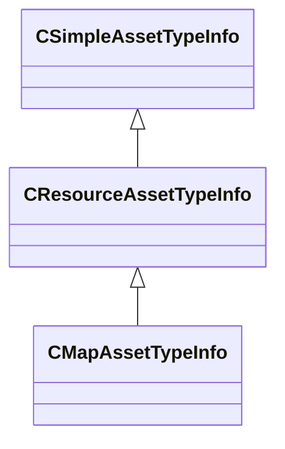

### CModuleManifests

**Metadata:** `MGetKV3ClassDefaults {
	"m_Manifests":
	[
	]
}`

**Relationships:**

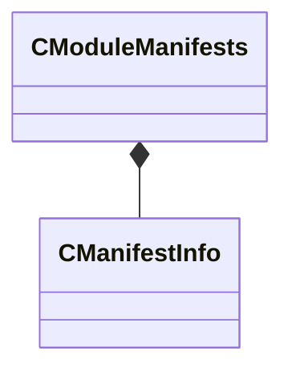

**Fields:**

| Name | Type | Annotations |
|------|------|-------------|
| `m_Manifests` | CUtlVector<[CManifestInfo](../schemas/toolutils2.md#cmanifestinfo)> |  |

### CResourceAssetTypeInfo

**Inherits from:** [CSimpleAssetTypeInfo](toolutils2.md#csimpleassettypeinfo)

**Derived by:** [CMapAssetTypeInfo](toolutils2.md#cmapassettypeinfo)

**Metadata:** `MGetKV3ClassDefaults {
	"_class": "CResourceAssetTypeInfo",
	"m_FriendlyName": "",
	"m_Ext": "",
	"m_IconLg": "game:tools/images/assettypes/generic_lg.png",
	"m_IconSm": "game:tools/images/assettypes/generic_sm.png",
	"m_SuppressSubstrings":
	[
	],
	"m_AdditionalExtensions":
	[
	],
	"m_EngineCommands":
	[
	],
	"m_LimitToMods":
	[
	],
	"m_ExcludeFromMods":
	[
	],
	"m_HideForRetailMods":
	[
	],
	"m_PreviewThumbnailOverlayIcon": "",
	"m_bErrorOnUnrecognizedOutboundRefs": false,
	"m_UnrecognizedOutboundRefsErrorTypeExceptions":
	[
	],
	"m_bHideTypeByDefault": false,
	"m_bCannotBeShown": false,
	"m_bIsNontrivialChildAssetType": false,
	"m_bSuppressFullFingerprintCalculation": false,
	"m_bIgnoreCompiledState": false,
	"m_bContentFileIsText": false,
	"m_bPrefersLivePreview": false,
	"m_bPresentInGameTree": false,
	"m_bShouldCompileErrorFallbackToDisk": false,
	"m_nAssetTypeVersion": 0,
	"m_Test_InjectSearchable": "",
	"m_CompilerIdentifier": "",
	"m_CompileDependsOnResourceTypes":
	[
	],
	"m_Blocks":
	[
	],
	"m_RequiredSpecialDependency": "",
	"m_bPreventDirectCompile": false,
	"m_bCannotBeAMultiParentChildCompile": false,
	"m_bPrefersIconForThumbnail": false,
	"m_bAllowedToCompileInTestMode": false
}`

**Relationships:**

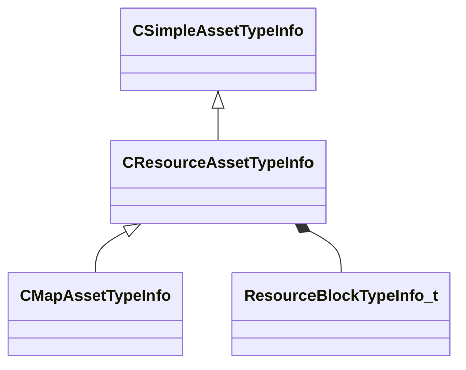

**Fields:**

| Name | Type | Annotations |
|------|------|-------------|
| `m_CompilerIdentifier` | CUtlString |  |
| `m_CompileDependsOnResourceTypes` | CUtlVector<CUtlString> |  |
| `m_Blocks` | CUtlVector<[ResourceBlockTypeInfo_t](../schemas/toolutils2.md#resourceblocktypeinfo_t)> |  |
| `m_RequiredSpecialDependency` | CUtlString |  |
| `m_bPreventDirectCompile` | bool |  |
| `m_bCannotBeAMultiParentChildCompile` | bool |  |
| `m_bPrefersIconForThumbnail` | bool |  |
| `m_bAllowedToCompileInTestMode` | bool |  |

### CSimpleAssetTypeInfo

**Derived by:** [CBitmapAssetTypeInfo](toolutils2.md#cbitmapassettypeinfo), [CResourceAssetTypeInfo](toolutils2.md#cresourceassettypeinfo), [CVMMDAssetTypeInfo](toolutils2.md#cvmmdassettypeinfo)

**Metadata:** `MGetKV3ClassDefaults {
	"_class": "CSimpleAssetTypeInfo",
	"m_FriendlyName": "",
	"m_Ext": "",
	"m_IconLg": "game:tools/images/assettypes/generic_lg.png",
	"m_IconSm": "game:tools/images/assettypes/generic_sm.png",
	"m_SuppressSubstrings":
	[
	],
	"m_AdditionalExtensions":
	[
	],
	"m_EngineCommands":
	[
	],
	"m_LimitToMods":
	[
	],
	"m_ExcludeFromMods":
	[
	],
	"m_HideForRetailMods":
	[
	],
	"m_PreviewThumbnailOverlayIcon": "",
	"m_bErrorOnUnrecognizedOutboundRefs": false,
	"m_UnrecognizedOutboundRefsErrorTypeExceptions":
	[
	],
	"m_bHideTypeByDefault": false,
	"m_bCannotBeShown": false,
	"m_bIsNontrivialChildAssetType": false,
	"m_bSuppressFullFingerprintCalculation": false,
	"m_bIgnoreCompiledState": false,
	"m_bContentFileIsText": false,
	"m_bPrefersLivePreview": false,
	"m_bPresentInGameTree": false,
	"m_bShouldCompileErrorFallbackToDisk": false,
	"m_nAssetTypeVersion": 0,
	"m_Test_InjectSearchable": ""
}`

**Relationships:**

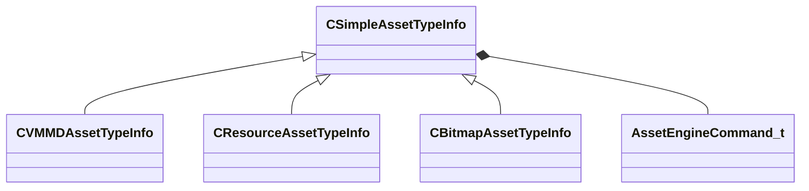

**Fields:**

| Name | Type | Annotations |
|------|------|-------------|
| `m_FriendlyName` | CUtlString |  |
| `m_Ext` | CUtlString |  |
| `m_IconLg` | CUtlString |  |
| `m_IconSm` | CUtlString |  |
| `m_SuppressSubstrings` | CUtlVector<CUtlString> |  |
| `m_AdditionalExtensions` | CUtlVector<CUtlString> |  |
| `m_EngineCommands` | CUtlVector<[AssetEngineCommand_t](../schemas/toolutils2.md#assetenginecommand_t)> |  |
| `m_LimitToMods` | CUtlVector<CUtlString> |  |
| `m_ExcludeFromMods` | CUtlVector<CUtlString> |  |
| `m_HideForRetailMods` | CUtlVector<CUtlString> |  |
| `m_PreviewThumbnailOverlayIcon` | CUtlString |  |
| `m_bErrorOnUnrecognizedOutboundRefs` | bool |  |
| `m_UnrecognizedOutboundRefsErrorTypeExceptions` | CUtlVector<CUtlString> |  |
| `m_bHideTypeByDefault` | bool |  |
| `m_bCannotBeShown` | bool |  |
| `m_bIsNontrivialChildAssetType` | bool |  |
| `m_bSuppressFullFingerprintCalculation` | bool |  |
| `m_bIgnoreCompiledState` | bool |  |
| `m_bContentFileIsText` | bool |  |
| `m_bPrefersLivePreview` | bool |  |
| `m_bPresentInGameTree` | bool |  |
| `m_bShouldCompileErrorFallbackToDisk` | bool |  |
| `m_nAssetTypeVersion` | int32 |  |
| `m_Test_InjectSearchable` | CUtlString |  |

### CSubassetTypeInfo

**Metadata:** `MGetKV3ClassDefaults {
	"m_bFollowReferences": false
}`

**Fields:**

| Name | Type | Annotations |
|------|------|-------------|
| `m_bFollowReferences` | bool |  |

### CToolsConfig

**Metadata:** `MGetKV3ClassDefaults {
	"m_EngineTools":
	[
	],
	"m_ExternalTools":
	[
	],
	"m_EngineModulesThatReferenceAssets":
	[
	]
}`

**Relationships:**

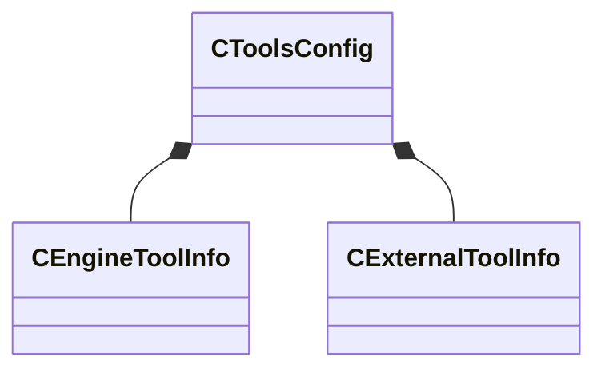

**Fields:**

| Name | Type | Annotations |
|------|------|-------------|
| `m_EngineTools` | CUtlVector<[CEngineToolInfo](../schemas/toolutils2.md#cenginetoolinfo)> |  |
| `m_ExternalTools` | CUtlVector<[CExternalToolInfo](../schemas/toolutils2.md#cexternaltoolinfo)> |  |
| `m_EngineModulesThatReferenceAssets` | CUtlVector<CUtlString> |  |

### CVMMDAssetTypeInfo

**Inherits from:** [CSimpleAssetTypeInfo](toolutils2.md#csimpleassettypeinfo)

**Metadata:** `MGetKV3ClassDefaults {
	"_class": "CVMMDAssetTypeInfo",
	"m_FriendlyName": "",
	"m_Ext": "",
	"m_IconLg": "game:tools/images/assettypes/generic_lg.png",
	"m_IconSm": "game:tools/images/assettypes/generic_sm.png",
	"m_SuppressSubstrings":
	[
	],
	"m_AdditionalExtensions":
	[
	],
	"m_EngineCommands":
	[
	],
	"m_LimitToMods":
	[
	],
	"m_ExcludeFromMods":
	[
	],
	"m_HideForRetailMods":
	[
	],
	"m_PreviewThumbnailOverlayIcon": "",
	"m_bErrorOnUnrecognizedOutboundRefs": false,
	"m_UnrecognizedOutboundRefsErrorTypeExceptions":
	[
	],
	"m_bHideTypeByDefault": false,
	"m_bCannotBeShown": false,
	"m_bIsNontrivialChildAssetType": false,
	"m_bSuppressFullFingerprintCalculation": false,
	"m_bIgnoreCompiledState": false,
	"m_bContentFileIsText": false,
	"m_bPrefersLivePreview": false,
	"m_bPresentInGameTree": false,
	"m_bShouldCompileErrorFallbackToDisk": false,
	"m_nAssetTypeVersion": 0,
	"m_Test_InjectSearchable": ""
}`

**Relationships:**

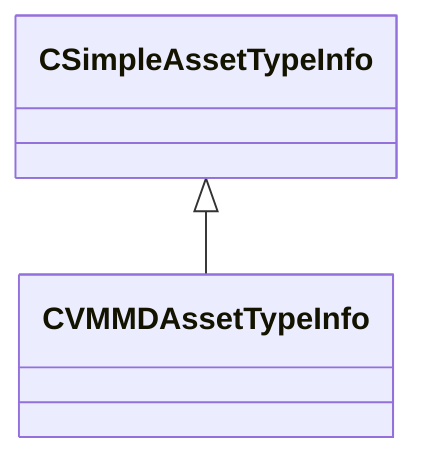

### ResourceBlockTypeInfo_t

**Metadata:** `MGetKV3ClassDefaults {
	"m_Encoding": "RESOURCE_ENCODING_INTROSPECTED",
	"m_BlockID": "",
	"m_IntrospectedRootStruct": "",
	"m_ResourceVersion": -1
}`

**Relationships:**

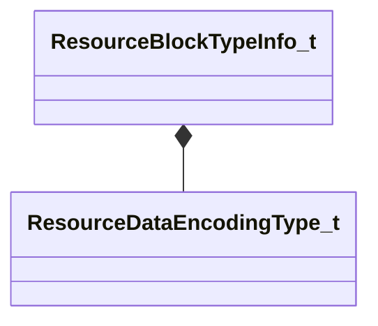

**Fields:**

| Name | Type | Annotations |
|------|------|-------------|
| `m_Encoding` | [ResourceDataEncodingType_t](../schemas/toolutils2.md#resourcedataencodingtype_t) |  |
| `m_BlockID` | CUtlString |  |
| `m_IntrospectedRootStruct` | CUtlString |  |
| `m_ResourceVersion` | int32 |  |

### ResourceDataEncodingType_t

**Values:**

| Name | Value | Description |
|------|-------|-------------|
| `RESOURCE_ENCODING_INVALID` | -1 |  |
| `RESOURCE_ENCODING_INTROSPECTED` | 0 |  |
| `RESOURCE_ENCODING_KV3` | 1 |  |
| `RESOURCE_ENCODING_VTEX` | 2 |  |
| `RESOURCE_ENCODING_RAW_BYTES` | 3 |  |
| `RESOURCE_ENCODING_VSNAP` | 4 |  |
| `RESOURCE_ENCODING_VRMAN` | 5 |  |
| `RESOURCE_ENCODING_COMPILEIMAGEUTILS_TEXT` | 6 |  |
| `RESOURCE_ENCODING_TEXT` | 7 |  |
| `RESOURCE_ENCODING_MBUF` | 8 |  |
| `RESOURCE_ENCODING_MVTX` | 9 |  |
| `RESOURCE_ENCODING_MIDX` | 10 |  |
| `RESOURCE_ENCODING_MSLT` | 11 |  |
| `RESOURCE_ENCODING_LEGACY_VSND` | 12 |  |
| `RESOURCE_ENCODING_COUNT` | 13 |  |
