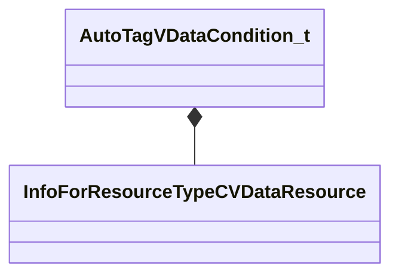

[Schemas](../../schemas.md) / [toolutils2](../toolutils2.md) / AutoTagVDataCondition_t

# AutoTagVDataCondition_t

**Kind:** class · **Size:** 344 bytes (`0x158`) · **Align:** 8 · **Module:** toolutils2

**Relationships:**

## Memory layout

4 fields (4 declared here, 0 inherited). Offsets are absolute from the object base.

| Offset | Field | Type | From | Annotations |
|--------|-------|------|------|-------------|
| `0x0` | `m_SourceFile` | CResourceNameTyped< CWeakHandle< [InfoForResourceTypeCVDataResource](../resourcesystem/InfoForResourceTypeCVDataResource.md) > > |  | `MPropertyDescription The VData file to read` |
| `0xe0` | `m_AssetKey` | CKV3MemberNameWithStorage |  | `MPropertyDescription The key whose value must match the asset name (ie. something like 'm_Model' if you want to apply this tag to .vmdl assets that are referenced by the vdata file)` |
| `0x118` | `m_AlternateAssetKey` | CKV3MemberNameWithStorage |  | `MPropertyDescription Optional second key to check` |
| `0x150` | `m_Expression` | CUtlString |  | `MPropertyDescription This expression determines whether the tag should actually be applied to an asset
It will be evaluated against vdata entries where the key matches the asset - if any of them evaluate to true the tag will be applied.
Most simple expressions involving the VData keys are supported. Use 'true' to tag unconditionally.` |

KV3 class defaults

<pre>{
	&quot;m_SourceFile&quot;: &quot;&quot;,
	&quot;m_AssetKey&quot;: &quot;&quot;,
	&quot;m_AlternateAssetKey&quot;: &quot;&quot;,
	&quot;m_Expression&quot;: &quot;&quot;
}</pre>

