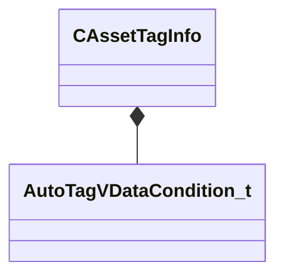

[Schemas](../../schemas.md) / [toolutils2](../toolutils2.md) / CAssetTagInfo

# CAssetTagInfo

> Source: **Build 25000182** · 2026-08-28 · `windows-x86_64` · schema `0.10.0`

**Kind:** class · **Size:** 480 bytes (`0x1e0`) · **Align:** 8 · **Module:** toolutils2

**Metadata:** `MVDataOutlinerDetailExpr m_TagName`, `MVDataOutlinerIconExpr m_TagIcon`, `MVDataRoot`

**Relationships:**

## Memory layout

11 fields (11 declared here, 0 inherited). Offsets are absolute from the object base.

| Offset | Field | Type | From | Annotations |
|--------|-------|------|------|-------------|
| `0x30` | `m_TagName` | CUtlString |  | `MPropertyDescription User-facing tag name` |
| `0x38` | `m_TagDescription` | CUtlString |  | `MPropertyAttributeEditor TextBlock()` `MPropertyDescription User-facing description of the tag` |
| `0x40` | `m_TagIcon` | CUtlString |  | `MPropertyAttributeEditor ToolImage( 16 )` `MPropertyDescription Icon associated with the tag` |
| `0x48` | `m_TagColor` | Color |  | `MPropertyDescription Color for the tag badge` |
| `0x50` | `m_TagAliases` | CUtlVector< CUtlString > |  | `MPropertyAutoExpandSelf` `MPropertyDescription Alternate strings this tag will match when searching for assets by name.` |
| `0x68` | `m_ThumbnailOverlayImage` | CUtlString |  | `MPropertyAttributeEditor ToolImage( 64 )` `MPropertyDescription If set, draw this as an overlay image on the asset preview` |
| `0x70` | `m_bTagIndicatesRejectedAsset` | bool |  | `MPropertyDescription If set, the presence of this tag will cause the tools to suppress or dissuade use in several ways (and draw a red X over the asset preview)` |
| `0x71` | `m_bTagHidesAssetByDefault` | bool |  | `MPropertyDescription If set, the presence of this tag will cause the tools to hide the asset from users by default. NOTE: This means if an asset gets tagged with this it might 'dissapear' from the UI!` |
| `0x78` | `m_RestrictAutoTagToAssetType` | CUtlString |  | `MPropertyDescription Required for any auto-tag. Restricts the auto-application of this tag to a specific asset type (string from assettypes_common.txt like 'material_asset' or 'model_asset')` `MPropertyStartGroup +Auto Tags` |
| `0x80` | `m_AutoFilterTag` | CUtlString |  | `MPropertyAutoExpandSelf` `MPropertyDescription Set this to automatically apply this tag based on an asset filter string. (NOTE: Auto tag names MUST start with an '@' character!)` `MPropertySuppressExpr m_RestrictAutoTagToAssetType == ""` |
| `0x88` | `m_AutoDataTag` | [AutoTagVDataCondition_t](../toolutils2/AutoTagVDataCondition_t.md) |  | `MPropertyAutoExpandSelf` `MPropertyDescription Set this to automatically apply this tag to assets based on references from a VData file. (NOTE: Auto tag names MUST start with an '@' character!)` `MPropertySuppressExpr m_RestrictAutoTagToAssetType == ""` |

KV3 class defaults

<pre>{
	&quot;m_TagName&quot;: &quot;&quot;,
	&quot;m_TagDescription&quot;: &quot;&quot;,
	&quot;m_TagIcon&quot;: &quot;&quot;,
	&quot;m_TagColor&quot;:
	[
		255,
		255,
		255
	],
	&quot;m_TagAliases&quot;:
	[
	],
	&quot;m_ThumbnailOverlayImage&quot;: &quot;&quot;,
	&quot;m_bTagIndicatesRejectedAsset&quot;: false,
	&quot;m_bTagHidesAssetByDefault&quot;: false,
	&quot;m_RestrictAutoTagToAssetType&quot;: &quot;&quot;,
	&quot;m_AutoFilterTag&quot;: &quot;&quot;,
	&quot;m_AutoDataTag&quot;:
	{
		&quot;m_SourceFile&quot;: &quot;&quot;,
		&quot;m_AssetKey&quot;: &quot;&quot;,
		&quot;m_AlternateAssetKey&quot;: &quot;&quot;,
		&quot;m_Expression&quot;: &quot;&quot;
	}
}</pre>

