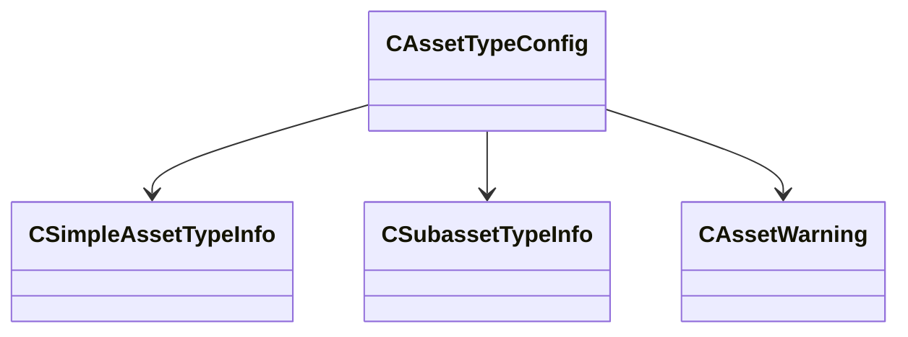

[Schemas](../../schemas.md) / [toolutils2](../toolutils2.md) / CAssetTypeConfig

# CAssetTypeConfig

> Source: **Build 25000182** · 2026-08-28 · `windows-x86_64` · schema `0.10.0`

**Kind:** class · **Size:** 72 bytes (`0x48`) · **Align:** 8 · **Module:** toolutils2

**Relationships:**

## Memory layout

3 fields (3 declared here, 0 inherited). Offsets are absolute from the object base.

| Offset | Field | Type | From | Annotations |
|--------|-------|------|------|-------------|
| `0x0` | `m_AssetTypes` | CUtlVector< [CSimpleAssetTypeInfo](../toolutils2/CSimpleAssetTypeInfo.md)* > |  |  |
| `0x18` | `m_SubassetTypes` | CUtlVector< [CSubassetTypeInfo](../toolutils2/CSubassetTypeInfo.md)* > |  |  |
| `0x30` | `m_AssetWarnings` | CUtlVector< [CAssetWarning](../toolutils2/CAssetWarning.md)* > |  |  |

KV3 class defaults

<pre>{
	&quot;m_AssetTypes&quot;:
	[
	],
	&quot;m_SubassetTypes&quot;:
	[
	],
	&quot;m_AssetWarnings&quot;:
	[
	]
}</pre>

