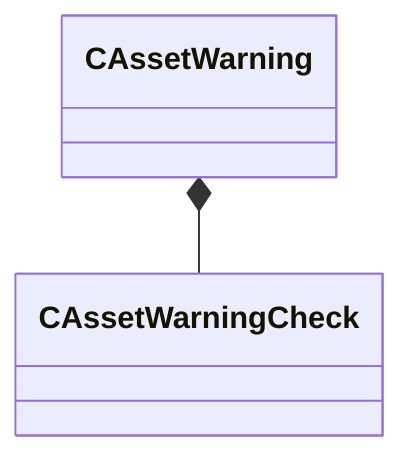

[Schemas](../../schemas.md) / [toolutils2](../toolutils2.md) / CAssetWarning

# CAssetWarning

**Kind:** class · **Size:** 64 bytes (`0x40`) · **Align:** 8 · **Module:** toolutils2

**Relationships:**

## Memory layout

3 fields (3 declared here, 0 inherited). Offsets are absolute from the object base.

| Offset | Field | Type | From | Annotations |
|--------|-------|------|------|-------------|
| `0x8` | `m_Title` | CBufferString |  |  |
| `0x18` | `m_Message` | CBufferString |  |  |
| `0x28` | `m_Checks` | CUtlVector< [CAssetWarningCheck](../toolutils2/CAssetWarningCheck.md) > |  |  |

KV3 class defaults

<pre>{
	&quot;m_Title&quot;: &quot;&quot;,
	&quot;m_Message&quot;: &quot;&quot;,
	&quot;m_Checks&quot;:
	[
	]
}</pre>

