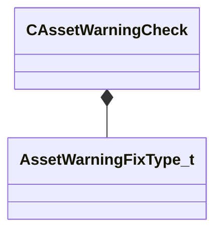

[Schemas](../../schemas.md) / [toolutils2](../toolutils2.md) / CAssetWarningCheck

# CAssetWarningCheck

**Kind:** class · **Size:** 104 bytes (`0x68`) · **Align:** 8 · **Module:** toolutils2

**Relationships:**

## Memory layout

9 fields (9 declared here, 0 inherited). Offsets are absolute from the object base.

| Offset | Field | Type | From | Annotations |
|--------|-------|------|------|-------------|
| `0x0` | `m_AssetType` | CUtlString |  |  |
| `0x8` | `m_RequireSearchableIntKey` | CBufferString |  |  |
| `0x18` | `m_RequireSearchableIntValue` | int32 |  |  |
| `0x1c` | `m_bOnlyWarnIfGameFilePresent` | bool |  |  |
| `0x1d` | `m_bOnlyWarnIfContentFilePresent` | bool |  |  |
| `0x1e` | `m_bOnlyWarnAddons` | bool |  |  |
| `0x20` | `m_ExcludeAddonNames` | CUtlVector< CUtlString > |  |  |
| `0x38` | `m_FixDescription` | CUtlString |  |  |
| `0x40` | `m_FixType` | [AssetWarningFixType_t](../toolutils2/AssetWarningFixType_t.md) |  |  |

KV3 class defaults

<pre>{
	&quot;m_AssetType&quot;: &quot;&quot;,
	&quot;m_RequireSearchableIntKey&quot;: &quot;&quot;,
	&quot;m_RequireSearchableIntValue&quot;: -1,
	&quot;m_bOnlyWarnIfGameFilePresent&quot;: false,
	&quot;m_bOnlyWarnIfContentFilePresent&quot;: false,
	&quot;m_bOnlyWarnAddons&quot;: false,
	&quot;m_ExcludeAddonNames&quot;:
	[
	],
	&quot;m_FixDescription&quot;: &quot;&quot;,
	&quot;m_FixType&quot;: &quot;NONE&quot;
}</pre>

