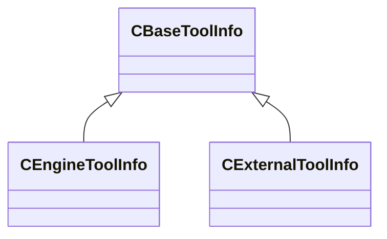

[Schemas](../../schemas.md) / [toolutils2](../toolutils2.md) / CBaseToolInfo

# CBaseToolInfo

> Source: **Build 25000182** · 2026-08-28 · `windows-x86_64` · schema `0.10.0`

**Kind:** class · **Size:** 32 bytes (`0x20`) · **Align:** 8 · **Module:** toolutils2

**Derived by:** [CEngineToolInfo](../toolutils2/CEngineToolInfo.md), [CExternalToolInfo](../toolutils2/CExternalToolInfo.md)

**Relationships:**

## Memory layout

4 fields (4 declared here, 0 inherited). Offsets are absolute from the object base.

| Offset | Field | Type | From | Annotations |
|--------|-------|------|------|-------------|
| `0x0` | `m_Name` | CUtlString |  |  |
| `0x8` | `m_OverrideToolShortcutName` | CUtlString |  |  |
| `0x10` | `m_FriendlyName` | CUtlString |  |  |
| `0x18` | `m_ToolIcon` | CUtlString |  |  |

KV3 class defaults

<pre>{
	&quot;m_Name&quot;: &quot;&quot;,
	&quot;m_OverrideToolShortcutName&quot;: &quot;&quot;,
	&quot;m_FriendlyName&quot;: &quot;&quot;,
	&quot;m_ToolIcon&quot;: &quot;&quot;
}</pre>

