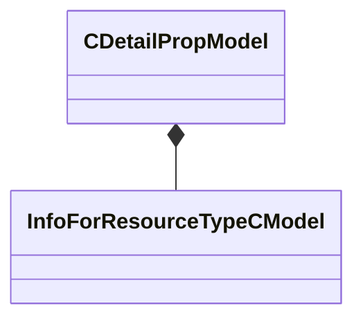

[Schemas](../../schemas.md) / [toolutils2](../toolutils2.md) / CDetailPropModel

# CDetailPropModel

**Kind:** class · **Size:** 328 bytes (`0x148`) · **Align:** 8 · **Module:** toolutils2

**Metadata:** `MPropertyFriendlyName Model`, `MVDataAnonymousNode`, `MVDataOutlinerAssetNameExpr`

**Relationships:**

## Memory layout

21 fields (21 declared here, 0 inherited). Offsets are absolute from the object base.

| Offset | Field | Type | From | Annotations |
|--------|-------|------|------|-------------|
| `0x0` | `m_ModelName` | CResourceNameTyped< CWeakHandle< [InfoForResourceTypeCModel](../resourcesystem/InfoForResourceTypeCModel.md) > > |  | `MPropertyDescription Model to be displayed.` `MPropertyProvidesEditContextString ToolEditContext_ID_VMDL` |
| `0xe0` | `m_MaterialGroup` | CModelMaterialGroupName |  | `MPropertyDescription Material group (skin) to assign to use with the model.` |
| `0xe8` | `m_flWeight` | float32 |  | `MPropertyDescription A weight determining the frequency at which this model is placed relative to other models within the detail type. The weights of all models are summed and the probability of selecting this model is its weight divided by the sum weight.` |
| `0xec` | `m_flStartFadeSize` | float32 |  | `MPropertyAttributeRange 0.001 1.0` `MPropertyDescription Screen space size [ 0, 1 ] (where 1 is the whole screen) at which the model will begin to to fade out. Anything larger will be fully visible, anything smaller will start to fade out.` `MPropertyFriendlyName Start fade out size` |
| `0xf0` | `m_flEndFadeSize` | float32 |  | `MPropertyAttributeRange 0.001 1.0` `MPropertyDescription Screen space size [ 0, 1 ] (where 1 is the whole screen) at which the model will be completely faded out. Anything smaller than this size will not be visible, anything larger will start fading in.` `MPropertyFriendlyName Complete fade out size` |
| `0xf4` | `m_bWorldSpaceOrientation` | bool |  | `MPropertyDescription If enabled, the up direction will be evaluated in world space, such that the object orientation does not affect the surface slope filtering. Additionally if Orient To Surface is 0, then and world space up is enabled, then the object orientation will not affect the rotation of detail model.` `MPropertyFriendlyName Use World Space Up` |
| `0xf8` | `m_flOrientToSurface` | float32 |  | `MPropertyAttributeRange 0.0 1.0` `MPropertyDescription Value indicating if the model's up direction should be matched to the surface. Value should be in the [ 0, 1 ] range, where 0 means that the model up will be model (or object space) up and will ignore the surface direction, and 1 indicates that the model up will exactly match the surface normal.` |
| `0xfc` | `m_flMinSurfaceSlope` | float32 |  | `MPropertyAttributeRange 0.0 180.0` `MPropertyDescription Minimum slope on which the target will be placed. Slope is a [ 0, 180 ] value based on the surface normal where horizontal surface (floor) is 0, vertical surface (wall) is 90, and a horizontal upside down surface (ceiling) is 180.` |
| `0x100` | `m_flMaxSurfaceSlope` | float32 |  | `MPropertyAttributeRange 0.0 180.0` `MPropertyDescription Maximum slope on which the target will be placed.` |
| `0x104` | `m_flRandomVerticalOffsetMin` | float32 |  | `MPropertyDescription Minimum range of random offset to apply along the model's local up direction` |
| `0x108` | `m_flRandomVerticalOffsetMax` | float32 |  | `MPropertyDescription Maximum range of random offset to apply along the model's local up direction` |
| `0x10c` | `m_vRandomRotationMin` | QAngle |  | `MPropertyDescription Minimum range of the random rotation to apply the model. Random rotation is applied in the local space of the model. Rotation values are ordered pitch, yaw, roll.` |
| `0x118` | `m_vRandomRotationMax` | QAngle |  | `MPropertyDescription Maximum range of the random rotation to apply the model.` |
| `0x124` | `m_flRandomScaleMin` | float32 |  | `MPropertyDescription Minimum random scale value to apply to the model.` |
| `0x128` | `m_flRandomScaleMax` | float32 |  | `MPropertyDescription Maximum random scale value to apply to the model.` |
| `0x12c` | `m_flDensityMinScale` | float32 |  | `MPropertyAttributeRange 0.01 1.0` `MPropertyDescription Minimum scale to apply to the model based the painted detail prop density. The minimum of the detail and blend weight scale values is multiplied with the random scale value to determine the final scale.` `MPropertyFriendlyName Density Scale` |
| `0x130` | `m_flBlendWeightMinScale` | float32 |  | `MPropertyAttributeRange 0.01 1.0` `MPropertyDescription Minimum scale to apply to the model based on the final material layer blend weight. The model will be given this scale value when the layer blend weight equals the minimum blend weight and will be 1.0 when the maximum blend weight has been reached. The minimum of the detail and blend weight scale values is multiplied with the random scale value to determine the final scale. Set this if you want the model to scale up as the material blend fades in. The smaller the value, the smaller the model will start as the material begins to fade in.` `MPropertyFriendlyName Blend Weight Scale` |
| `0x134` | `m_flBlendWeightMin` | float32 |  | `MPropertyAttributeRange 0.01 1.0` `MPropertyDescription Minimum blend weight value for which the model will be placed. If the blend weight value is less than this value, the model will not be placed.` `MPropertyFriendlyName Min Blend Weight` |
| `0x138` | `m_flBlendWeightMax` | float32 |  | `MPropertyAttributeRange 0.01 1.0` `MPropertyDescription Maximum blend weight value for which the model will be placed. If the blend weight value is more than this value, the model will not be placed.` `MPropertyFriendlyName Max Blend Weight` |
| `0x13c` | `m_flBlendWeightFullDenstity` | float32 |  | `MPropertyAttributeRange 0.01 1.0` `MPropertyDescription Blend weight at which the model will be at full density. Must be between the minimum and maximum blend weight values. The density of this model placement will increase with the blend weight value up to this value at which point it will be at full density.` `MPropertyFriendlyName Full Density Blend Weight` |
| `0x140` | `m_bCastStaticShadows` | bool |  | `MPropertyDescription Should instances of this model generate shadows in the lightmap. Note that shadows in the light map will persist even after the model fades out.` |

KV3 class defaults

<pre>{
	&quot;m_ModelName&quot;: &quot;&quot;,
	&quot;m_MaterialGroup&quot;: &quot;&quot;,
	&quot;m_flWeight&quot;: 1.000000,
	&quot;m_flStartFadeSize&quot;: 0.020000,
	&quot;m_flEndFadeSize&quot;: 0.012500,
	&quot;m_bWorldSpaceOrientation&quot;: false,
	&quot;m_flOrientToSurface&quot;: 1.000000,
	&quot;m_flMinSurfaceSlope&quot;: 0.000000,
	&quot;m_flMaxSurfaceSlope&quot;: 180.000000,
	&quot;m_flRandomVerticalOffsetMin&quot;: 0.000000,
	&quot;m_flRandomVerticalOffsetMax&quot;: 0.000000,
	&quot;m_vRandomRotationMin&quot;:
	[
		0.000000,
		0.000000,
		0.000000
	],
	&quot;m_vRandomRotationMax&quot;:
	[
		0.000000,
		360.000000,
		0.000000
	],
	&quot;m_flRandomScaleMin&quot;: 1.000000,
	&quot;m_flRandomScaleMax&quot;: 1.000000,
	&quot;m_flDensityMinScale&quot;: 1.000000,
	&quot;m_flBlendWeightMinScale&quot;: 1.000000,
	&quot;m_flBlendWeightMin&quot;: 0.250000,
	&quot;m_flBlendWeightMax&quot;: 1.000000,
	&quot;m_flBlendWeightFullDenstity&quot;: 0.750000,
	&quot;m_bCastStaticShadows&quot;: false
}</pre>

