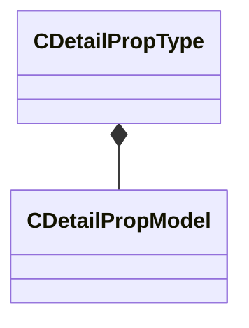

[Schemas](../../schemas.md) / [toolutils2](../toolutils2.md) / CDetailPropType

# CDetailPropType

> Source: **Build 25000182** · 2026-08-28 · `windows-x86_64` · schema `0.10.0`

**Kind:** class · **Size:** 32 bytes (`0x20`) · **Align:** 8 · **Module:** toolutils2

**Metadata:** `MPropertyFriendlyName Detail Prop Type`, `MVDataAssociatedFile scripts/detail_prop_types.vdata`, `MVDataOutlinerDefaultExpanded`, `MVDataRoot`

**Relationships:**

## Memory layout

2 fields (2 declared here, 0 inherited). Offsets are absolute from the object base.

| Offset | Field | Type | From | Annotations |
|--------|-------|------|------|-------------|
| `0x0` | `m_flDensity` | float32 |  | `MPropertyDescription Specifies the number of props placed per square foot.` |
| `0x8` | `m_Models` | CUtlVector< [CDetailPropModel](../toolutils2/CDetailPropModel.md) > |  | `MVDataPromoteField 1` |

KV3 class defaults

<pre>{
	&quot;m_flDensity&quot;: 1.000000,
	&quot;m_Models&quot;:
	[
	]
}</pre>

