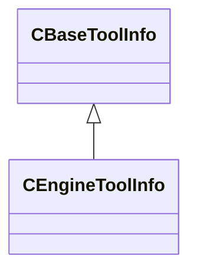

[Schemas](../../schemas.md) / [toolutils2](../toolutils2.md) / CEngineToolInfo

# CEngineToolInfo

> Source: **Build 25000182** · 2026-08-28 · `windows-x86_64` · schema `0.10.0`

**Kind:** class · **Size:** 136 bytes (`0x88`) · **Align:** 8 · **Module:** toolutils2

**Inherits from:** [CBaseToolInfo](../toolutils2/CBaseToolInfo.md)

**Relationships:**

## Memory layout

15 fields (11 declared here, 4 inherited). Offsets are absolute from the object base.

| Offset | Field | Type | From | Annotations |
|--------|-------|------|------|-------------|
| `0x0` | `m_Name` | CUtlString | [CBaseToolInfo](../toolutils2/CBaseToolInfo.md) |  |
| `0x8` | `m_OverrideToolShortcutName` | CUtlString | [CBaseToolInfo](../toolutils2/CBaseToolInfo.md) |  |
| `0x10` | `m_FriendlyName` | CUtlString | [CBaseToolInfo](../toolutils2/CBaseToolInfo.md) |  |
| `0x18` | `m_ToolIcon` | CUtlString | [CBaseToolInfo](../toolutils2/CBaseToolInfo.md) |  |
| `0x20` | `m_Library` | CUtlString |  |  |
| `0x28` | `m_InterfaceName` | CUtlString |  |  |
| `0x30` | `m_bShowInRevisionSubMenu` | bool |  |  |
| `0x31` | `m_bIsSecondaryTool` | bool |  |  |
| `0x32` | `m_bDoNotWarnAboutLargeAssetBatches` | bool |  |  |
| `0x33` | `m_bIsWorkshopManagerTool` | bool |  |  |
| `0x34` | `m_bIsWorkshopItemTool` | bool |  |  |
| `0x35` | `m_bCanHighlightSubassets` | bool |  |  |
| `0x38` | `m_AssetTypes` | CUtlVector< CUtlString > |  |  |
| `0x50` | `m_LimitToMods` | CUtlVector< CUtlString > |  |  |
| `0x68` | `m_ExcludeFromMods` | CUtlVector< CUtlString > |  |  |

KV3 class defaults

<pre>{
	&quot;m_Name&quot;: &quot;&quot;,
	&quot;m_OverrideToolShortcutName&quot;: &quot;&quot;,
	&quot;m_FriendlyName&quot;: &quot;&quot;,
	&quot;m_ToolIcon&quot;: &quot;&quot;,
	&quot;m_Library&quot;: &quot;&quot;,
	&quot;m_InterfaceName&quot;: &quot;&quot;,
	&quot;m_bShowInRevisionSubMenu&quot;: false,
	&quot;m_bIsSecondaryTool&quot;: false,
	&quot;m_bDoNotWarnAboutLargeAssetBatches&quot;: false,
	&quot;m_bIsWorkshopManagerTool&quot;: false,
	&quot;m_bIsWorkshopItemTool&quot;: false,
	&quot;m_bCanHighlightSubassets&quot;: false,
	&quot;m_AssetTypes&quot;:
	[
	],
	&quot;m_LimitToMods&quot;:
	[
	],
	&quot;m_ExcludeFromMods&quot;:
	[
	]
}</pre>

