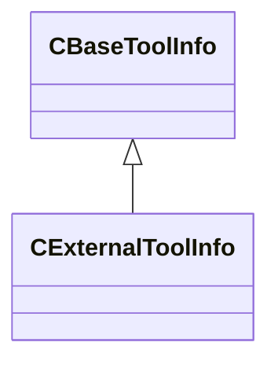

[Schemas](../../schemas.md) / [toolutils2](../toolutils2.md) / CExternalToolInfo

# CExternalToolInfo

> Source: **Build 25000182** · 2026-08-28 · `windows-x86_64` · schema `0.10.0`

**Kind:** class · **Size:** 128 bytes (`0x80`) · **Align:** 8 · **Module:** toolutils2

**Inherits from:** [CBaseToolInfo](../toolutils2/CBaseToolInfo.md)

**Relationships:**

## Memory layout

12 fields (8 declared here, 4 inherited). Offsets are absolute from the object base.

| Offset | Field | Type | From | Annotations |
|--------|-------|------|------|-------------|
| `0x0` | `m_Name` | CUtlString | [CBaseToolInfo](../toolutils2/CBaseToolInfo.md) |  |
| `0x8` | `m_OverrideToolShortcutName` | CUtlString | [CBaseToolInfo](../toolutils2/CBaseToolInfo.md) |  |
| `0x10` | `m_FriendlyName` | CUtlString | [CBaseToolInfo](../toolutils2/CBaseToolInfo.md) |  |
| `0x18` | `m_ToolIcon` | CUtlString | [CBaseToolInfo](../toolutils2/CBaseToolInfo.md) |  |
| `0x20` | `m_Executable` | CUtlString |  |  |
| `0x28` | `m_Args` | CUtlString |  |  |
| `0x30` | `m_ArgsWithLineColumn` | CUtlString |  |  |
| `0x38` | `m_WorkingDir` | CUtlString |  |  |
| `0x40` | `m_MatchSystemExecutable` | CUtlString |  |  |
| `0x48` | `m_SupportedExts` | CUtlVector< CUtlString > |  |  |
| `0x60` | `m_PriorityExts` | CUtlVector< CUtlString > |  |  |
| `0x78` | `m_bDebugCommandline` | bool |  |  |

KV3 class defaults

<pre>{
	&quot;m_Name&quot;: &quot;&quot;,
	&quot;m_OverrideToolShortcutName&quot;: &quot;&quot;,
	&quot;m_FriendlyName&quot;: &quot;&quot;,
	&quot;m_ToolIcon&quot;: &quot;&quot;,
	&quot;m_Executable&quot;: &quot;&quot;,
	&quot;m_Args&quot;: &quot;&quot;,
	&quot;m_ArgsWithLineColumn&quot;: &quot;&quot;,
	&quot;m_WorkingDir&quot;: &quot;&quot;,
	&quot;m_MatchSystemExecutable&quot;: &quot;&quot;,
	&quot;m_SupportedExts&quot;:
	[
	],
	&quot;m_PriorityExts&quot;:
	[
	],
	&quot;m_bDebugCommandline&quot;: false
}</pre>

