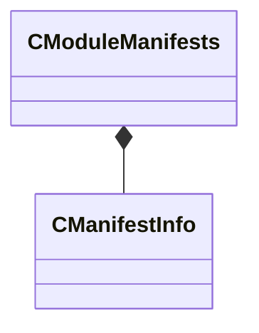

[Schemas](../../schemas.md) / [toolutils2](../toolutils2.md) / CModuleManifests

# CModuleManifests

**Kind:** class · **Size:** 24 bytes (`0x18`) · **Align:** 8 · **Module:** toolutils2

**Relationships:**

## Memory layout

1 fields (1 declared here, 0 inherited). Offsets are absolute from the object base.

| Offset | Field | Type | From | Annotations |
|--------|-------|------|------|-------------|
| `0x0` | `m_Manifests` | CUtlVector< [CManifestInfo](../toolutils2/CManifestInfo.md) > |  |  |

KV3 class defaults

<pre>{
	&quot;m_Manifests&quot;:
	[
	]
}</pre>

